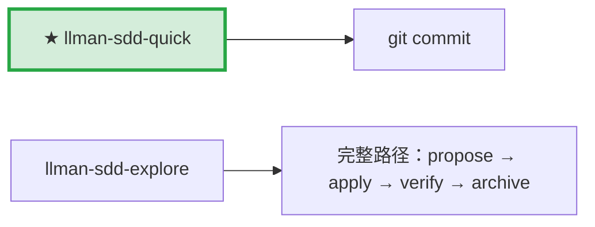

# LLMAN SDD Quick Path

不改行为合约的小改动用此路径。

## Pipeline 位置

> 📍 快速路径：直接改代码 commit。发现要改合约 → STOP，转 `llman-sdd-propose`。

## 使用条件（全部满足）
- 不改变任何 spec 中 MUST/SHALL 定义的外部可观测行为
- 不跨 capability；不涉及迁移/兼容性；不是 SDD 元规范变更

## 步骤
1. 用 `llman-sdd context --task "..." --paths "..."` 确认无相关 spec 变更。
   - context 返回 `quality: "unavailable"` → 先 `llman-sdd index check`：stale/缺失则 `llman-sdd index rebuild`（默认 pageindex，免模型）后重试；fresh 仍不可用（`LLMAN_SDD_INDEX_CHAT_MODEL` 未设）→ 改用 `llman-sdd list --specs` + 直读 `.feature`——勿循环 rebuild。
2. 直接改代码。
3. 若要动 `llmanspec/specs/**`，STOP——除非已在绑定的非默认 change 分支上（迷你 change：`change start`/`attach` → 编辑 → commit）。禁止在默认分支 commit specs，即使 typo 或仅收紧 scope 也不行。优先把 specs 维护路由到 `llman-sdd-propose`。
4. git commit（message 写明 why）。无需 change 目录，无需 archive。

## 边界处理
- 修改中发现要改行为合约 → STOP，转 `llman-sdd-propose`。
- 涉及多文件且 scope 不明 → 先用 `llman-sdd context` 确认。

> 命令细节用 `llman-sdd <cmd> --help` 查看；命令参考以 CLI 为准，skill 不内嵌命令表。
> 文中「规约」= 本项目 `llmanspec/specs/` 下的 `.feature` 文件；用 `llman-sdd list --specs` / `llman-sdd show <capability>` 查全文。

## Ethics Governance
- `ethics.risk_level`：low——仅读写本仓库与 `llmanspec/`，无外发动作；正文另有声明时从其声明。
- `ethics.prohibited_actions`：违反正文「硬约束」的动作；未经用户明确要求的 push / PR / 外部上传。
- `ethics.required_evidence`：结论须有命令输出或文件路径佐证；门禁状态以 `llman-sdd validate` 为准。
- `ethics.refusal_contract`：门禁 CRITICAL 未清零 → 拒绝进入下一阶段；自修复达上限 → 报告 blocker。
- `ethics.escalation_policy`：改动 SDD 合约/模板或执行不可逆动作前，暂停并请用户确认。
