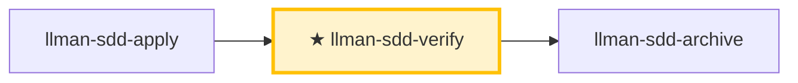

# LLMAN SDD Verify

验证实现是否与该 change 的工件一致。

## Pipeline 位置



> 📍 你在验证阶段 → 通过则 `llman-sdd-archive`，失败回 `llman-sdd-apply` 修复。对象应已落地 specs 且 `readyToImplement=true`（全门绿——完成信号）。

## 硬约束

- **必须先 apply 全绿**：未完成实现的 change 跳过验证。
- **CRITICAL 必须修复**：归档前清零。
- **亲自复跑门禁**：MUST 亲自重跑 `llman-sdd validate <id> --strict`（真实 harness）与项目门禁，MUST NOT 采信实现者报告的门禁结论；复跑结果与报告不符 → CRITICAL。
- **`--no-check` 不是证据**：以 `--no-check` 取得的门禁证据 → CRITICAL。收口会执行已配置的 `bdd.run_command`，收口前不必再跑一遍；`--no-check` 打出的跳过说明不是通过。
- **不要问「要不要继续」**：跑完整验证流程，输出完整报告。

## 阶段守卫（`stage` / `readyToImplement`）

以权威 JSON 判定（勿凭「工件看着齐了」）：

```bash
llman-sdd show <id> --output json --type change
```

读字段：`stage`、`specsLanded`、`needsSpecsChange`、`readyToImplement`、`gateChecks`（逐项 `pass` + 未过时的 `hint`）。

| 状态 | 动作 |
|------|------|
| `stage=draft`（仅 proposal.md） | STOP。补 design.md → designed，补 tasks.md → planned，再绑定分支、落地 specs。draft 不能 apply/verify。若已有 proposal+tasks 而仍是 `draft`（缺 design.md——它是 stage 门槛）：先补 design.md。**不要**建 `changes/<id>/specs/`，**不要**在默认分支改 specs。 |
| `stage=designed`（proposal + design） | 补 tasks.md → `planned`；规划文档齐全后再 `change start` / `attach`（绑定分支）。 |
| `stage=planned`（proposal + design + tasks） | STOP 直到绑定：`change start` / `attach` → `full`。 |
| `stage=full` 且 `readyToImplement=false` | 读未过的 `gateChecks` 分项。specs-landed 门未过 → 在**绑定分支**落地 specs（编辑 `llmanspec/specs/**` 并 commit），或设 `needs_specs_change: false`；**不要**重跑 `change start`（绑定分支上的 specs 丢失 → checkout/重建 + 必要时 `attach --force`）。specs-landed 门已绿而 tasks-done/validate/clean-tree 未过 → 实施中期的正常状态：继续 apply 勾 tasks，勿当落地失败。 |
| `readyToImplement=true` | 完成信号：gateChecks 全绿（tasks 全勾 + validate 通过）——verify/finalize 前置已满足。`changes/<id>/specs/` 预期**不存在**，勿当缺失。 |

## 步骤
1. 确定 change id（不明确时让用户从 `llman-sdd list --json` 选）。
2. 快速校验门禁：`llman-sdd validate <id> --strict`。
   - 诊断结构问题（Gherkin 解析 / `@req` 链接 / 双写 / req_id 唯一性）先跑结构校验（配置 `bdd.run_command` 时 validate 缺省执行该 harness，`--no-check` 跳过；harness 失败以 ERROR 落在对应 spec 条目）。失败项在缺省 TOON 输出的 `items[].issues[]` 逐条列出（`--output human` 输出 `FAIL <item_type>/<id>` 行，位于 `Totals` 上方）。
3. 阅读：分支上的 `llmanspec/specs/**`（`<capability>.feature`，唯一事实来源）、`proposal.md` 与 `design.md`（如有）、`tasks.md`；`changes/<id>/specs/` 若有残留旧文档可忽略。
4. **双轴审查（两轴分离，互不掩盖）**——对比 diff（`git diff <merge-base>...HEAD`，merge-base 现算 `git merge-base <本地默认分支> HEAD`；存储的 base_sha 仅审计、MUST NOT 参与范围计算）：
   - **合约轴**：实现是否满足 `@human` 规则的 MUST/SHALL 与 `@executable` 的 GWT？缺失/部分实现、错误实现、spec 未要求的超范围改动 → 给最小修复建议或建议更新工件。前后对比类证据（计数、基线）核对测量位置：MUST 在 change 分支上测量（相对现算 merge-base）；默认分支测得的值通常恒为基线，不构成证据。
   - **标准轴**：代码是否符合 `AGENTS.md` 规范 + 常见坏味清单。权威优先级：`AGENTS.md` > 坏味清单；工具已强制的跳过。坏味是**判断性提示**（「可能是 Feature Envy」），不是硬性违规：

     | 坏味 | 怎么修 |
     |------|--------|
     | Mysterious Name（名不达意） | 重命名 |
     | Duplicated Code（重复逻辑） | 抽取共享部分 |
     | Feature Envy（方法更爱用别人的数据） | 把方法移过去 |
     | Data Clumps（同组字段到处走） | 打包成类型 |
     | Primitive Obsession（原始类型充当领域概念） | 给专门类型 |
     | Repeated Switches（同类 switch 反复出现） | 多态或共享 map |
     | Shotgun Surgery（一处改动散落多处） | 聚到一个模块 |
     | Divergent Change（一个文件因多个无关原因被改） | 拆分 |
     | Speculative Generality（为未发生的需求加抽象） | 删掉 |
     | Message Chains（长链 a.b().c()） | 隐入一个方法 |
     | Middle Man（只转发） | 删掉直连 |
     | Refused Bequest（子类拒绝大部分继承） | 改组合 |
   - 两轴可并行（sub-agent）审查；报告 MUST 分离呈现，MUST NOT 合并或交叉重排（一轴通过不能掩盖另一轴失败）。
5. **BDD 验证**——仅当 `config.yaml` 含 `bdd:` 段：
   - 确认 change 已绑定分支且当前在该分支上。
   - `llman-sdd validate --specs`：Gherkin + `@req`/双写门禁；配置 `bdd.run_command` 时缺省执行该 harness（`--no-check` 跳过），失败映射为对应 spec 条目的 ERROR。
   - 可选只读审查：`llman-sdd change diff <id>`（或 `--export-patch <path>`）——仅审查/导出，绝不当作 apply 步骤。
   - verify 通过后下一步 `llman-sdd-archive`（勿在此 inline finalize）。

6. 输出简短报告：**CRITICAL**（归档前必须修复）/ **WARNING**（建议修复）/ **SUGGESTION**（可选优化）。
7. **人审关卡**：报告无 CRITICAL 后、建议归档前跑 `llman-sdd review`：退出码零 → 建议 `llman-sdd-archive`；非零 = CRITICAL → 用 `llman-sdd-apply` 修复后重跑 review；MUST NOT 带 CRITICAL 进入 finalize/archive。

## Git 分支生命周期（摘要）

**Skill 导航** ≠ **分支生命周期**。全图见根 `AGENTS.md` 或 `llman-sdd-propose` 内嵌图。

硬规则：
1. **先**绑定分支（`change start` / `attach`）→ full；**再**落地 specs（绑定分支上编辑并 commit `llmanspec/specs/**`）。
2. 无合约编辑 → `needs_specs_change: false`。`stage=full` 且 specs-landed 门通过即可进 apply；`readyToImplement=true`（全门绿）是 verify/finalize 前的完成信号。
3. 收口用 `change finalize`（自动提交 `archive(sdd): <id>`；`--no-commit` 跳过）。
4. **禁止**在默认分支 commit specs；已 attach 勿重复 `start`。
5. worktree（可选）：`change start --worktree` 在独立 worktree 建分支、不动当前检出（`--base <branch>` 记录分叉源）；finalize 目标被其他 worktree 持有时自动在该 worktree 内执行（输出标注位置）。
# 人读摘要（强制）

每份报告、交接或门禁输出，MUST 在任何机器细节之前先给人读摘要：

- **结论** — 一行（如「门禁全绿」/「发现 2 个 CRITICAL」）。
- **风险** — 最多三条，按影响降序。
- **待决策** — 明确提问，或「无」。

十行以内；细节放折叠线以下。
> 命令细节用 `llman-sdd <cmd> --help` 查看；命令参考以 CLI 为准，skill 不内嵌命令表。
> 文中「规约」= 本项目 `llmanspec/specs/` 下的 `.feature` 文件；用 `llman-sdd list --specs` / `llman-sdd show <capability>` 查全文。

校验修复（单轨 feature-as-spec）：

1）缺头注释（`missing # capability: header comment`）：每个 capability `.feature`（`llmanspec/specs/<capability>.feature` 或目录内同名主文件）必须以下列注释开头：
```
# language: zh-CN
# capability: <capability>
# purpose: 一句话概述
# scope: src/
```

2）tag 语法（`@human constraint scenario must carry an @req:<req_id> tag` / `orphan acceptance scenario`）：
- 规则：`@req:<id> @human`——statement 全文放场景描述（须含 MUST/SHALL）。
- 验收：`@executable` + 至少一个 `@req:<id>` 挂回规则。
- 配对判据：新增 `@human` 前先分流——凡 GWT 可表达的自动化判定行为 MUST 落 `@executable` 验收并挂回规则（纯文字规则无行为守护）；`@human` 仅用于不可自动化的人工约束，无法配对时在 proposal/design 记录理由。
- 禁止 `@human` 与 `@executable` 同场景；`@manual` 已在 0.3.0 移除——残留报迁移 ERROR，删掉即可（`@human` 本身已承载人工判定语义）。

分支护栏：
- 先 `change start` / `attach` 绑定分支，再在绑定的非默认分支编辑 `.feature` 并 commit（落地 specs）。
- 锁定规则（报告制）：改/删既有 `@human` 场景只出 WARNING，不阻断 validate / finalize / `change diff`；报告按 `@req:<id>` 指明被改规则。控制点：git 分支对比 + `llman-sdd review` / `change diff`。旧锁定确认元数据（frontmatter `rules_touched` / `agent_acked`、`@agent` tag、`--yes` 确认语义）已全部删除，无别名无兼容层。
- `stage=full` 且 specs-landed 门通过（specsLanded ∨ `needs_specs_change: false`）即可进 apply；verify/finalize 须 `readyToImplement=true`（完成信号）。收口优先 `change finalize`。

## Context
- 先查状态再动手：change/spec 状态以 `llman-sdd show/list/validate` 输出为准；读 spec 全文前先用 `llman-sdd context --task --paths` 定位。

## Goal
- 达成一个可验证结果；报告附结果路径与校验状态。

## Constraints
- 遵守正文硬约束（不复读）。先判断规模选路径：合约变更走完整 SDD，实现层走 quick；不确定选完整 SDD。改动最小；已知校验错误禁止强行继续。

## Workflow
- 每步以 `llman-sdd` 命令结果为事实来源；改动工件后必跑 `llman-sdd validate`；命令细节见 `llman-sdd <cmd> --help`。

## Decision Policy
- 高影响歧义先澄清再继续；事实自己查证，只有决策问用户。

## Output Contract
- 先给人读摘要（结论 / 风险 / 待决策），机器细节随后。

## Ethics Governance
- `ethics.risk_level`：low——仅读写本仓库与 `llmanspec/`，无外发动作；正文另有声明时从其声明。
- `ethics.prohibited_actions`：违反正文「硬约束」的动作；未经用户明确要求的 push / PR / 外部上传。
- `ethics.required_evidence`：结论须有命令输出或文件路径佐证；门禁状态以 `llman-sdd validate` 为准。
- `ethics.refusal_contract`：门禁 CRITICAL 未清零 → 拒绝进入下一阶段；自修复达上限 → 报告 blocker。
- `ethics.escalation_policy`：改动 SDD 合约/模板或执行不可逆动作前，暂停并请用户确认。
