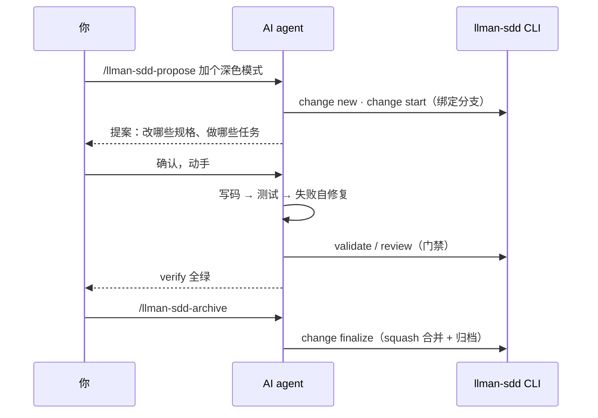
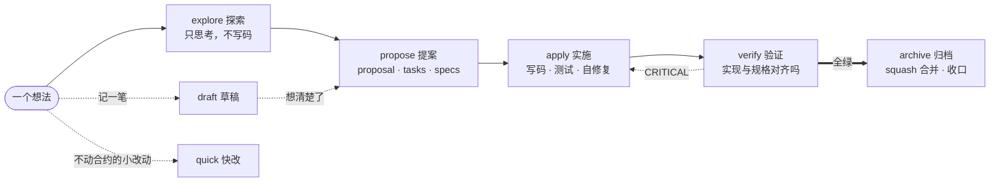
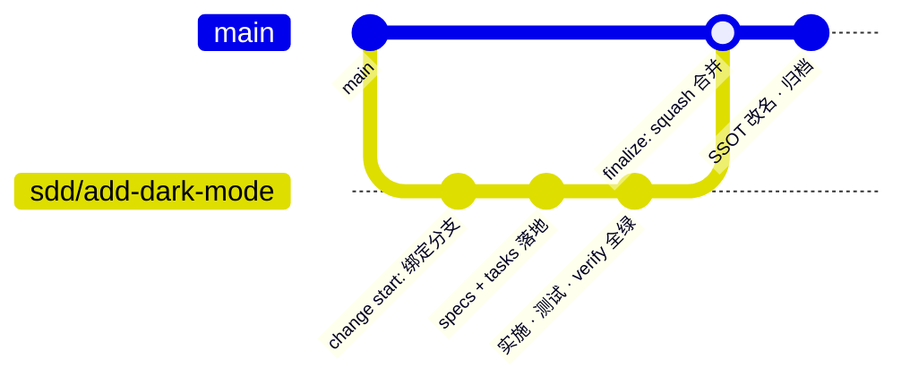
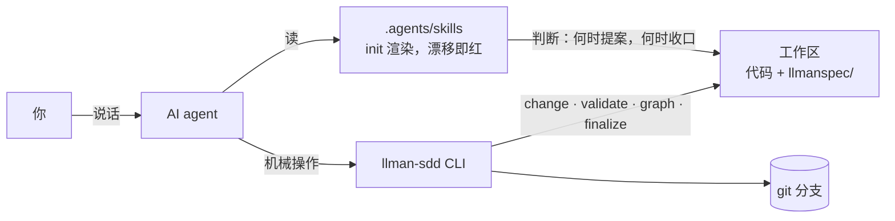

<div align="center">

# llman-sdd

[](https://github.com/StrayDragon/llman-sdd/actions/workflows/ci.yml)
[](LICENSE)

**s**pec-**d**riven development —— agent 管判断，CLI 管机械，git 管生命周期

前身：Rust 版 [llman](https://github.com/StrayDragon/llman) 的 sdd 子命令，现以 TypeScript + Bun 重写。

</div>

---

llman-sdd 是一套 spec 驱动开发（SDD）工作流：**先写规格，再写代码**，规格与实现由门禁对齐。规格就是 Gherkin `.feature` 文件——`规则:` 块写需求，块内嵌套的 `场景:` 直接接测试跑起来，人和 agent 读的是同一份可执行规格。

本仓库用 llman-sdd 开发 llman-sdd，[llmanspec/](llmanspec/) 就是它自身的行为合约（狗粮现场）。

## 快速上手

安装后（见下文「[安装](#安装)」），在你的项目根目录跑一次：

```bash
llman-sdd init    # 生成 llmanspec/ + AGENTS.md 托管块 + .agents/skills/
```

然后对 agent 说出想法就行。一次完整的 change，体验大致是：



你只负责两件事：**出想法**，以及在关键点拍板。每个阶段怎么做判断，agent 按 [.agents/skills/](.agents/skills/) 里 init 渲染出的技能执行；机械操作 skill 会自己调 CLI。想亲手敲命令，`llman-sdd --help` 见全貌，每个子命令有自己的 `--help`。

## 核心循环



| 阶段 | skill | 干什么 |
| --- | --- | --- |
| 探索 | [llman-sdd-explore](.agents/skills/llman-sdd-explore/SKILL.md) | 理清思路、调查需求，只思考不写码 |
| 提案 | [llman-sdd-propose](.agents/skills/llman-sdd-propose/SKILL.md) | 写 proposal + tasks，把规格落进 llmanspec/ |
| 实施 | [llman-sdd-apply](.agents/skills/llman-sdd-apply/SKILL.md) | 按 tasks 写码，测试失败自己修，门禁全绿 |
| 验证 | [llman-sdd-verify](.agents/skills/llman-sdd-verify/SKILL.md) | 对照 specs 查实现，产出 CRITICAL/WARNING 分级报告 |
| 归档 | [llman-sdd-archive](.agents/skills/llman-sdd-archive/SKILL.md) | squash 合并回默认分支，规格改名入 archive/ |

侧门与辅助：[draft](.agents/skills/llman-sdd-draft/SKILL.md) 随手记想法、[quick](.agents/skills/llman-sdd-quick/SKILL.md) 不改行为合约的小改动直改直提交；[apply-cycle](.agents/skills/llman-sdd-apply-cycle/SKILL.md) 单 change 手动端到端，[graph](.agents/skills/llman-sdd-graph/SKILL.md) 画 change 依赖图，[specs-compact](.agents/skills/llman-sdd-specs-compact/SKILL.md) 手动压缩冗余规格。

## 规格长什么样

一个能力一个 `.feature` 文件，放在 `llmanspec/specs/`。需求写在 `规则:` 块里，块头 `@req:<id>` 是唯一句柄；块内嵌套的 `场景:`（假如 / 当 / 那么）绑定步骤代码，`bun test tests/bdd` 真跑——**规格即测试**。节选自 [llmanspec/specs/change-lifecycle.feature](llmanspec/specs/change-lifecycle.feature)：

```gherkin
  @req:r14
  规则: 分支绑定门
    `change start` MUST 要求干净工作树且当前在默认分支,创建 `<branch_prefix><id>` 分支(默认前缀 sdd/)并把
    branch/base_branch/base_sha 三键以注释保留方式写入 proposal.md frontmatter;不满足门条件 MUST 报错且不产生任何变更。

    场景: start 全链路
      假如 一个已提交的临时 git 仓库含 change "demo-add-feature" 的 proposal
      当 对其运行 change start
      那么 分支 sdd/demo-add-feature 被创建且被检出
```

凡是能用场景表达的，都必须可执行；实在程序化不了的（架构决策、治理约束）才允许裸 `规则:`，而且 pending 门盯着裸规则数——只许降，不许升。Gherkin 关键字 locale 可切（官方 80 种方言），本仓用 zh-Hans。

## 一个 change 的 git 一生

change 不是文件夹，是一条 git 分支。



`change start` 建 `sdd/<id>` 分支，并把 `branch` / `base_branch` / `base_sha` 写进 proposal frontmatter——它是 change 元信息的唯一权威：白名单校验，出现野字段 validate 直接 ERROR；生命周期阶段由 CLI 从磁盘工件 + git 绑定实时推断，不落盘。收口一条命令：`change finalize`。

并行开发按「一个 change = 一个 worktree = 一个 agent 工作区」组织，change 间用 `depends_on` / `blocks` 声明依赖，`llman-sdd graph` 直接吐 mermaid 依赖图。

## 双面架构



skill 是生成物不是手写物：模板在 [packages/core/templates](packages/core/templates)，渲染门拿 init 产物对基线做 diff——skill 永远不会教 agent 已删除的命令。`packages/core` 保持纯域逻辑，文件系统、git、终端副作用一律经接口注入。monorepo 子包可以带自己的 `llmanspec/`，多根走同一条代码路径（v0.7 起）。

## 与 OpenSpec 的区别

目录形态借自 [OpenSpec](https://github.com/Fission-AI/OpenSpec)，但方向分开了：OpenSpec 把规格当**文档**管，llman-sdd 把规格当**代码**管——可执行、有门禁、绑 git。

|               | OpenSpec                        | llman-sdd                                                             |
| ------------- | ------------------------------- | --------------------------------------------------------------------- |
| 规格格式      | Markdown，Requirement + Scenario | Gherkin `.feature`（Cucumber 官方解析器）                             |
| 规格可执行    | 否，规格是文档                  | `场景:` 接 bun:test；pending 门盯裸规则数，只降不升                   |
| change 与 git | 目录约定，归档即移动文件夹      | 分支绑定 `sdd/<id>`，finalize 一条命令完成合并 + 归档                 |
| agent 指引    | 仓库内手写 slash commands       | init 渲染 `.agents/skills`，渲染门看守，过期即红                      |
| 并行开发      | Stores（独立规划仓）            | 一 change 一 worktree + 依赖图                                        |

哲学一句话：OpenSpec 追求 fluid not rigid；llman-sdd 把能机械化的全机械化，门禁跑在真实 harness 上，agent 的自由度只留在判断层。

## 安装

```bash
# 方式一：单文件二进制
# GitHub Releases：linux x64/arm64 · macOS x64/arm64 · windows x64（打 tag 自动发布）

# 方式二：从源码（需要 Bun >= 1.4 和 just）
git clone https://github.com/StrayDragon/llman-sdd.git && cd llman-sdd
just install
just build    # 二进制落在 apps/cli/dist/
```

## 工程细节

- **capture 契约**：结果走 stdout，进度走 stderr。脚本、CI、agent 捕获 stdout 拿到的永远是干净结果；人读形态走 `--output human`。
- **输出格式**：报告型命令缺省 TOON（对机器与 LLM 都友好的紧凑编码），`--output` 可切 `toon`、`json`、`compact-json`、`human`。
- **门禁**：`just qa` 与 CI 等价——静态检查、全部测试、skills 渲染门、pending 计量门、schema 漂移门；默认静默，排障 `just QA_VERBOSE=2 qa`。全部任务以 justfile 注释为唯一权威。

## 文档

- [llmanspec/specs/](llmanspec/specs/) —— 本仓自身的行为合约（狗粮现场）
- [.agents/skills/](.agents/skills/) —— 上述技能的渲染产物；模板在 [packages/core/templates](packages/core/templates)
- [llmanspec/AGENTS.md](llmanspec/AGENTS.md) —— 项目规则与技术选型定案
- [CHANGELOG.md](CHANGELOG.md) —— 版本历史与迁移指引
- [AGENTS.md](AGENTS.md) —— 工作区速览

## 许可证

MIT
