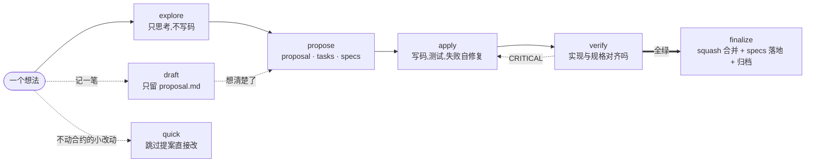
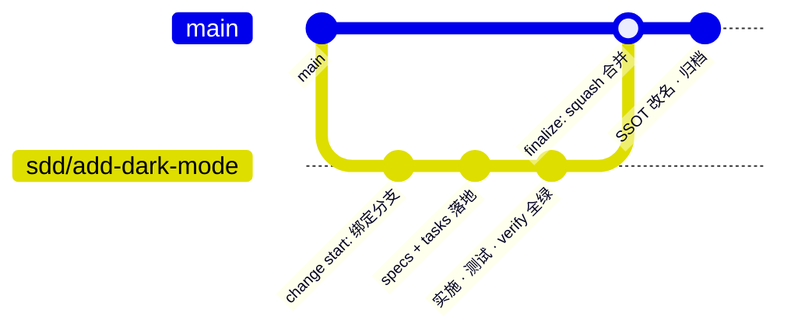
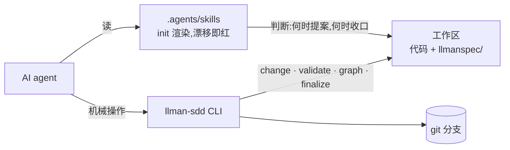

<div align="center">

# llman-sdd

[](https://github.com/StrayDragon/llman-sdd/actions/workflows/ci.yml)
[](LICENSE)

**s**pec-**d**riven development —— agent 管判断,CLI 管机械,git 管生命周期

前身:Rust 实现的 llman 的 sdd 子命令,[最后一次携带它的提交版本为](https://github.com/StrayDragon/llman/commit/e87e7fb0e4e152ed41a5cc436a7f715fcf9764f1);此后以 TypeScript + Bun 重写!

</div>

---

llman-sdd 是一套 spec 驱动开发(SDD)工作流:先写规格,再写代码,规格与实现由门禁对齐。分工明确——`init` 渲染出的 `.agents/skills` 教 AI agent 在每个阶段做什么判断;`llman-sdd` CLI 负责 change 生命周期、校验、依赖图、归档这些确定性操作。规格用 Gherkin 写(locale 可切,本仓用 zh-Hans 关键字),带 `@executable` 标签的场景直接接 bun:test 跑起来。

本仓库用 llman-sdd 开发 llman-sdd,`llmanspec/` 就是它自身的行为合约。

## 核心循环



五个阶段各有一个 skill 做入口(explore → propose → apply → verify → archive),侧门两个:随手记想法走 draft,不碰行为合约的小改动走 quick。每个 skill 的触发条件与边界写在模板里,`llman-sdd init` 落到 `.agents/skills/`,agent 直接按斜杠命令调用。

## 规格长什么样

一个能力一个 `.feature` 文件,头部注释写清 purpose 与 scope(映射到源码路径)。需求以 `@req:rNN` 场景表达——编号延续自前代规则号,重写延续的是同一份合约,不是重开一份。场景分两类,分流判据本身也是一条规格(init-generators r66):

- `@executable`:GWT 步骤(假如 / 当 / 那么),`bun test tests/bdd` 真跑。凡是 GWT 能表达的自动化判定行为,必须落这里并挂回对应规则
- `@human`:一行 MUST 合约,给人和 agent 读。只放 GWT 表达不了的约束;新增时无可配对验收,必须在 proposal / design 里写明不可执行的理由

同一规则常常两类兼有,人读合约配一条机器验收。节选自 [llmanspec/specs/change-lifecycle.feature](llmanspec/specs/change-lifecycle.feature):

```gherkin
  @req:r16 @human
  场景: 默认分支 local-first 解析
    - 默认分支 MUST 按 main → master → origin/HEAD → origin/* 顺序取第一个本地存在者;四者皆缺 MUST 报错。

  @req:r16 @executable
  场景: 默认分支解析顺序与皆缺报错
    假如 一个默认分支布局为 main+master 的临时仓库
    当 运行 change start
    那么 base_branch 记录为 main
```

没有配对 `@executable` 验收的规则算 pending,pending 门要求 pending 数不得高于基线、只降不升。本仓三个 executable 化批次落地后基线已归零——新 MUST 规则要么配机器验收,要么留下书面理由,没有第三条路。

## 一个 change 的 git 一生

change 不是文件夹,是一条 git 分支。



`change start` 建 `sdd/<id>` 分支并把 `branch` / `base_branch` / `base_sha` 写进 proposal frontmatter。frontmatter 是 change 元信息的唯一权威:字段集白名单校验,出现 `status` 之类野字段 validate 直接 ERROR;生命周期阶段(draft / designed / planned / full)由 CLI 从磁盘工件加 git 绑定实时推断,不落盘,想手改都没地方改。收口一条命令:`change finalize` 完成 squash 合并、specs SSOT 改名、归档提交。

并行开发按「一个 change = 一个 worktree = 一个 agent 工作区」组织,change 间用 `depends_on` / `blocks` 声明依赖,`llman-sdd graph` 直接吐 mermaid 依赖图。

## 与 OpenSpec 的区别

`llmanspec/` 这个目录形态借自 [OpenSpec](https://github.com/Fission-AI/OpenSpec),早期还带过互导命令;后来方向分开了:OpenSpec 把规格当文档管,llman-sdd 把规格当代码管——可执行、有门禁、绑 git。

|               | OpenSpec                        | llman-sdd                                                                           |
| ------------- | ------------------------------- | ----------------------------------------------------------------------------------- |
| 规格格式      | Markdown,Requirement + Scenario | Gherkin `.feature`(Cucumber 官方解析器)                                             |
| 规格可执行    | 否,规格是文档                   | `@executable` 场景接 bun:test;pending 计量门盯着无 executable 验收的规则数,只降不升 |
| change 与 git | 目录约定,归档即移动文件夹       | 分支绑定 `sdd/<id>`;finalize 一条命令完成 squash 合并 + specs 改名 + 归档提交       |
| 阶段与元信息  | —                               | frontmatter 白名单校验,阶段由 CLI 从工件 + git 推断                                 |
| agent 指引    | 仓库内手写 slash commands       | `init` 从模板渲染 `.agents/skills`,渲染门 + 新鲜度门看守,过期即红                   |
| 输出口径      | 面向人读                        | stdout = 结果,stderr = 进度;报告缺省 TOON,`--json` 与前代字节兼容                   |
| 并行开发      | Stores(独立规划仓)              | 一 change 一 worktree + 依赖图                                                      |

两家哲学也不同。OpenSpec 追求 fluid not rigid;llman-sdd 反着来,把能机械化的全机械化,门禁跑在真实 harness 上,agent 的自由度只留在判断层。

## 双面架构



skill 是生成物不是手写物:模板在 `packages/core/templates`,改动模板或 CLI 表面的 change 必须跑 `init --update` 并提交刷新后的 skills,渲染门拿 runInit 产物对 golden 基线做归一化 diff——skill 永远不会教 agent 已删除的命令。`packages/core` 保持纯域逻辑,文件系统、git、终端副作用一律经接口注入。

## 快速开始

在你的项目里:

```bash
llman-sdd init    # 生成 llmanspec/ + AGENTS.md 托管块 + .agents/skills
```

然后对 agent 说 `/llman-sdd-propose <你的想法>`,机械部分 skill 会自己调 CLI。人工常用的就几个:`llman-sdd change start|finalize`、`llman-sdd validate --strict`、`llman-sdd graph`。完整命令面看 `llman-sdd --help`,每个子命令有自己的 `--help`。

### 安装

```bash
# 单文件二进制:GitHub Releases(linux x64/arm64 · macOS x64/arm64 · windows x64)
# 打 tag 触发 release 流水线,产物挂在 Actions

# 从源码(需要 Bun >= 1.4 和 just)
git clone https://github.com/StrayDragon/llman-sdd.git && cd llman-sdd
just install
just build    # 二进制落在 apps/cli/dist/
```

## 工程细节

### capture 契约

结果走 stdout,进度走 stderr。脚本、CI、agent 捕获 stdout 拿到的永远是干净结果,不会被日志污染;要人读形态走 `--output human`。

### 输出格式

报告型命令(review / validate / list / show / config / index)缺省输出 TOON(Token-Oriented Object Notation,机器与 LLM 友好的紧凑编码),`--output` 可切 `toon | json | compact-json | human`,`--json` / `--compact-json` 与前代输出字节级一致。

### 门禁

`just qa` 与 CI 等价:静态检查、全部测试、skills 渲染门、pending 计量门、schema 漂移门。默认 L0 静默,排障用 `just QA_VERBOSE=2 qa` 开全量输出。全部任务直接跑 `just` 看注释——justfile 注释是任务清单的唯一权威,本节不复读;真实 LLM 冒烟与 eval 剧本的入口也在那里。

## 文档

- [llmanspec/specs/](llmanspec/specs/) —— 本仓自身的行为合约(狗粮现场)
- [llmanspec/AGENTS.md](llmanspec/AGENTS.md) —— 项目规则与技术选型定案
- [AGENTS.md](AGENTS.md) —— 工作区速览
- [CHANGELOG.md](CHANGELOG.md) —— 版本历史

## 许可证

MIT
