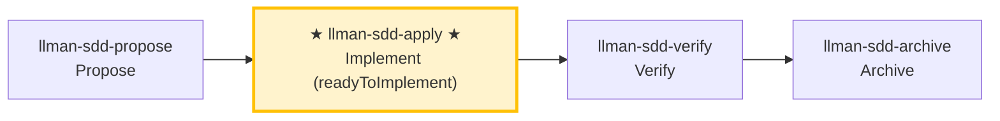

# LLMAN SDD Apply

Implement all tasks in `llmanspec/changes/<id>/tasks.md` **in one closed loop**:
Implement code → Add tests/acceptance → Run gates → Self-heal on failures → Report results when all pass.
Unless there is a clear blocker, **DO NOT stop halfway to ask "should I continue?"**

## Pipeline Position

{{ unit("skills/git-native-flow-brief") }}

### Skill navigation (not the lifecycle; shows current skill only)

> 📍 You are at Git-native **H (apply)** in the full lifecycle diagram: Specs-landed (or `needs_specs_change: false`) and `readyToImplement=true` required first → next: `llman-sdd-verify`

## Hard Constraints

- **SSOT-driven**: `proposal.md` / `design.md` / `tasks.md` and live `llmanspec/specs/**` on the feature branch are the single source of truth; every MUST/SHALL in specs must be fulfilled.
- **Scope-locked**: Only implement what's in the current change; don't fix "unrelated issues" on the side.
- **Minimal changes**: Keep changes minimal and strictly scoped to current tasks.
- **No guessing**: If requirements are unclear, or specs contradict reality, STOP and report — don't assume behavior.
- **No legacy compatibility layers**: If a change requires new behavior, upgrade all call sites directly, unless tasks/proposal explicitly require compatibility.
- **Don't ask "should I continue?"**: Execute to loop closure unless you hit an unresolvable blocker.
- **Close-out**: this skill's closed loop ends by suggesting `llman-sdd-verify`; finalize/archive is handled by `llman-sdd-archive` (do not finalize inside the self-healing loop).

## Commit Policy

- **Commits on the change branch are free** (no mid-flight archive point; `change finalize` needs no clean tree): segment by task or milestone when it helps review, or keep the working tree dirty and let finalize make ONE close commit — both are first-class. `change checkpoint` no longer exists (calling it exits non-zero and points to finalize), so there is no mid-flight "archive point" to maintain; `change finalize` handles both shapes (it does NOT require a clean tree).
- **Default close-out**: after all tasks pass gates and verify is green, `llman-sdd change finalize <id>` auto-commits `archive(sdd): <change-id>` (uncommitted impl diff + frontmatter + archive rename in one commit). Do not run finalize inside the apply loop. `--no-commit` skips the auto commit (manual/CI histories; pre-commit-hook conflicts).
- **Blocker interrupt**: when you must STOP on a blocker, make ONE work-in-progress commit (e.g. `wip(sdd): <change-id> 
`) to preserve the state, then report.

## Steps

### 0) Preflight (required)
- Read and obey: `llmanspec/config.yaml`, `AGENTS.md` (if present).
- `git status --porcelain`:
  - If working tree is dirty and changes don't belong to the current change: `git stash push -u -m "llman-sdd-apply autopilot backup"`.
- Run `llman-sdd validate --all --strict --no-interactive`:
  - If it fails for reasons unrelated to the current change, stop and report (inconsistent artifacts prevent SSOT-driven implementation).
- **Check spec valid_scope integrity**: use `llman-sdd list --specs --json` to list all specs, then for each spec verify every path in its `valid_scope` exists on disk. If any scope file/directory is missing, stop and suggest updating the spec (remove the deleted path from `valid_scope`).

### 1) Select change id and check prerequisites
- If a change id is provided, use it directly.
- Otherwise infer from context; if ambiguous, run `llman-sdd list --json` and let user pick.
- Always announce: "Using change: <id>" and how to override.
- Confirm you are on the non-default feature branch bound via `llman-sdd change start <id>` or `change attach <id>` (`--force` only to rebind). Specs/features on the branch are SSOT — do not author under `changes/<id>/specs/`.
{{ unit("skills/stage-guard") }}
- Use `llman-sdd context --task "<goal from proposal>" --paths "<scope from specs>"` to get relevant specs.
  - If context is unavailable, run `llman-sdd index rebuild` and retry.

### 2) Read SSOT artifacts
You must read through:
- `llmanspec/changes/<id>/proposal.md`
- `llmanspec/changes/<id>/design.md` (if present)
- `llmanspec/changes/<id>/tasks.md`
- Live specs on the feature branch: `llmanspec/specs/**` (`<capability>.feature`) — this is SSOT

Extract hard constraints from proposal.md and design.md decisions. Convert tasks.md into a minimal executable step sequence (preserving original order).

### 3) Show status
- Progress: "N/M tasks complete"
- Next 1–3 unchecked tasks (brief overview)

### 4) Implement tasks one by one (closed-loop execution)
For each unchecked task:
1. **Implement**: strictly per task description + specs requirements, keep changes minimal.
2. **Update checkbox immediately** after completion: `- [ ]` → `- [x]`.
3. If task is unclear, you hit a blocker, or specs/design don't match reality → STOP and report the blocker, don't assume.

> 💡 Previous phase `llman-sdd-propose` (generated tasks); after this phase → `llman-sdd-verify` (verify)

### 5) Verification and self-healing loop (run after each task or batch)
Run project gate commands (adapt to the actual project):
- Relevant test suite: `just test` or `cargo test --all`
- Format/lint: `just check` or `just lint` + `just fmt`
- Git-native: stay on the bound feature branch; edit live `llmanspec/specs/<capability>.feature` (flat, or directory `llmanspec/specs/<capability>/` main file; rules `@human`, acceptance `@executable`) as needed; run `llman-sdd validate --specs` after spec edits; commit on the branch freely (segmented or leave dirty for finalize). Do not use `change delta` / solidify / feature_delta; `change checkpoint` is removed.
- SDD validation: `llman-sdd validate <id> --strict --no-interactive`

**On failure → enter self-healing loop (don't ask "should I continue?"):**
1. Parse failure cause (test failure / lint / format / validation error).
2. **Decide if it's a hard-to-locate bug** (cause unclear / intermittent flake / regression not obvious at a glance):
   - **Not hard-to-locate** (clear lint/format/compile/validation error): apply a minimum fix (don't expand scope); re-run the "minimum failure repro command" first, then re-run all gates.
   - **Hard-to-locate bug → escalate to the diagnose sub-flow**:
     1. **First build a command that reproduces the failure** (fast, deterministic, agent-runnable, and goes red on *this* bug) — one that drives the real bug path and asserts the user's exact symptom. **MUST NOT start hypothesizing before such a command exists** (staring at code and guessing is the failure this prevents).
     2. Run it, confirm red → minimize the repro (cut inputs/calls/config/data one at a time, keep only what's load-bearing).
     3. Generate **3–5 ranked hypotheses**, each falsifiable ("if X is the cause, changing Y makes the bug disappear").
     4. Verify one variable at a time; fix once the root cause is found.
     5. If there's no correct seam for a regression test, note the architectural gap (hand off to `llman-sdd-arch-review`; when that skill is not enabled via `extra_skills`, write the gap into this change's `proposal.md` Further Notes section or `design.md`, and MUST NOT break the loop over it).
3. Re-run the "minimum failure repro command" first, then re-run all gates.
4. Log as one self-healing round: `Round N: failure → fix → re-run → pass/fail`.

**Self-healing cap: 8 rounds**; exceeding this is a blocker: stop and output a blocker report (last failing command + output summary + what you tried).

**Human review checkpoint (after each task batch passes the gates)**: once a batch is green, before starting the next batch or producing the completion report, run `llman-sdd review`:

- Exit code zero → continue.
- Non-zero exit = CRITICAL findings: STOP, fix, re-run review; MUST NOT enter the next batch or emit the completion report with CRITICAL findings open.

### 6) Completion report
After all tasks complete + all gates green, output a structured report (see Output Contract below).
Then suggest running `llman-sdd-verify` for the verification phase.

> 💡 Implementation done → next: `llman-sdd-verify` (verify)

> For command details run `llman-sdd <cmd> --help`; the CLI is the command reference — skills embed no command tables.
> "Spec" here = a `.feature` file under this project's `llmanspec/specs/`; run `llman-sdd list --specs` or `llman-sdd show <capability>`.

{{ unit("skills/validation-hints") }}

{{ unit("skills/structured-protocol") }}
