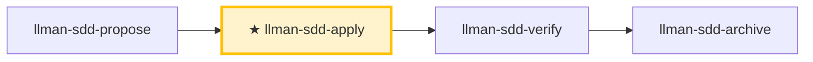

# LLMAN SDD Apply

Implement all tasks in `llmanspec/changes/<id>/tasks.md` **in one closed loop**: implement → add tests/acceptance → run gates → self-heal and re-run on failure → report when all pass. Unless there is a clear blocker, **do not stop halfway to ask "should I continue?"**

## Pipeline Position

{{ unit("skills/git-native-flow-brief") }}

> 📍 Entry requires the specs-landed gate green (or `needs_specs_change: false`); `readyToImplement=true` (all gates green) is the completion signal that closes this loop → next `llman-sdd-verify`.

## Hard Constraints

- **Single-source-of-truth driven**: `proposal.md` / `design.md` / `tasks.md` and `llmanspec/specs/**` on the branch; every MUST/SHALL in specs must be fulfilled.
- **Scope-locked**: only implement the current change's scope; never fix "unrelated issues" on the side; keep changes minimal.
- **No guessing**: unclear requirements or specs contradicting reality → STOP and report; don't assume.
- **No legacy compatibility layers**: if the change requires new behavior, upgrade all call sites directly, unless tasks/proposal explicitly require compatibility.
- **Close-out**: this loop ends by suggesting `llman-sdd-verify`; finalize/archive belongs to `llman-sdd-archive` (do not finalize inside the self-healing loop).

## Commit Policy

- **Commits on the change branch are free** (`change finalize` needs no clean tree): segment by task/milestone, or keep the tree dirty and let finalize make one close commit — both are first-class.
- **Default close-out**: after all tasks pass gates and verify is green, `llman-sdd change finalize <id>` auto-commits `archive(sdd): <change-id>` (uncommitted diff + frontmatter + rename in one commit). Do not run finalize inside the apply loop. `--no-commit` skips the auto commit (manual/CI histories; pre-commit-hook conflicts).
- **Blocker interrupt**: when you must STOP on a blocker, make ONE WIP commit (e.g. `wip(sdd): <change-id> 
`) to preserve the state, then report.

## Steps

### 0) Preflight (required)
- Read and obey `llmanspec/config.yaml`, `AGENTS.md` (if present).
- `git status --porcelain`: if the tree is dirty with changes not belonging to this change → `git stash push -u -m "llman-sdd-apply autopilot backup"` first.
- `llman-sdd validate --all --strict`: if it fails for reasons unrelated to this change → stop and report (inconsistent artifacts prevent source-of-truth-driven implementation).
- **Check spec valid_scope integrity**: `llman-sdd list --specs --json` lists all specs; for each, verify every `valid_scope` path exists on disk. On missing paths → stop and suggest updating the spec (remove the deleted path).

### 1) Select the change id and check prerequisites
- If provided, use it; otherwise infer from context, and if ambiguous run `llman-sdd list --json` and let the user pick. Always announce "Using change: <id>" and how to override.
- Confirm you are on the non-default branch bound via `llman-sdd change start <id>` or `change attach <id>` (`--force` only to rebind). Specs on the branch are the single source of truth — do not author under `changes/<id>/specs/`.
{{ unit("skills/stage-guard") }}
- Use `llman-sdd context --task "<goal from proposal>" --paths "<scope from specs>"` to get relevant specs.
  - Context unavailable → run `llman-sdd index check` first: stale/missing → `llman-sdd index rebuild` and retry; still unavailable on a fresh index (`LLMAN_SDD_INDEX_CHAT_MODEL` unset) → fall back to `llman-sdd list --specs` + reading `.feature` files directly — do not loop on rebuild.

### 2) Read the source-of-truth artifacts
- `llmanspec/changes/<id>/proposal.md`, `design.md` (if present), `tasks.md`
- `llmanspec/specs/**` (`<capability>.feature`) on the branch

Distill proposal/design decisions into a list of inviolable hard constraints; convert tasks.md into a minimal executable step sequence (preserving original order).

### 3) Show status
- Progress "N/M tasks complete" + a brief look at the next 1–3 unchecked tasks.

### 4) Implement tasks one by one (closed loop)
For each unchecked task:
1. **Implement**: strictly per task description + specs, minimal changes.
2. **Check the box immediately** after completion: `- [ ]` → `- [x]`. **Close-out is not a task**: `change finalize` / `change archive` are pipeline steps and MUST NOT appear in tasks.md — if one is listed (e.g. "close-out — finalize"), remove it (the close-out task gate requires every task checked).
3. **Edit, then verify — serially**: verification MUST run after edits land on disk; MUST NOT put edits and tests/validation in the same parallel tool-call batch (the check may read stale files and report a false failure or a false pass).
4. Task unclear, blocker hit, or specs/design contradict reality → STOP and report; don't assume.

### 5) Verification and self-healing loop (after each task or batch)
Run the project gates as appropriate:
- Test suite: `just test` or `cargo test --all`; format/lint: `just check` or `just lint` + `just fmt`
- Edit `llmanspec/specs/<capability>.feature` on the branch as needed (flat or directory main file; rules `@human`, acceptance `@executable`); run `llman-sdd validate --specs` after spec edits; commit on the branch freely.
- SDD validation: `llman-sdd validate <id> --strict`

**Gate evidence**:
- Close-out runs the configured `bdd.run_command`, so do not run that command again just before close-out; the skip line printed by `--no-check` is not a pass.
- Gate verdicts MUST come from the real harness: MUST NOT obtain a "pass" via `--no-check`; on harness failure, find the root cause first (leaked env vars, nested-invocation guards, wrong cwd …) — MUST NOT label it an "inherent/self-referential property" and bypass it.
- Before/after criteria (counts, baselines) MUST be measured on the change branch (against the freshly computed merge-base); a value measured on the default branch is usually trivially the baseline and proves nothing.
- Refactors and bulk replacements: MUST compare the test count before and after; all-green gates with fewer tests is a failure.

**On failure → self-heal (don't ask "should I continue?"):**
1. Parse the failure cause (test / lint / format / validation).
2. Decide if it's a hard-to-locate bug (cause unclear / intermittent flake / regression not obvious at a glance):
   - **Not hard-to-locate** (clear lint/format/compile/validation error): apply a minimal fix (don't expand scope); re-run the minimum failure-repro command first, then all gates.
   - **Hard-to-locate → escalate to the diagnose sub-flow**:
     1. **First build a command that reproduces the failure** (fast, deterministic, agent-runnable, and goes red on *this* bug) — one that drives the real bug path and asserts the user's exact symptom. **MUST NOT start hypothesizing before such a command exists** (staring at code and guessing is the failure this prevents).
     2. Run it, confirm red → minimize the repro (cut inputs/calls/config/data one at a time, keep only what's load-bearing).
     3. Generate **3–5 ranked hypotheses**, each falsifiable ("if X is the cause, changing Y makes the bug disappear").
     4. Verify one variable at a time; fix once the root cause is found.
     5. If there's no correct seam for a regression test, note the architectural gap (hand off to `llman-sdd-arch-review`; when not enabled, write the gap into this change's `proposal.md` Further Notes section or `design.md`, and MUST NOT break the loop over it).
3. Re-run the minimum failure-repro command first, then all gates.
4. Log one self-healing round: `Round N: failure → fix → re-run → pass/fail`.

**Self-healing cap: 8 rounds**; exceeding it is a blocker: stop and output a blocker report (last failing command + output summary + what you tried).

**Human review gate (after each task batch passes the gates)**: before starting the next batch or emitting the completion report, run `llman-sdd review`: exit code zero → continue; non-zero = CRITICAL findings → STOP, fix, re-run review; MUST NOT enter the next batch or emit the completion report with CRITICAL findings open.

### 6) Completion report
After all tasks complete + all gates green, output a structured report (see Output Contract), then suggest `llman-sdd-verify`.

{{ unit("skills/cli-footer") }}

{{ unit("skills/validation-hints") }}

{{ unit("skills/structured-protocol") }}
