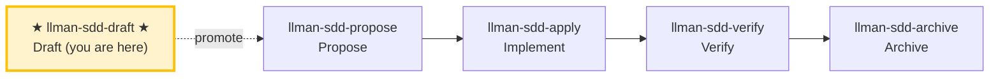

# LLMAN SDD Draft

Capture a change idea as a **draft proposal** (a `proposal.md` skeleton only). This is the lightweight entry point for "just record this idea / future need" — no triage, no tasks, no live specs, no attach. Promote to a formal change with `llman-sdd-propose` when the idea is ready to act on.

## Pipeline Position



> 📍 You are at the draft stage → next: flesh out `proposal.md`, then run `llman-sdd-propose` to formalize
> 📎 This skill creates a **draft** change (proposal.md only). Full propose follows Git-native: tasks → Branch binding → Specs landing (see propose lifecycle diagram)
> 🗺️ Skill navigation ≠ Git-native lifecycle; Branch binding / Specs landing are not separate skills

## Hard Constraints

- **MUST NOT ask the user for a change id**: derive it from the description via `change new --from` and announce it.
- **MUST NOT create tasks/design/specs/attach**: this skill creates only the `proposal.md` draft shell. Full planning artifacts belong to `llman-sdd-propose`.
- **MUST NOT run triage or assess change scale**: that is propose's job. If the user wants to start implementing, suggest `llman-sdd-propose`.
- **Scope boundary**: if the description clearly involves MUST/SHALL behavioral contract changes or multi-file impact, suggest `llman-sdd-propose` instead of stopping at a draft — but still create the draft shell first so the idea isn't lost.
- **Frontmatter has a fixed schema**: when fleshing out `proposal.md`, only the allowed fields in `llmanspec/AGENTS.md` "Change Proposal Frontmatter SSOT" are accepted (including `depends_on`, `blocks`, `branch`, `base_sha`, `needs_specs_change`). `status`/`title`/`priority`/`author` etc. are rejected by `llman-sdd validate` as ERROR. Lifecycle stage is inferred — query it via `llman-sdd show`/`list`, never store it in frontmatter. Do not re-declare frontmatter fields in the prose body (no `## Status` block); the body H1 is a human-readable title, not a repeat of the change id.

## Steps

### 0) Preflight
- Read `llmanspec/config.yaml` for project context, rules, locale.
- `llmanspec/` must exist; if missing, tell the user to run `llman-sdd init`, then STOP.

### 1) Capture the description
- Take the user's description as-is (e.g. "draft: add a export-to-json command", "note down: we should support worktrees for sdd changes").
- **MUST NOT ask for a change id.** Derive it from the description.

### 2) Create the draft shell
```bash
llman-sdd change new --from "<user description>"
```
- The CLI generates a legal kebab-case id (sanitized + validated), creates `llmanspec/changes/<derived id>/proposal.md` (a skeleton with `## Why` / `## What Changes` TODO sections), and prints the final id + path.
- If the derived id collides with an existing change, the CLI fails non-zero; suggest rephrasing the description or using `--force` to overwrite (rare for drafts).

### 3) Announce and hand off
- **MUST tell the user the derived id** (e.g. "Created draft change `<id>` at `llmanspec/changes/<id>/proposal.md`").
- Suggest next steps:
  - Flesh out `proposal.md` (Why / What Changes / Capabilities / Impact) now or later.
  - When ready to act on it, run `llman-sdd-propose` to formalize (triage + tasks → `change start`/`attach` → Specs landing).

> 💡 Draft captured → next: edit `proposal.md`, then `llman-sdd-propose` to formalize.

> For command details run `llman-sdd <cmd> --help`; the CLI is the command reference — skills embed no command tables.
> "Spec" here = a `.feature` file under this project's `llmanspec/specs/`; run `llman-sdd list --specs` or `llman-sdd show <capability>`.

{{ unit("skills/ethics-governance") }}
