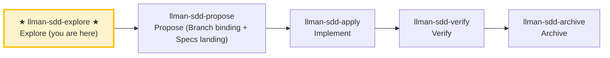

# LLMAN SDD Explore

Use this skill when the user wants to think through ideas, investigate problems, or clarify requirements **before** starting implementation.

**IMPORTANT: Explore mode is for thinking, not implementing.**
- You MAY read files, search code, and investigate the codebase.
- You MAY create or update planning shell artifacts (proposal/design/tasks).
- Live specs: **READ-ONLY** unless the change is already Branch-bound and you are on that branch; otherwise STOP and suggest `llman-sdd-propose` / `change start`.
- You MUST NOT write application code or implement features in explore mode.

## Pipeline Position

{{ unit("skills/git-native-flow-brief") }}

### Skill navigation (not the lifecycle; shows current skill only)

> 📍 You are in the explore phase (thinking only) → standard path next: `llman-sdd-propose` (propose)
> 📎 For small changes (no behavioral contract changes), go directly to `llman-sdd-quick` (quick path)
> 🗺️ Skill navigation ≠ Git-native lifecycle

## Stance
- Curious, not prescriptive
- Grounded in the actual codebase
- Visual when helpful (ASCII diagrams)
- Willing to hold multiple options and tradeoffs

## Suggested moves
1. Use `llman-sdd context --task "<task>" --paths "<files>"` to quickly locate relevant specs.
   - Read the `direct` spec files (these are the contracts you must understand).
   - If context is unavailable, rebuild with `llman-sdd index rebuild` (default `pageindex`, no model needed) and retry.
2. Clarify the goal and constraints (ask 1–3 questions).
3. **Grilling branch (optional, only when the user explicitly triggers)**: triggers on "deep-dig" / "grill" / "one at a time" / "nail it down". Walks the decision tree one question at a time:
   - **Ask one question at a time**, with your recommended answer, waiting for feedback before the next.
   - **Facts vs decisions**: look up anything verifiable by reading the capability `.feature`/code/running commands yourself — **don't ask** the user; only **decisions** (tradeoffs, preferences, scope boundaries) go to the user.
   - **Terminology sharpening**: when a term conflicts or is fuzzy, call it out immediately ("your spec defines 'X' as A, but you just said B — which is it?"); on resolution: if the change already has Branch binding and you are on the bound branch, update live `.feature` (Specs landing); otherwise record only in `proposal.md` — **never** edit live specs on the default branch. MUST NOT create a `CONTEXT.md` glossary as a second authority.
   - **Write decisions back**: resolved decisions go into the change's `proposal.md` "Open Questions" section (planning shell; OK briefly on the default branch).
   - **Completion criterion**: every pending decision is resolved or explicitly deferred. When not triggered, the default (ask 1–3 questions) behavior is unchanged.
4. If a change id is relevant, read its artifacts under `llmanspec/changes/<id>/`.
   - When diagnosing validation errors, prefer `llman-sdd validate <spec> --strict --no-check` (fast mode, skips the potentially slow `bdd.run_command`); resolve structural gates first (Gherkin / `@req` linkage / dual-write / req_id uniqueness), then run full mode (`--check` or `cargo test --features bdd`). Failing items are pinned down in the default TOON output's `items[].issues[]`; `--output human` prints v1 human-readable `FAIL <item_type>/<id>` lines.
5. Explore options and tradeoffs (2–3 options).
6. Assess change scale (triage) to determine if full SDD is needed.
7. When something crystallizes, offer to capture it (don't auto-write):
   - Scope / design / work items → planning shell (`proposal.md` / `design.md` / `tasks.md`)
   - Constraints / executable harness → **suggest** live `llmanspec/specs/**` (one `.feature` per capability); actual edits require Branch binding then Specs landing. If not bound yet in explore, record only in proposal — do not edit live specs.

> Git-native: first `change start`/`attach` (Branch binding) to enter Full, then edit live `.feature` on the bound branch (Specs landing); no `change delta` / solidify / feature_delta.

## Exiting explore mode
When the user is ready to implement, choose based on change scale:
- Behavioral contract change → `llman-sdd-propose` (create proposal artifacts)
- Small change / no contract change → `llman-sdd-quick` (quick path)
- `readyToImplement=true` → `llman-sdd-apply` (implement tasks)
If the user asks you to implement while in explore mode, STOP and remind them to exit explore mode first.

> 💡 Explore done → next: `llman-sdd-propose` (propose) or `llman-sdd-quick` (quick path)

> For command details run `llman-sdd <cmd> --help`; the CLI is the command reference — skills embed no command tables.
> "Spec" here = a `.feature` file under this project's `llmanspec/specs/`; run `llman-sdd list --specs` or `llman-sdd show <capability>`.

{{ unit("skills/structured-protocol") }}
