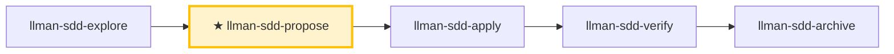

# LLMAN SDD Propose

Create a new change with planning docs (proposal + tasks; design optional): **first** `change start` (or `attach`) to bind the branch, **then** edit `llmanspec/specs/<capability>.feature` (flat, or directory main file) on the bound branch to land specs, validate, and suggest next steps.

## Pipeline Position

{{ unit("skills/git-native-flow") }}
{{ unit("skills/human-readable-summary") }}



> 📍 You are in propose: planning docs (draft → designed → planned) → bind branch → land specs (through the specs-landed gate) → next `llman-sdd-apply`. Small changes go via `llman-sdd-quick`.

## Hard Constraints

- **Non-blocking change id**: if the user supplied an id, use it; otherwise derive a valid kebab-case id from the task description (verb prefix, passes the CLI id check, follows the naming convention in `llmanspec/AGENTS.md`), announce the chosen id and how to override, and continue — MUST NOT wait for confirmation (ids are cheap to change before binding). Route to `llman-sdd-draft` only when the user wants to capture an idea (no id).
- **Specs are the single source of truth**: edit `llmanspec/specs/**` only **after** binding, on the **bound non-default branch**. **Do not** edit specs on the default branch. Planning docs may briefly live on the default branch.
- **Don't ask "should I continue?"**: execute the full propose phase in one pass, generate artifacts and validate.

- **If the change already exists**: STOP. If the specs-landed gate is green, suggest `llman-sdd-apply`; otherwise use `llman-sdd-continue` to finish binding / landing specs or the planning docs.

- **If the change already exists**: STOP. If the specs-landed gate is green, suggest `llman-sdd-apply`; otherwise finish the planning docs / binding / landing specs (edit `llmanspec/changes/<id>/`, or enable `extra_skills: [llman-sdd-continue]`).

- **Frontmatter has a fixed schema**: `proposal.md` accepts only the allowed fields in `llmanspec/AGENTS.md` "Change Proposal Frontmatter SSOT" (`depends_on`, `blocks`, `branch`, `base_sha`, `needs_specs_change`, etc.); `status`/`title`/`priority`/`author` are rejected by `llman-sdd validate` as ERROR. Lifecycle stage is inferred (query via `llman-sdd show`/`list`), never stored in frontmatter. Do not re-declare frontmatter fields in the prose body; the H1 is a human-readable title, not a repeat of the change id.

## Quick-capture routing

If the user just wants to **capture an idea** ("draft a proposal", "note down X", "remember Y later") → `llman-sdd-draft`: it creates a `proposal.md`-only draft via `change new --from` (no id asked, no tasks/specs/attach). Full propose starts here.

## Steps

### 0) Preflight
- Read `llmanspec/config.yaml` for project context, rules, locale.
- `llman-sdd validate --all --strict` to ensure current artifacts are clean; on pre-existing errors, STOP and report (stacking a new change on dirty artifacts causes cascading errors).
- **Check spec valid_scope integrity**: `llman-sdd list --specs --json` lists all specs; for each, verify every `valid_scope` path exists on disk. On missing paths, STOP and suggest updating the spec (remove the deleted path).

### 1) Assess change scale
1. Classify:
   - **Behavioral contract change** (modify MUST/SHALL, change external behavior) → full SDD
   - **Implementation change** (refactor, typo, perf) → `llman-sdd-quick`
   - **Meta-spec change** (SDD templates/process) → full SDD
   - When uncertain, choose full SDD (conservative).
2. Use `llman-sdd context --task "<goal>" --paths "<scope>"` to find relevant specs.
   - Context unavailable → run `llman-sdd index check` first: stale/missing → `llman-sdd index rebuild` (default `pageindex`, no model needed) and retry; still unavailable on a fresh index (`LLMAN_SDD_INDEX_CHAT_MODEL` unset) → fall back to `llman-sdd list --specs` + reading `.feature` files directly — do not loop on rebuild.
3. Gather input: a short change description; a change id (user-supplied, else derive per the non-blocking rule and announce); the impacted capability (to name `specs/<capability>`).

### 2) Ensure the project is initialized
- `llmanspec/` must exist; if missing, tell the user to run `llman-sdd init`, then STOP.

### 3) Create the change directory and artifacts
- Prefer `llman-sdd change new <change-id>` for the `proposal.md` draft shell (or create `llmanspec/changes/<change-id>/` manually).

- If the change already exists, STOP and suggest `llman-sdd-continue`.

- If the change already exists, STOP and suggest filling missing artifacts or `llman-sdd-apply` (optionally enable continue via `extra_skills`).

- Flesh out `proposal.md` (Why / What Changes / Capabilities / Impact); write `design.md` only when tradeoffs/migrations matter.
- **Confirm seams before writing tasks.md**: list the seams to be tested and confirm with the user. A seam = the public boundary driven by `*.feature` GWT steps (CLI subprocess or public interface) — MUST reuse existing harness seams, MUST NOT invent seams detached from `.feature`; without `.feature`, the seam is the CLI subcommand or public function boundary under test.
- `tasks.md`: split into **vertical slices** (each task cuts a narrow but complete path through schema→API→UI→tests, independently verifiable), with `[blocked-by: <task-id>]` dependency markers. **Wide-refactor exception** (one mechanical change sweeping the codebase, a single edit breaking many call sites): sequence as expand-contract (add new beside old → migrate call sites in batches → delete old); don't force vertical slices. **tasks.md lists implementation and verification tasks only**: close-out (`change finalize` / `change archive`) is a pipeline step and MUST NOT be listed as a task — its task gate requires every task checked, so a close-out task is self-contradictory (checking it lies, leaving it blocks close-out, and `validate --strict` stays red during implementation). Before/after completion criteria (counts, baselines) MUST state they are measured on the change branch (against merge-base) — a value taken on the default branch is usually trivially the baseline.
- **First** `llman-sdd change start <change-id>` (recommended; clean tree on the default branch; `--worktree` to keep the current checkout, `--base <branch>` for a non-default fork source) or manually create a branch then `change attach <change-id>`.
- **Then** edit `llmanspec/specs/<capability>.feature` (flat, or directory `llmanspec/specs/<capability>/` main file) on the bound non-default branch and commit (land specs). **Do not** edit specs before start; **do not** commit specs to the default branch just to satisfy the clean-tree gate. If already attached, do not re-run `start` (recover lost specs by checkout/recreate + `attach --force`).
- For changes with no contract edits, set frontmatter `needs_specs_change: false`. Enter apply when `llman-sdd show <id> --output json` shows `stage=full` with the specs-landed gate green; `readyToImplement=true` (all gates) is the completion signal gating verify/finalize.
- **Breaking contract changes** (removed/renamed fields, commands, tags, or stage values) MUST plan the upgrade path: write a `migrations/v<from>-v<to>/README` (upgrade guidance; a one-shot script SHALL ship with the repo when feasible) — include it in the proposal's What Changes.

### 4) Validate
```bash
llman-sdd validate <change-id> --strict
```
This MUST pass before proceeding; failing items are listed one by one in the validate output's `items[].issues[]` — fix each and re-run.

### 4a) Optional BDD runner (`bdd:` block)
- Read `llmanspec/config.yaml`. Is there a `bdd:` block?
  - **Yes**: `bdd.run_command` declares the project's BDD execution entry; validate executes it by default when its target set includes specs (`--no-check` skips). Authoring follows 4b regardless.
  - **No**: if this change involves executable behavior scenarios (Given/When/Then the user will want to run), ask **once, up front** whether to enable a `bdd:` runner block (adds a `bdd:` block to `config.yaml` — runner only, does not change the lifecycle). If **yes**: show the exact `bdd:` block to add (pick a `run_command` matching the project's test framework — `cargo test --features bdd` for rstest-bdd, `pytest {feature_dir} -k {feature_name} -v` for pytest-bdd), let the user confirm or edit, write it to `config.yaml`, then proceed with 4b. If **no**: features still validate structurally; BDD execution responsibility stays with the project test suite.
- **Do NOT silently add the `bdd:` block** — always ask first. Adding it declares the project-wide BDD execution entry.

### 4b) Single-track feature authoring
- Planning docs may briefly live on the default branch; **do not** edit `llmanspec/specs/**` on the default branch. After binding, landing specs and implementation happen on the bound branch.
- **Single-track**: each capability is ONE `<capability>.feature`. Constraint rules are `@req:<id> @human` scenarios (statement verbatim in the description); executable acceptance scenarios carry `@executable` and link back via `@req:<req_id>`. Never nest scenarios in `Rule:` blocks (the runner skips them silently).
- **Structured adds preferred**: to append rules/acceptances to an existing capability, prefer `llman-sdd spec next-req-id` (global rN allocation) + `spec add-req` / `spec add-scenario` (pairing tag syntax built in; write path auto-resolves flat vs directory layout). New capability → `spec skeleton <capability>`; id lookup → `spec resolve-req <rN>`. Hand-editing the `.feature` stays the escape hatch (best for editing existing clauses).
- **@human/@executable triage** (decide before writing any new clause): any behavior expressible as GWT (Given/When/Then) MUST land as an `@executable` acceptance scenario linked back to its rule — prose-only rules guard nothing; `@human` is only for human judgment that cannot be automated (process rulings, aesthetics, external facts). A new `@human` clause without a paired `@executable` MUST record the justification in proposal/design.

### 5) Summarize and suggest next step
- Enter implementation: `llman-sdd-apply`. Need more thinking: `llman-sdd-explore`.

{{ unit("skills/cli-footer") }}
{{ unit("skills/validation-hints") }}

{{ unit("skills/structured-protocol") }}
