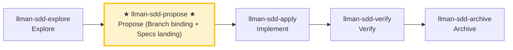

# LLMAN SDD Propose

Create a new change with planning artifacts (proposal + tasks; design optional), **first** `change start` (or `attach`) for Branch binding, **then** edit live `llmanspec/specs/<capability>.feature` (flat, or directory main file) on the bound branch (Specs landing), validate, and suggest next actions.

## Pipeline Position

{{ unit("skills/git-native-flow") }}
{{ unit("skills/human-readable-summary") }}

### Skill navigation (not the lifecycle; shows current skill only)



> 📍 You are in propose: the Git-native path above is **planning shell (draft → designed → planned) → Branch binding → Specs landing** (until `readyToImplement=true`) → next: `llman-sdd-apply`
> 📎 For small changes (no behavioral contract changes), use `llman-sdd-quick` (quick path)

## Hard Constraints

- **Non-blocking change id**: if the user supplied an id, use it; otherwise derive a valid kebab-case id from the task description (verb prefix, passes the CLI id check, follows the naming convention declared in `llmanspec/AGENTS.md`), announce the chosen id and how to override, and continue — MUST NOT wait for confirmation (ids are cheap to change before Branch binding). Only route to `llman-sdd-draft` when the user wants to capture an idea (draft, no id).
- **Live specs are SSOT**: edit `llmanspec/specs/**` only **after** Branch binding, on the **bound non-default branch** (Specs landing). **Do not** edit live specs on the default branch; **do not** author under `changes/<id>/specs/` or use `change delta` (removed). The planning shell may briefly live on the default branch.
- **Don't ask "should I continue?"**: execute the full propose phase in one pass, generate artifacts and validate.

- **If change already exists**: STOP. If `readyToImplement=true`, suggest `llman-sdd-apply`; otherwise use `llman-sdd-continue` to finish Branch binding / Specs landing, or fill the planning shell.

- **If change already exists**: STOP. If `readyToImplement=true`, suggest `llman-sdd-apply`; otherwise finish the planning shell / Branch binding / Specs landing (edit `llmanspec/changes/<id>/`, or enable `extra_skills: [llman-sdd-continue]`).

- **Frontmatter has a fixed schema**: when fleshing out `proposal.md`, only the allowed fields in `llmanspec/AGENTS.md` "Change Proposal Frontmatter SSOT" are accepted (including `depends_on`, `blocks`, `branch`, `base_sha`, `needs_specs_change`). `status`/`title`/`priority`/`author` etc. are rejected by `llman-sdd validate` as ERROR; lifecycle stage is inferred (query via `llman-sdd show`/`list`), never stored in frontmatter. Do not re-declare frontmatter fields in the prose body; the body H1 is a human-readable title, not a repeat of the change id.

## Quick-capture routing

If the user just wants to **capture an idea** (e.g. "draft a proposal", "note down X", "remember to do Y later") without full planning, route them to the `llman-sdd-draft` skill — it creates a `proposal.md`-only draft shell via `change new --from` (no id asked, no tasks/specs/attach). Full propose (triage + tasks → `change start`/`attach` → Specs landing) starts here.

## Steps

### 0) Preflight
- Read `llmanspec/config.yaml` for project context, rules, locale.
- `llman-sdd validate --all --strict --no-interactive`: ensure current artifacts are clean.
  - If pre-existing errors, stop and report (stacking new changes on dirty artifacts causes cascading errors).
- **Check spec valid_scope integrity**: use `llman-sdd list --specs --json` to list all specs, then for each spec verify every path in its `valid_scope` exists on disk. If any scope file/directory is missing, stop and suggest updating the spec (remove the deleted path from `valid_scope`).

### 1) Assess change scale (triage)
1. Classify:
   - **Behavioral contract change** (modify MUST/SHALL, change external behavior) → full SDD workflow
   - **Implementation change** (refactor, typo, perf) → quick path via `llman-sdd-quick`
   - **Meta-spec change** (SDD templates/process) → full SDD workflow
   - When uncertain, choose full SDD (conservative).
2. Use `llman-sdd context --task "<goal>" --paths "<scope>"` to find relevant specs.
   - If context unavailable, rebuild with `llman-sdd index rebuild` (default `pageindex`, no model needed) and continue.
3. Gather input:
   - A short description of the change
   - A change id (user-supplied if given; otherwise derive it with the non-blocking rule above and announce it)
   - The impacted capability/capabilities (to name `specs/<capability>`)

### 2) Ensure project is initialized
   - `llmanspec/` must exist; if missing, tell the user to run `llman-sdd init`, then STOP.

### 3) Create change directory and artifacts
   - Prefer `llman-sdd change new <change-id>` for the draft `proposal.md` shell (or create `llmanspec/changes/<change-id>/` manually).

   - If the change already exists, STOP and suggest `llman-sdd-continue`.

   - If the change already exists, STOP and suggest filling missing artifacts or `llman-sdd-apply` (optionally enable continue via `extra_skills`).

   - Flesh out `proposal.md` (Why / What Changes / Capabilities / Impact)
   - `design.md` only when tradeoffs/migrations matter
   - **Confirm seams before writing tasks.md**: list the seams to be tested and confirm with the user. A seam = the public boundary driven by `*.feature` GWT steps (CLI subprocess or public interface) — MUST reuse existing harness seams, MUST NOT invent seams detached from `.feature`. Without `.feature`, seam = the CLI subcommand or public function boundary under test.
   - `tasks.md`: split into **vertical slices** (each task cuts a narrow but complete path through schema→API→UI→tests, independently verifiable), with `[blocked-by: <task-id>]` dependency markers. **Wide-refactor exception** (one mechanical change sweeping the codebase, single edit breaks many call sites): sequence as expand-contract (add new beside old → migrate call sites in batches → delete old), don't force into a vertical slice.
   - **First** `llman-sdd change start <change-id>` (recommended; clean tree on the default branch) or manually create a branch then `change attach <change-id>` to reach Full (bound).
   - **Then** edit live `llmanspec/specs/<capability>.feature` (flat, or directory `llmanspec/specs/<capability>/` main file) on the bound non-default branch and commit (Specs landing). **Do not** edit live specs before start; **do not** commit live specs to the default branch just to satisfy the clean-tree gate. If already attached, do not re-run `start` (recover lost specs by checkout/recreate + `attach --force` if needed).
   - For changes with no live contract edits, set frontmatter `needs_specs_change: false`. Enter apply only when `llman-sdd show <id> --output json` has `readyToImplement=true`.
   - **Breaking contract changes** (removed/renamed fields, commands, tags, or stage values) MUST plan the upgrade path: `migrations/v<from>-v<to>/` with README prompt + one-shot script (ship the upgrade dir + one-shot script in the same repo) — include it in the proposal's What Changes.

### 4) Validate
   ```bash
   llman-sdd validate <change-id> --strict --no-interactive
   ```
   This MUST pass before proceeding; failing items are listed one by one in the validate output's `items[].issues[]` — fix each and re-run.

### 4a) Optional BDD runner (`bdd:` block)
- Read `llmanspec/config.yaml`. Is there a `bdd:` block?
  - **Yes**: `bdd.run_command` declares the project's BDD execution entry, carried by the project test suite (e.g. qa); validate never executes the harness (`--check`/`--no-check` are v1-compat no-ops). Authoring follows 4b regardless.
  - **No**: if this change involves executable behavior scenarios (Given/When/Then the user will want to run), ask **once, up front**: "This change looks like it has executable behavior. Enable a `bdd:` runner block so scenarios can be validated as `.feature` files? (adds a `bdd:` block to `config.yaml` — runner only, does not change the lifecycle.)"
    - If **yes**: show the exact `bdd:` block to add (pick a `run_command` matching the project's test framework — `cargo test --features bdd` for rstest-bdd, `pytest {feature_dir} -k {feature_name} -v` for pytest-bdd). Let the user confirm or edit it, write it to `config.yaml`, then proceed with 4b rules.
    - If **no**: features still validate structurally; BDD execution responsibility always stays with the project test suite.
- **Do NOT silently add the `bdd:` block** — always ask first. Adding it declares the project-wide BDD execution entry (carried by the project test suite; validate itself never executes the harness).

### 4b) Single-track feature authoring
- Planning shell (proposal/design/tasks) may briefly live on the default branch; **do not** edit live `llmanspec/specs/**` on the default branch. After Branch binding, Specs landing and implementation happen on the bound branch.
- **Single-track**: each capability is ONE `<capability>.feature`. Constraint rules are `@req:<id> @human` scenarios (statement verbatim in the description); executable acceptance scenarios carry `@executable` and link back via `@req:<req_id>`. Never nest scenarios in `Rule:` blocks (the runner skips them).
- **@human/@executable triage** (decide before writing any new clause): any behavior expressible as GWT (Given/When/Then) MUST land as an `@executable` acceptance scenario linked back to its rule — prose-only rules guard nothing; `@human` is only for human judgment that cannot be automated (process rulings, aesthetics, external facts). A new `@human` clause without a paired `@executable` MUST record the justification in proposal/design.
- Change shell: `llman-sdd change new <change-id>` → fill proposal/design/tasks → `llman-sdd change start <change-id>` (or `change attach`) → **then** edit live specs on the bound branch and commit (Specs landing).
- Do **not** use `change delta` / solidify / `*.feature.delta.toon`.

### 5) Summarize and suggest next step
   - Enter implementation phase: `llman-sdd-apply`.
   - If you need to think more: `llman-sdd-explore`.

> 💡 Proposal done → next: `llman-sdd-apply` (implement)

> For command details run `llman-sdd <cmd> --help`; the CLI is the command reference — skills embed no command tables.
> "Spec" here = a `.feature` file under this project's `llmanspec/specs/`; run `llman-sdd list --specs` or `llman-sdd show <capability>`.
{{ unit("skills/validation-hints") }}

{{ unit("skills/structured-protocol") }}
