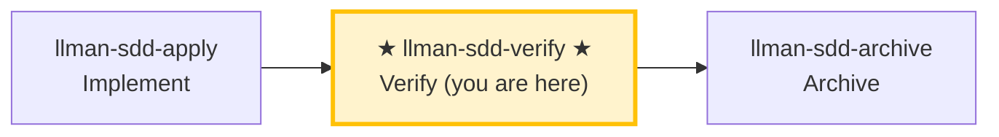

# LLMAN SDD Verify

Use this skill to verify that the implementation matches the change's artifacts.

## Pipeline Position

### Skill navigation (not the lifecycle; shows current skill only)

> 📍 You are in the verify phase → if pass: next `llman-sdd-archive` (archive); if fail: go back to `llman-sdd-apply` (fix). This is Git-native **I (verify)**; the change should already be Specs-landed with `readyToImplement=true` (all gates green — the completion signal).
> 🗺️ Skill navigation ≠ Git-native lifecycle; see brief lifecycle unit at the bottom.

## Hard Constraints

- **Must pass apply phase all-green first**: don't skip to verify on changes that haven't been implemented.
- **CRITICAL issues must be fixed**: CRITICAL problems must be resolved before archive.
- **Rerun the gates yourself**: MUST rerun `llman-sdd validate <id> --strict` (real harness) and the project gates; MUST NOT trust gate verdicts in the implementer's report — a mismatch is CRITICAL.
- **`--no-check` is not evidence**: gate evidence obtained with `--no-check` → CRITICAL. Close-out runs the configured `bdd.run_command`, so do not run that command again just before close-out; the skip line printed by `--no-check` is not a pass.
- **Don't ask "should I continue?"**: run the full verification flow, output a complete report.

{{ unit("skills/stage-guard") }}

## Steps
1. Select the change id (or ask the user to pick from `llman-sdd list --json`).
2. Run a fast validation gate:
   - `llman-sdd validate <id> --strict`
   - **When diagnosing structural issues (Gherkin parse / `@req` linkage / dual-write / global req_id uniqueness), run the structural validation first** (when `bdd.run_command` is configured, validate executes that harness by default — `--no-check` skips it; a harness failure lands as an ERROR on its spec item). Failing items are listed one by one in the default TOON output's `items[].issues[]` (`--output human` prints the v1 text form: `FAIL <item_type>/<id>` lines above the `Totals` line).
3. Read:
   - Live specs on the feature branch: `llmanspec/specs/**` (`<capability>.feature`) — SSOT
   - `proposal.md` and `design.md` if present
   - `tasks.md` to understand what was implemented
   - `llmanspec/changes/<id>/specs/` only if residual old docs exist — ignore; SSOT is live specs
4. **Dual-axis review (Standards + Spec, kept separate so neither masks the other)** — diff against `git diff <merge-base>...HEAD` (merge-base is COMPUTED via `git merge-base <local-default> HEAD`; the stored base_sha is audit-only and MUST NOT feed range math) on two axes:
   - **Spec axis**: does the implementation satisfy the `@human` rule MUST/SHALL and the `@executable` GWT?
     - Missing/partial behaviors, wrong implementations, and scope creep in the diff not asked for by the spec.
     - Suggest minimal fixes or artifact updates.
     - Check where before/after evidence (counts, baselines) was taken: it MUST be measured on the change branch (against the freshly computed merge-base); a value measured on the default branch is usually trivially the baseline and proves nothing.
   - **Standards axis**: does the code follow `AGENTS.md` coding style + the Fowler smell baseline?
     - **Authority priority**: `AGENTS.md` documented standard > smell baseline (repo overrides); skip anything tooling already enforces.
     - Smells are **judgement heuristics** ("possible Feature Envy"), not hard violations.
     - Smell baseline (each "what → fix"):

     | Smell | Fix |
     |-------|-----|
     | Mysterious Name (name hides intent) | rename it |
     | Duplicated Code (same logic shape) | extract the shared part |
     | Feature Envy (method uses another's data more) | move the method over |
     | Data Clumps (same fields travel together) | bundle into a type |
     | Primitive Obsession (primitive stands in for a domain concept) | give it a dedicated type |
     | Repeated Switches (same switch recurs) | polymorphism or a shared map |
     | Shotgun Surgery (one change scatters edits) | gather into one module |
     | Divergent Change (one file changes for unrelated reasons) | split it |
     | Speculative Generality (abstraction for unseen needs) | delete it |
     | Message Chains (long a.b().c()) | hide the chain behind one method |
     | Middle Man (just delegates) | cut it, call direct |
     | Refused Bequest (subclass rejects most inheritance) | use composition |
   - The two axes may be reviewed in parallel (sub-agents); the report MUST present them separately, MUST NOT merge or cross-rerank (one axis passing must not mask the other failing).
5. **BDD-on verification (Git-native Partitioned SSOT)** — only when `config.yaml` has a `bdd:` block:
   - Confirm the change is attached and you are on that feature branch.
   - `llman-sdd validate --specs`: Gherkin + `@req`/dual-write gates; when `bdd.run_command` is configured the harness runs by default (`--no-check` skips it) and a failure maps to an ERROR on the matching spec item.
   - Optional read-only review: `llman-sdd change diff <id>` (or `--export-patch <path>`). Diff is review/export only — never treat it as an apply step.
   - Next step after verify passes: `llman-sdd-archive` (not inline finalize here).

   - Extra requirement: {{ bdd_verify_prompt }}

6. Produce a short report:
   - **CRITICAL** (must fix before archive)
   - **WARNING** (should fix)
   - **SUGGESTION** (nice to have)
7. **Human review gate**: once the report has no CRITICAL findings and before suggesting archive, run `llman-sdd review`:
   - Exit code zero → suggest `llman-sdd-archive` for finalize/archive.
   - Non-zero exit = CRITICAL findings: fix via `llman-sdd-apply`, then re-run review; MUST NOT enter finalize/archive with CRITICAL findings open.

> 💡 Verify pass → next: `llman-sdd-archive` (archive); CRITICAL issues → go back to `llman-sdd-apply` (fix)

{{ unit("skills/git-native-flow-brief") }}
{{ unit("skills/human-readable-summary") }}
{{ unit("skills/cli-footer") }}

{{ unit("skills/validation-hints") }}

{{ unit("skills/structured-protocol") }}
