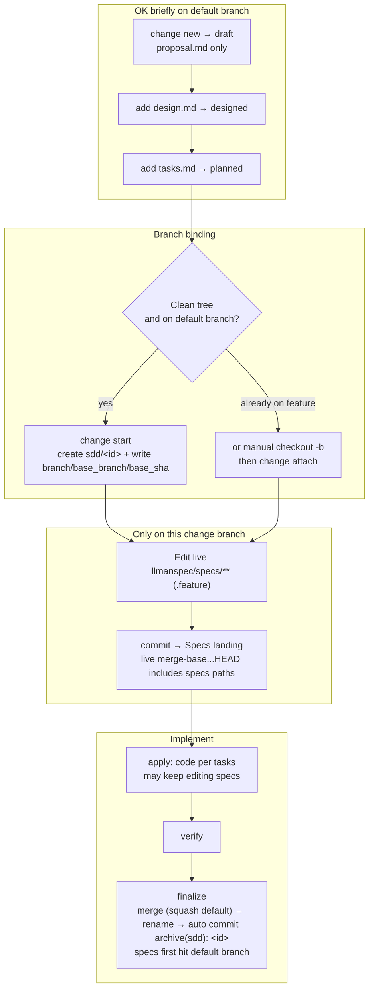

## Git-native lifecycle (full diagram)

Do not conflate two layers: the **Git-native lifecycle** (Branch binding → Specs landing → `readyToImplement`) vs **skill navigation** (explore→propose→apply→verify→archive). Specs landing is **not** a separate skill.

Hard rules:
1. **First** `change start` / `attach` (Branch binding) to enter Full; **then** edit `llmanspec/specs/**` on the bound non-default branch and commit (Specs landing).
2. For changes with no live contract edits, set frontmatter `needs_specs_change: false`. Enter apply only when `llman-sdd show <id> --json` has `readyToImplement=true` — `Full ∧` every `gateChecks` item passes (specs-landed = `specsLanded ∨ needs_specs_change=false`; ranges are live merge-bases, stored `base_sha` is audit-only).
3. `change checkpoint` is removed (no mid-flight archive point; `change finalize` does not require a clean tree). Close-out is `llman-sdd change finalize <id>`: it auto-commits `archive(sdd): <id>` (impl diff + rename in one commit); `--no-commit` skips the auto commit for manual/CI histories. Commits on the change branch are free (segmented or finalize single-shot).
4. **Do not** commit live specs to the default branch just to satisfy the clean-tree gate; if already attached, do not re-run `start`.
