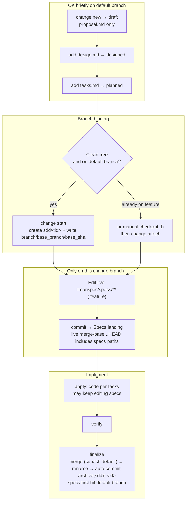

## Git-native lifecycle (full diagram)

Do not conflate two layers: the **Git-native lifecycle** (Branch binding → Specs landing → `readyToImplement`) vs **skill navigation** (explore→propose→apply→verify→archive). Specs landing is **not** a separate skill.

Hard rules:
1. **First** `change start` / `attach` (Branch binding) to enter Full; **then** edit `llmanspec/specs/**` on the bound non-default branch and commit (Specs landing).
2. For changes with no live contract edits, set frontmatter `needs_specs_change: false`. Enter apply when `stage=full` and the specs-landed gate passes (specsLanded ∨ needs_specs_change=false); `readyToImplement=true` — every `gateChecks` item passing, incl. tasks-done — is the completion signal that gates verify/finalize (ranges are live merge-bases, stored `base_sha` is audit-only).
3. `change checkpoint` is removed (no mid-flight archive point; `change finalize` does not require a clean tree). Close-out is `llman-sdd change finalize <id>`: it auto-commits `archive(sdd): <id>` (impl diff + rename in one commit); `--no-commit` skips the auto commit for manual/CI histories. Commits on the change branch are free (segmented or finalize single-shot).
4. **Do not** commit live specs to the default branch just to satisfy the clean-tree gate; if already attached, do not re-run `start`.

Worktree-mode decision table (multi-checkout workflows):

| Working style | Command | Criteria |
|---|---|---|
| Classic single checkout | `llman-sdd change start <id>` | On the default branch with a clean tree; switches this checkout to the new branch |
| Keep current checkout / parallel changes | `llman-sdd change start <id> --worktree` | Branch lives in a dedicated worktree (`sdd.worktree_root` / `sdd.worktree_naming` config; default sibling of the repo root), current checkout untouched, output includes the worktree path; pair with `--base <branch>` for a non-default fork source |
| Already on a feature branch (incl. manual wt/git-worktree) | `llman-sdd change attach <id>` | Branch already exists; `--base <branch>` records the fork source explicitly |

finalize target location: when the target branch is held by another worktree, `llman-sdd change finalize <id>` / `llman-sdd change archive <id>` automatically run the merge, rename and commit inside that worktree (output includes `executed in target worktree <path>`); a dirty holding worktree aborts with disposal options and zero writes.
