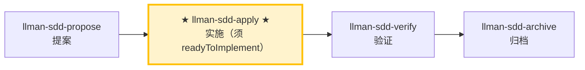

# LLMAN SDD Apply

使用此 skill 在**一个闭环内**按顺序完成 `llmanspec/changes/<id>/tasks.md` 的所有任务：
实现代码 → 补测试/验收 → 跑门禁 → 失败自修复并重跑 → 全部通过后报告结果。
除非遇到明确 blocker，否则**不要中途停下来问「要不要继续」**。

## Pipeline 位置

{{ unit("skills/git-native-flow-brief") }}

### Skill 导航（非生命周期；仅指示当前 skill）

> 📍 你现在在完整 Git-native 生命周期图中的 **H（apply）**：进入前须 Specs-landed（或 `needs_specs_change: false`）且 `readyToImplement=true` → 下一步 `llman-sdd-verify`

## 硬约束

- **SSOT 驱动**：以 `proposal.md` / `design.md` / `tasks.md` 及 feature 分支上的 live `llmanspec/specs/**` 为唯一事实来源；specs 中的 MUST/SHALL 必须逐条落实。
- **范围锁定**：只实现当前 change 的范围；禁止顺手修「无关问题」。
- **最小改动**：改动保持最小并严格围绕当前 tasks。
- **禁止猜测**：需求不明确、specs 与实现矛盾时，先 STOP 并报告，不要自行假定行为。
- **不保留旧兼容层**：若 change 要求改行为，直接全量升级到新写法，除非 tasks/proposal 明确写了要兼容。
- **不要问「要不要继续」**：除非遇到无法自动解决的 blocker，否则一路执行到闭环结束。
- **收尾**：本 skill 闭环以建议 `llman-sdd-verify` 结束；finalize/archive 由 `llman-sdd-archive` 负责（勿在自修复循环里 finalize）。

## Commit 策略

- **change 分支上提交自由**（无存档点概念：`change finalize` 不要求干净树）：可按 task/里程碑分段提交（利于 review），也可保持工作区不提交、交给 finalize 一次收尾——两条路都是一等公民。`change checkpoint` 已不存在（调用它以非零退出报错并指向 finalize），因此没有「中途存档点」要维护；`change finalize` 对两种形态都原生支持（不要求干净树）。
- **默认收尾**：全部 task 过门禁且 verify 全绿后，`llman-sdd change finalize <id>` 自动提交 `archive(sdd): <change-id>`（未提交的实现 diff + frontmatter + archive 改名一次提交）。不要在 apply 循环内 finalize。`--no-commit` 可跳过自动提交（手动/CI 历史、pre-commit hook 冲突场景）。
- **blocker 中断**：必须因 blocker STOP 时，先做**一次** WIP commit（如 `wip(sdd): <change-id> <摘要>`）保全现场，再报告。

## 步骤

### 0) Preflight（必须做）
- 读取并遵守：`llmanspec/config.yaml`、`AGENTS.md`（若存在）。
- `git status --porcelain`：
  - 若工作区不干净且改动不属于当前 change：先 `git stash push -u -m "llman-sdd-apply autopilot backup"` 做备份。
- 运行 `llman-sdd validate --all --strict --no-interactive`：
  - 若失败且与当前 change 无关，先停下报告（工件不一致会导致实现无法以 SSOT 驱动）。
- **检查 spec valid_scope 完整性**：使用 `llman-sdd list --specs --json` 列出所有 spec，然后对每个 spec 验证其 `valid_scope` 中的每个路径是否存在于磁盘上。若存在缺失的文件/目录，停下并建议更新 spec（从 `valid_scope` 中移除已删除的路径）。

### 1) 选择变更 id 并检查前置条件
- 若已提供 change id，直接使用。
- 否则从上下文推断；若不明确，运行 `llman-sdd list --json` 并让用户选择。
- 始终说明："使用变更：<id>"，并告知如何覆盖。
- 确认已在经 `llman-sdd change start <id>` 或 `change attach <id>` 绑定的非默认 feature 分支上（仅在需要重绑时用 `--force`）。分支上的 specs/features 即 SSOT——不要在 `changes/<id>/specs/` 下编写。
{{ unit("skills/stage-guard") }}
- 使用 `llman-sdd context --task "<proposal 中的目标>" --paths "<specs 中的 scope>"` 获取相关 specs。
  - 若 context 不可用，运行 `llman-sdd index rebuild` 后重试。

### 2) 阅读 SSOT 工件
必须通读以下文件：
- `llmanspec/changes/<id>/proposal.md`
- `llmanspec/changes/<id>/design.md`（如存在）
- `llmanspec/changes/<id>/tasks.md`
- feature 分支上的 live specs：`llmanspec/specs/**`（`<capability>.feature`）——这是 SSOT

将 `proposal.md` 和 `design.md` 中的决策整理为不可违反的硬约束清单。把 `tasks.md` 转成可执行的最小步骤序列（保持原顺序）。

### 3) 展示状态
- 进度："N/M tasks complete"
- 接下来 1–3 个未完成任务（简短概览）

### 4) 逐任务实施（闭环执行）
对每个未完成 task：
1. **实现**：严格按 task 描述 + specs 要求，改动保持最小。
2. **完成后立刻更新 checkbox**：`- [ ]` → `- [x]`。
3. 若 task 不明确、遇到 blocker、或发现 specs/design 与现实不一致 → STOP 并报告 blocker，不要自行假定。

> 💡 上一阶段 `llman-sdd-propose`（已生成 tasks）；完成本阶段后 → `llman-sdd-verify`（验证）

### 5) 验证与自修复循环（每个 task 或每批 task 完成后执行一次）
运行项目门禁命令（根据项目实际选择）：
- 相关测试集：`just test` 或 `cargo test --all`
- 格式/lint：`just check` 或 `just lint` + `just fmt`
- Git-native：留在绑定 feature 分支；按需编辑 live `llmanspec/specs/<capability>.feature`（扁平，或目录 `llmanspec/specs/<capability>/` 内主文件；规则 `@human`，验收 `@executable`）；spec 改动后跑 `llman-sdd validate --specs`；分支上可自由提交（分段，或留脏交给 finalize）。勿使用 `change delta` / solidify / feature_delta；`change checkpoint` 已移除。
- SDD 校验：`llman-sdd validate <id> --strict --no-interactive`

**若失败 → 进入自修复循环（不要问要不要继续）：**
1. 解析失败原因（测试失败 / lint / 格式 / 校验错误）。
2. **判定是否难定位的 bug**（测试失败原因不明 / 间歇性 flake / 回归且一眼看不穿）：
   - **不是难定位的 bug**（明确的 lint/格式/编译错误/校验失败）：进行最小修复（不扩大范围），先重跑「最小失败复现命令」再重跑全部门禁。
   - **难定位的 bug → 升级诊断子流程**：
     1. **先建一个能复现失败的命令**（快、确定、agent 可运行，且能在这个 bug 上失败）——即一个能驱动真实 bug 路径并断言用户确切症状的命令。**MUST NOT 在没有这种命令前就开始猜原因**（盯着代码空想正是本流程要防止的失败）。
     2. 运行并确认失败 → 最小化复现（逐个剔除输入/调用/配置/数据，只留关键部分）。
     3. 生成 **3–5 个排序假设**，每个须可证伪（「若 X 是因，则改 Y 会让 bug 消失」）。
     4. 单变量验证（一次只改一个），找到根因后修复。
     5. 若没有合适的边界（seam）写回归测试，记录该架构缺口（交 `llman-sdd-arch-review`；该 skill 未在 `extra_skills` 启用时，把缺口写入该 change 的 `proposal.md` Further Notes 段或 `design.md`，MUST NOT 因此中断闭环）。
3. 先重跑「最小失败复现命令」，再重跑全部门禁。
4. 记录为一轮自修复：`Round N：失败点 → 修复 → 重跑 → 通过/失败`。

**自修复上限 8 轮**；超过仍不通过视为 blocker：停止并输出 blocker 报告（含最后一次失败命令与输出摘要、你已尝试的修复）。

**人审检查点（每个 task 批次门禁通过后）**：批次全绿后、进入下一批次或输出完成报告前，运行 `llman-sdd review`：

- 退出码为零 → 继续。
- 非零退出 = 存在 CRITICAL 发现：STOP，修复后重跑 review；MUST NOT 带着 CRITICAL 进入下一批次或输出完成报告。

### 6) 完成报告
所有 task 完成 + 全部门禁通过后，输出结构化报告（见下方 Output Contract）。
然后建议运行 `llman-sdd-verify` 进入验证阶段。

> 💡 实施完成 → 下一步 `llman-sdd-verify`（验证）

> 命令细节用 `llman-sdd <cmd> --help` 查看；命令参考以 CLI 为准，skill 不内嵌命令表。
> 文中「规约」= 本项目 `llmanspec/specs/` 下的 `.feature` 文件；用 `llman-sdd list --specs` / `llman-sdd show <capability>` 查全文。

{{ unit("skills/validation-hints") }}

{{ unit("skills/structured-protocol") }}
