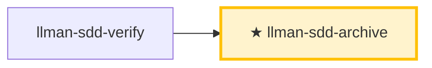

# LLMAN SDD 归档

归档已完成的变更。前置：verify 全绿，且 change 已绑定分支、specs 已落地（或 `needs_specs_change: false`）。`change finalize` **自动合并**到基准分支（目标：`--into` > 绑定 `base_branch` > 默认分支；方式：`--method` > 配置 `sdd.merge_method`，默认 squash——feature diff + 改名收敛为目标分支单个 commit）、**改名** change 文档到 `changes/archive/`、**自动提交** `archive(sdd): <change-id>`（`--no-commit` 跳过）。`git push` / PR 仅可选。

## Pipeline 位置



> 📍 你在归档阶段：分支生命周期最后一站。specs 膨胀时可跑 `llman-sdd-specs-compact`。

## 硬约束

- **必须先 verify 全绿**；**须已绑定分支**（`change start` / `attach`），无绑定 STOP。
- 每个 change 归档前必须通过 `llman-sdd validate <id> --strict`。
- **不要问「要不要继续」**：批量归档一路执行到底，除非遇到无法自动解决的错误。
- **收尾不默认导向 PR/push**：CLI 本地合并（默认 squash）+ 一次性收口提交。push / PR 仅在用户或项目明确要求远程审查时做——**Agent MUST NOT** 默认 push 或建 PR。

## 步骤

### 0) Preflight
- `git status --porcelain`：确认工作区改动属于已完成的 change；有未预期改动先处理（stash 或报告）。

### 1) 确认目标
- 确定 ID（单个或批量，来自用户输入或 `llman-sdd list --json`），始终说明「归档 IDs：<id1>, <id2>, ...」，并确认每个 change 都已 verify 全绿。

### 2) 逐个归档
- **人审关卡（每个 id 归档前，含批量）**：跑 `llman-sdd review`（无旗标；`--capability` 只接受 spec id）。退出码零 → 继续；非零 = CRITICAL → STOP 修复后重跑；MUST NOT 带 CRITICAL 归档。
- 先校验：`llman-sdd validate <id> --strict`；失败 → STOP 报告，禁止跳过强行归档。
- 可选预览：`llman-sdd change archive <id> --dry-run`。
- 执行：`llman-sdd change archive <id>`；**任一失败立即停止**，报告剩余 ID。
- **分支收尾**：
  - 前置：已绑定分支；仍在绑定分支上（或合并后已在目标分支）。
  - `change archive` / `change finalize` **先自动合并**（目标 `--into` > `base_branch` > 默认分支；方式默认 squash 或 `ff`；目标被其他 worktree 持有时在该 worktree 内原地执行，输出标注 `executed in target worktree <path>`；该 worktree 脏时中止报错并列出处置选项，零写入），**再**改名到 `changes/archive/`——合并失败不回滚改名，降级提示显式可见。
  - **默认 `change finalize`（单命令收口）**——门禁 → 合并 → 改名 → **自动提交** `archive(sdd): <change-id>`（无需手动 `git commit`；锁定规则改动为报告制 WARNING，只警告不阻断）：
    ```text
    1. 实现 specs + 代码（工作区可保持脏；分支上提交自由）
    2. llman-sdd change finalize <id>    # 门禁 + 合并（默认 squash）+ 改名 + 自动提交
    3. 可选：git commit --amend 调整说明；git branch -D <feature>  # squash 后分支不再是祖先，-d 会被拒
    ```
    `--no-commit` 跳过自动提交（CI / pre-commit hook 冲突）：finalize 留脏工作区并打印手动提交命令。幂等重试：自动提交失败后重跑会识别已归档改名并补提交。
  - **Fallback：`change archive <id>`**——与 finalize 同样的自动合并 + 改名 + 收口提交（此路无 `--no-commit`）；门禁：task 全勾 + 干净树 + 在绑定非默认分支（`--force` 跳过）。快照审查用 `change diff`。

### 3) 全量校验
- 全部归档后 `llman-sdd validate --all --strict`，确认 specs 工件一致。

### 4) Commit 引导
- finalize 已自动提交；`--no-commit` 时手动：`git add -A && git commit -m "archive(sdd): <id1>, <id2>"`。
- 可选：合并后 `git branch -D <feature>`。push / PR 仅在明确要求时做。
- **破坏性合约变更**（移除/重命名 frontmatter 字段、命令、tag 或 stage 值域）MUST 提供 `migrations/v<from>-v<to>/` 升级路径（README + 一次性脚本随仓库发布）——收口前确认存在。
- **archived `depends_on`**：archive 把 change 目录改名为 `archive/YYYY-MM-DD-<id>`；validate 把指向 archived/frozen id 的 `depends_on` 识别为 INFO（非 ERROR），**无需**手动更新其它 change 的 frontmatter。

{{ unit("workflow/archive-freeze-guidance") }}

{{ unit("skills/cli-footer") }}

{{ unit("skills/validation-hints") }}

{{ unit("skills/structured-protocol") }}
