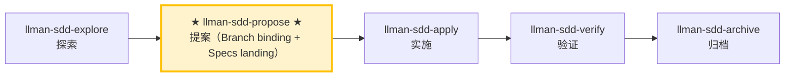

# LLMAN SDD Propose

创建一个带规划工件的新 change（proposal + tasks；design 可选），**先** `change start`（或 `attach`）完成 Branch binding，**然后**在绑定分支上编辑 live `llmanspec/specs/<capability>.feature`（扁平，或目录主文件）（Specs landing）、校验，并建议下一步。

## Pipeline 位置

{{ unit("skills/git-native-flow") }}
{{ unit("skills/human-readable-summary") }}

### Skill 导航（非生命周期；仅指示当前 skill）



> 📍 你现在在 propose 阶段：上方 Git-native 路径为 **规划壳（draft → designed → planned）→ Branch binding → Specs landing**（至 specs-landed 门通过）→ 下一步：`llman-sdd-apply`
> 📎 小改动（不改行为合约）请走 `llman-sdd-quick`（快速路径）

## 硬约束

- **change id 非阻塞**：用户已给出 id 则直接采用；否则从任务描述推导一个合法 kebab-case id（动词前缀开头，通过 CLI 的 id 合法性检查，并遵循 `llmanspec/AGENTS.md` 声明的命名约定），宣布所用 id 与覆盖方式后继续，MUST NOT 等待确认——Branch binding 前更换 id 成本很低。仅当用户想先记 idea（草案、无需 id）时转 `llman-sdd-draft`。
- **Live specs 是 SSOT**：只在 Branch binding **之后**、在**绑定的非默认分支**上编辑 `llmanspec/specs/**`（Specs landing）。**不要**在默认分支上改 live specs；**不要**在 `changes/<id>/specs/` 下撰写或使用 `change delta`（已移除）。规划壳可以短暂留在默认分支。
- **不要问「要不要继续」**：一口气执行完整 propose 阶段，生成工件并校验。

- **change 已存在**：STOP。若 specs-landed 门已绿，建议 `llman-sdd-apply`；否则用 `llman-sdd-continue` 补完 Branch binding / Specs landing 或规划壳。

- **change 已存在**：STOP。若 specs-landed 门已绿，建议 `llman-sdd-apply`；否则补完规划壳 / Branch binding / Specs landing（编辑 `llmanspec/changes/<id>/`，或在配置启用 `extra_skills: [llman-sdd-continue]`）。

- **frontmatter 有固定 schema**：充实 `proposal.md` 时只接受 `llmanspec/AGENTS.md`「Change Proposal Frontmatter SSOT」中的合法字段（含 `depends_on`、`blocks`、`branch`、`base_sha`、`needs_specs_change`）。`status`/`title`/`priority`/`author` 等会被 `llman-sdd validate` 报 ERROR 拒绝；生命周期阶段是推断量（用 `llman-sdd show`/`list` 查询），绝不写进 frontmatter。正文 MUST NOT 复读 frontmatter 字段；正文 H1 是人类可读标题，不是 change id 的复读。

## 快速记录分流

若用户只是想**记一个 idea**（如「draft 一个提案」「记下 X」「之后要做 Y」）而不需要完整规划，转 `llman-sdd-draft` skill——它经 `change new --from` 创建仅含 `proposal.md` 的草案壳（不问 id、无 tasks/specs/attach）。完整 propose（triage + tasks → `change start`/`attach` → Specs landing）从这里开始。

## 步骤

### 0) 预检
- 读 `llmanspec/config.yaml` 获取项目上下文、规则、locale。
- `llman-sdd validate --all --strict --no-interactive`：确认现有工件干净。
  - 若已有错误，STOP 并报告（在脏工件上叠新 change 会造成级联错误）。
- **检查 spec valid_scope 完整性**：用 `llman-sdd list --specs --json` 列出全部 specs，逐个核对其 `valid_scope` 中的路径在磁盘上是否存在。任何 scope 文件/目录缺失时，STOP 并建议更新该 spec（从 `valid_scope` 移除已删除的路径）。

### 1) 评估 change 规模（triage）
1. 判定类型：
   - **行为合约变更**（修改 MUST/SHALL、改变外部行为）→ 完整 SDD 工作流
   - **实现层变更**（重构、typo、性能）→ 走 `llman-sdd-quick` 快速路径
   - **元规范变更**（SDD 模板/流程）→ 完整 SDD 工作流
   - 不确定时选完整 SDD（保守）。
2. 用 `llman-sdd context --task "<目标>" --paths "<范围>"` 找相关 specs。
   - context 不可用时，先跑 `llman-sdd index check`：stale/缺失 → `llman-sdd index rebuild`（默认 `pageindex`，无需模型）后重试；index 已 fresh 仍不可用（`LLMAN_SDD_INDEX_CHAT_MODEL` 未设）→ 回退 `llman-sdd list --specs` + 直读 `.feature` 文件——不要循环 rebuild。
3. 收集输入：
   - 一段简短的变更描述
   - 一个 change id（用户给出则用之；否则按上面的非阻塞规则推导并宣布）
   - 受影响的 capability（用于命名 `specs/<capability>`）

### 2) 确认项目已初始化
   - `llmanspec/` 必须存在；若缺失，让用户运行 `llman-sdd init`，然后 STOP。

### 3) 创建 change 目录与工件
   - 优先用 `llman-sdd change new <change-id>` 生成 `proposal.md` 草案壳（或手动创建 `llmanspec/changes/<change-id>/`）。

   - change 已存在时，STOP 并建议 `llman-sdd-continue`。

   - change 已存在时，STOP 并建议补齐缺失工件或 `llman-sdd-apply`（可通过 `extra_skills` 启用 continue）。

   - 充实 `proposal.md`（Why / What Changes / Capabilities / Impact）
   - 仅当存在权衡/迁移时写 `design.md`
   - **写 tasks.md 前确认测试边界（seam，接缝）**：列出将要测试的 seam 并与用户确认。seam = 由 `*.feature` GWT 步骤驱动的公共边界（CLI 子进程或公共接口）——MUST 复用既有 harness seam，MUST NOT 脱离 `.feature` 凭空发明 seam。没有 `.feature` 时，seam = 被测的 CLI 子命令或公共函数边界。
   - `tasks.md`：按**垂直切片**拆分（每个 task 打穿 schema→API→UI→tests 一条窄而完整的路径，可独立验证），并带 `[blocked-by: <task-id>]` 依赖标记。**大范围重构例外**（一个机械改动扫全库、单点编辑牵动大量调用处）：按 expand-contract 排序（旧的旁边加新的 → 分批迁移调用处 → 删掉旧的），不强拆垂直切片。
   - **先** `llman-sdd change start <change-id>`（推荐；默认分支上工作树干净时；需保留当前检出用 `--worktree`，非默认分叉源用 `--base <branch>`）或手动建分支后 `change attach <change-id>` 到达 Full（bound）。
   - **然后**在绑定的非默认分支上编辑 live `llmanspec/specs/<capability>.feature`（扁平，或目录 `llmanspec/specs/<capability>/` 内主文件）并 commit（Specs landing）。**不要**在 start 之前改 live specs；**不要**为过干净树门禁把 live specs commit 到默认分支。已 attach 时勿重复 `start`（丢失 specs 时用 checkout/重建 + `attach --force` 恢复）。
   - 无 live 合约编辑的 change，设置 frontmatter `needs_specs_change: false`。`llman-sdd show <id> --output json` 显示 `stage=full` 且 specs-landed 门通过时进入 apply；`readyToImplement=true`（全门）是 verify/finalize 的完成信号门。
   - **破坏性合约变更**（移除/重命名字段、命令、tag 或 stage 值域）MUST 规划升级路径：`migrations/v<from>-v<to>/`（README prompt + 一次性脚本，随仓库发布）——写进提案的 What Changes。

### 4) 校验
   ```bash
   llman-sdd validate <change-id> --strict --no-interactive
   ```
   这一步 MUST 通过后才能继续；失败项以 validate 输出的 `items[].issues[]` 逐条指明，按条修复后重跑。

### 4a) 可选 BDD runner（`bdd:` 段）
- 读 `llmanspec/config.yaml`。是否含 `bdd:` 段？
  - **有**：`bdd.run_command` 声明项目的 BDD 执行入口，由项目测试套件（如 qa）承载；validate 不执行 harness（`--check`/`--no-check` 为 v1 兼容 no-op）。撰写仍按 4b 执行。
  - **无**：若本次 change 涉及可执行行为场景（用户会想运行的 Given/When/Then），**一次性、前置**询问：「本次变更看起来有可执行行为。要启用 `bdd:` runner 段以便把场景作为 `.feature` 校验吗？（会向 `config.yaml` 加一个 `bdd:` 段——仅 runner，不改变生命周期。）」
    - **是**：展示要添加的精确 `bdd:` 段（`run_command` 选匹配项目测试框架的——rstest-bdd 用 `cargo test --features bdd`，pytest-bdd 用 `pytest {feature_dir} -k {feature_name} -v`）。让用户确认或修改后写入 `config.yaml`，再按 4b 规则继续。
    - **否**：feature 仍做结构校验；BDD 执行责任始终在项目测试套件。
- **MUST NOT 静默添加 `bdd:` 段**——总是先询问。添加它会向全项目声明 BDD 执行入口（由项目测试套件承载；validate 自身不执行 harness）。

### 4b) 单轨 feature 撰写
- 规划壳（proposal/design/tasks）可短暂留在默认分支；**不要**在默认分支上编辑 live `llmanspec/specs/**`。Branch binding 之后，Specs landing 与实现都发生在绑定分支上。
- **单轨**：每个 capability 只有一个 `<capability>.feature`。约束规则是 `@req:<id> @human` 场景（statement 全文放描述）；可执行验收场景带 `@executable` 并用 `@req:<req_id>` 挂回规则。绝不把场景嵌进 `Rule:` 块（runner 会静默跳过其中场景）。
- **结构化新增首选**：向既有 capability 追加规则/验收，优先用 `llman-sdd spec next-req-id`（全局 rN 分配）+ `spec add-req` / `spec add-scenario`（配对 tag 语法内建；写入路径自动解析扁平/目录布局）。新建 capability 用 `spec skeleton <capability>`；rN 反查用 `spec resolve-req <rN>`。手改 `.feature` 保留为逃生门（适合改既有条款）。
- **@human/@executable 分流判据**（撰写新条款前先判定）：凡 GWT（假如/当/那么）可表达的自动化判定行为，MUST 落成 `@executable` 验收场景并挂回对应规则——纯文字规则无法守护行为；`@human` 仅用于无法自动化判定的人工约束（流程裁决、审美、外部事实）。新增 `@human` 条款若无可配对的 `@executable` 验收，MUST 在 proposal/design 记录不可执行理由。
- change 壳：`llman-sdd change new <change-id>` → 填 proposal/design/tasks → `llman-sdd change start <change-id>`（或 `change attach`）→ **然后**在绑定分支编辑 live specs 并 commit（Specs landing）。
- **不要**使用 `change delta` / solidify / `*.feature.delta.toon`。

### 5) 总结并建议下一步
   - 进入实现阶段：`llman-sdd-apply`。
   - 需要再想清楚：`llman-sdd-explore`。

> 💡 提案完成 → 下一步：`llman-sdd-apply`（实施）

> 命令细节用 `llman-sdd <cmd> --help` 查看；命令参考以 CLI 为准，skill 不内嵌命令表。
> 文中「规约」= 本项目 `llmanspec/specs/` 下的 `.feature` 文件；用 `llman-sdd list --specs` / `llman-sdd show <capability>` 查全文。
{{ unit("skills/validation-hints") }}

{{ unit("skills/structured-protocol") }}
