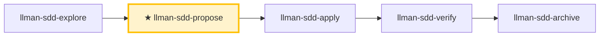

# LLMAN SDD Propose

创建带规划文档的新 change（proposal + tasks；design 可选）：**先** `change start`（或 `attach`）绑定分支，**再**在绑定分支编辑 `llmanspec/specs/<capability>.feature`（扁平，或目录主文件）落地 specs、校验，并建议下一步。

## Pipeline 位置

{{ unit("skills/git-native-flow") }}
{{ unit("skills/human-readable-summary") }}


```mermaid
flowchart LR
    explore["llman-sdd-explore"] --> propose["★ llman-sdd-propose"]
    propose --> apply["llman-sdd-apply"]
    apply --> verify["llman-sdd-verify"]
    verify --> archive["llman-sdd-archive"]

    style propose fill:#fff3cd,stroke:#ffc107,stroke-width:3px
```

> 📍 你在 propose 阶段：规划文档（draft → designed → planned）→ 绑定分支 → 落地 specs（至 specs-landed 门通过）→ 下一步 `llman-sdd-apply`。小改动走 `llman-sdd-quick`。

## 硬约束

- **change id 非阻塞**：用户给了就用；否则从任务描述推导合法 kebab-case id（动词前缀，过 CLI id 检查，遵循 `llmanspec/AGENTS.md` 命名约定），宣布所用 id 与覆盖方式后继续，MUST NOT 等确认——绑定分支前换 id 成本很低。只想先记 idea（不要 id）时转 `llman-sdd-draft`。
- **specs 是唯一事实来源**：只在绑定分支**之后**、在**绑定的非默认分支**上编辑 `llmanspec/specs/**`。**不要**在默认分支改 specs。规划文档可短暂留在默认分支。
- **不要问「要不要继续」**：一口气执行完 propose，生成工件并校验。

- **change 已存在**：STOP。specs-landed 门已绿 → 建议 `llman-sdd-apply`；否则用 `llman-sdd-continue` 补绑定分支 / 落地 specs 或规划文档。

- **change 已存在**：STOP。specs-landed 门已绿 → 建议 `llman-sdd-apply`；否则补规划文档 / 绑定分支 / 落地 specs（编辑 `llmanspec/changes/<id>/`，或配置 `extra_skills: [llman-sdd-continue]`）。

- **frontmatter 有固定 schema**：`proposal.md` 只接受 `llmanspec/AGENTS.md`「Change Proposal Frontmatter SSOT」的合法字段（`depends_on`、`blocks`、`branch`、`base_sha`、`needs_specs_change` 等）；`status`/`title`/`priority`/`author` 会被 `llman-sdd validate` 报 ERROR。生命周期阶段是推断量（用 `llman-sdd show`/`list` 查），绝不写进 frontmatter。正文 MUST NOT 复读 frontmatter 字段；H1 用人类可读标题，不复读 change id。

## 快速记录分流

只想**记一个 idea**（「draft 一个提案」「记下 X」「之后要做 Y」）→ `llman-sdd-draft`：经 `change new --from` 建仅含 `proposal.md` 的草案（不问 id、无 tasks/specs/attach）。完整 propose 从这里开始。

## 步骤

### 0) 预检
- 读 `llmanspec/config.yaml` 获取项目上下文、规则、locale。
- `llman-sdd validate --all --strict` 确认现有工件干净；有错误则 STOP 并报告（脏工件上叠新 change 会级联出错）。
- **检查 spec valid_scope 完整性**：`llman-sdd list --specs --json` 列出全部 specs，逐个核对 `valid_scope` 路径在磁盘上存在；有缺失则 STOP 并建议更新该 spec（移除已删路径）。

### 1) 判断变更规模
1. 分类：
   - **行为合约变更**（改 MUST/SHALL、改外部行为）→ 完整 SDD
   - **实现层变更**（重构、typo、性能）→ `llman-sdd-quick`
   - **元规范变更**（SDD 模板/流程）→ 完整 SDD
   - 不确定选完整 SDD（保守）。
2. 用 `llman-sdd context --task "<目标>" --paths "<范围>"` 找相关 specs。
   - context 不可用 → 先 `llman-sdd index check`：stale/缺失则 `llman-sdd index rebuild`（默认 pageindex，免模型）后重试；fresh 仍不可用（`LLMAN_SDD_INDEX_CHAT_MODEL` 未设）→ 改用 `llman-sdd list --specs` + 直读 `.feature`——勿循环 rebuild。
3. 收集输入：简短变更描述；change id（用户给了就用，否则按非阻塞规则推导并宣布）；受影响 capability（命名 `specs/<capability>`）。

### 2) 确认项目已初始化
- `llmanspec/` 必须存在；缺失则让用户跑 `llman-sdd init`，然后 STOP。

### 3) 创建 change 目录与工件
- 优先 `llman-sdd change new <change-id>` 生成 `proposal.md` 草案（或手动建 `llmanspec/changes/<change-id>/`）。

- change 已存在时 STOP 并建议 `llman-sdd-continue`。

- change 已存在时 STOP 并建议补齐缺失工件或 `llman-sdd-apply`（可经 `extra_skills` 启用 continue）。

- 充实 `proposal.md`（Why / What Changes / Capabilities / Impact）；仅当有权衡/迁移时写 `design.md`。
- **写 tasks.md 前确认测试边界（seam）**：列出要测的 seam 并与用户确认。seam = 由 `*.feature` GWT 步骤驱动的公共边界（CLI 子进程或公共接口）——MUST 复用既有 harness seam，MUST NOT 脱离 `.feature` 凭空发明；没有 `.feature` 时，seam = 被测的 CLI 子命令或公共函数边界。
- `tasks.md` 按**垂直切片**拆（每个 task 打穿 schema→API→UI→tests 一条窄而完整的路径，可独立验证），带 `[blocked-by: <task-id>]` 依赖标记。**大范围重构例外**（一个机械改动扫全库、单点编辑牵动大量调用处）：按先加后删排序（新的加在旧的旁边 → 分批迁移调用处 → 删旧的），不强拆垂直切片。**tasks.md 只列实现与验证任务**：收口（`change finalize` / `change archive`）是流水线步骤，MUST NOT 列为任务——收口的任务门要求全部任务已勾，列了必然自相矛盾（勾选即虚报、不勾则收口被拒，实施期 `validate --strict` 永红）。前后对比类完成判据（计数、基线）MUST 注明在 change 分支上测量（相对 merge-base）——默认分支测得的值通常恒为基线。
- **先** `llman-sdd change start <change-id>`（推荐；默认分支上工作树干净时；保留当前检出用 `--worktree`，非默认分叉源用 `--base <branch>`（仅本地分支））或手动建分支后 `change attach <change-id>`（attach 缺省按运行时信号推导分叉源，偏离默认分支时输出 WARNING）。
- **再**在绑定的非默认分支编辑 `llmanspec/specs/<capability>.feature`（扁平，或目录 `llmanspec/specs/<capability>/` 内主文件）并 commit（落地 specs）。**不要**在 start 前改 specs；**不要**为过干净树门禁把 specs commit 到默认分支。已 attach 勿重复 `start`（specs 丢失用 checkout/重建 + `attach --force` 恢复）。
- 无合约编辑的 change 设 frontmatter `needs_specs_change: false`。`llman-sdd show <id> --output json` 显示 `stage=full` 且 specs-landed 门通过即可进 apply；`readyToImplement=true`（全门）是 verify/finalize 的完成信号。
- **破坏性合约变更**（移除/重命名字段、命令、tag 或 stage 值域）MUST 规划升级路径：`migrations/v<from>-v<to>/` 下写 README（升级提示；一次性脚本可行时随仓库提供）——写进提案 What Changes。

### 4) 校验
```bash
llman-sdd validate <change-id> --strict
```
MUST 通过才能继续；失败项在 validate 输出的 `items[].issues[]` 逐条指明，按条修复后重跑。

### 4a) 可选 BDD runner（`specs:` 段）
- 读 `llmanspec/config.yaml` 是否含 `specs:` 段：
  - **有**：`specs.check_command` 是项目的 BDD 执行入口；validate 仅在显式 `--check` 时执行它（缺省跳过，仅结构/状态门）。撰写仍按 4b。
  - **无**：若本次 change 含可执行行为场景（用户会想运行的 Given/When/Then），**一次性前置**询问是否启用 `specs:` 验证 runner 段（会向 `config.yaml` 加一个 `specs:` 段——仅 runner，不改生命周期）。**是**：展示要加的精确 `specs:` 段（`check_command` 选匹配项目测试框架的——rstest-bdd 用 `cargo test --features bdd`，pytest-bdd 用 `pytest {feature_dir} -k {feature_name} -v`），用户确认或修改后写入 `config.yaml`，再按 4b 继续。**否**：feature 仍做结构校验；BDD 执行责任始终在项目测试套件。
- **MUST NOT 静默添加 `specs:` 段**——总是先问。添加它会向全项目声明 BDD 执行入口。

### 4b) 单轨 feature 撰写
- 规划文档可短暂留在默认分支；**不要**在默认分支编辑 `llmanspec/specs/**`。绑定分支后，落地 specs 与实现都在绑定分支上。
- **单轨**：每个 capability 只有一个 `<capability>.feature`。规范样式为原生 Gherkin 分层：`@req:<id>` 挂 `规则:` 块头，块内嵌套 `场景:`（假如/当/那么 步骤，绑定 runner 步骤代码并被执行——**默认首选形态**）；仅当需求无法程序化表达（抽象目标、架构决策、治理/人工约束）或暂不转写时，才留下无嵌套场景的 `规则:` 块（裸规则，描述自由文本）并在 proposal/design 记录理由。历史标签（@executable/@rule/@human/@manual）不再使用。
- **描述可读性**：`规则:` 描述较长时拆成多行便于审查（官方解析器按行保留）；描述行不加 `- ` 列表前缀（会原样进入描述），也不得以 `假如/当/那么/而且`（en `Given/When/Then/And/But`）开头——会被 Gherkin 解析为步骤。
- **结构化新增首选**：向既有 capability 追加规则/场景，优先 `llman-sdd spec next-req-id`（全局 rN 分配）+ `spec add-req`（追加 `规则:` 块）+ `spec add-scenario`（向规则块插入嵌套 `场景:`）。新建 capability 用 `spec skeleton <capability>`；rN 反查用 `spec resolve-req <rN>`。旧式标签文件先 `spec migrate-native`。手改 `.feature` 保留为逃生门（适合改既有条款）。
- **可执行场景优先判据**（写新条款前先判定）：凡 GWT（假如/当/那么）可表达、绑定步骤代码的自动化判定行为 MUST 落成嵌套 `场景:`——纯文字规则无行为守护。用例如下：行为可程序判定（如「当 运行 validate 后,那么 stdout 为 TOON 且退出码为 0」）→ 嵌套 `场景:`；抽象目标/架构决策暂不可程序判定 → 裸 `规则:` 块（无嵌套场景，聚合计数提示，交 specs-compact），并在 proposal/design 记录理由。

### 5) 总结并建议下一步
- 进入实现：`llman-sdd-apply`；需要再想清楚：`llman-sdd-explore`。

{{ unit("skills/cli-footer") }}
{{ unit("skills/validation-hints") }}

{{ unit("skills/structured-protocol") }}
