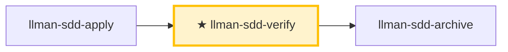

# LLMAN SDD Verify

验证实现是否与该 change 的工件一致。

## Pipeline 位置

> 📍 你在验证阶段 → 通过则 `llman-sdd-archive`，失败回 `llman-sdd-apply` 修复。对象应已落地 specs 且 `readyToImplement=true`（全门绿——完成信号）。

## 硬约束

- **必须先 apply 全绿**：未完成实现的 change 跳过验证。
- **CRITICAL 必须修复**：归档前清零。
- **亲自复跑门禁**：MUST 亲自重跑 `llman-sdd validate <id> --strict`（真实 harness）与项目门禁，MUST NOT 采信实现者报告的门禁结论；复跑结果与报告不符 → CRITICAL。
- **`--no-check` 不是证据**：以 `--no-check` 取得的门禁证据 → CRITICAL。收口会执行已配置的 `bdd.run_command`，收口前不必再跑一遍；`--no-check` 打出的跳过说明不是通过。
- **不要问「要不要继续」**：跑完整验证流程，输出完整报告。

{{ unit("skills/stage-guard") }}

## 步骤
1. 确定 change id（不明确时让用户从 `llman-sdd list --json` 选）。
2. 快速校验门禁：`llman-sdd validate <id> --strict`。
   - 诊断结构问题（Gherkin 解析 / `@req` 链接 / 双写 / req_id 唯一性）先跑结构校验（配置 `bdd.run_command` 时 validate 缺省执行该 harness，`--no-check` 跳过；harness 失败以 ERROR 落在对应 spec 条目）。失败项在缺省 TOON 输出的 `items[].issues[]` 逐条列出（`--output human` 输出 `FAIL <item_type>/<id>` 行，位于 `Totals` 上方）。
3. 阅读：分支上的 `llmanspec/specs/**`（`<capability>.feature`，唯一事实来源）、`proposal.md` 与 `design.md`（如有）、`tasks.md`；`changes/<id>/specs/` 若有残留旧文档可忽略。
4. **双轴审查（两轴分离，互不掩盖）**——对比 diff（`git diff <merge-base>...HEAD`，merge-base 现算 `git merge-base <本地默认分支> HEAD`；存储的 base_sha 仅审计、MUST NOT 参与范围计算）：
   - **合约轴**：实现是否满足 `@human` 规则的 MUST/SHALL 与 `@executable` 的 GWT？缺失/部分实现、错误实现、spec 未要求的超范围改动 → 给最小修复建议或建议更新工件。前后对比类证据（计数、基线）核对测量位置：MUST 在 change 分支上测量（相对现算 merge-base）；默认分支测得的值通常恒为基线，不构成证据。
   - **标准轴**：代码是否符合 `AGENTS.md` 规范 + 常见坏味清单。权威优先级：`AGENTS.md` > 坏味清单；工具已强制的跳过。坏味是**判断性提示**（「可能是 Feature Envy」），不是硬性违规：

     | 坏味 | 怎么修 |
     |------|--------|
     | Mysterious Name（名不达意） | 重命名 |
     | Duplicated Code（重复逻辑） | 抽取共享部分 |
     | Feature Envy（方法更爱用别人的数据） | 把方法移过去 |
     | Data Clumps（同组字段到处走） | 打包成类型 |
     | Primitive Obsession（原始类型充当领域概念） | 给专门类型 |
     | Repeated Switches（同类 switch 反复出现） | 多态或共享 map |
     | Shotgun Surgery（一处改动散落多处） | 聚到一个模块 |
     | Divergent Change（一个文件因多个无关原因被改） | 拆分 |
     | Speculative Generality（为未发生的需求加抽象） | 删掉 |
     | Message Chains（长链 a.b().c()） | 隐入一个方法 |
     | Middle Man（只转发） | 删掉直连 |
     | Refused Bequest（子类拒绝大部分继承） | 改组合 |
   - 两轴可并行（sub-agent）审查；报告 MUST 分离呈现，MUST NOT 合并或交叉重排（一轴通过不能掩盖另一轴失败）。
5. **BDD 验证**——仅当 `config.yaml` 含 `bdd:` 段：
   - 确认 change 已绑定分支且当前在该分支上。
   - `llman-sdd validate --specs`：Gherkin + `@req`/双写门禁；配置 `bdd.run_command` 时缺省执行该 harness（`--no-check` 跳过），失败映射为对应 spec 条目的 ERROR。
   - 可选只读审查：`llman-sdd change diff <id>`（或 `--export-patch <path>`）——仅审查/导出，绝不当作 apply 步骤。
   - verify 通过后下一步 `llman-sdd-archive`（勿在此 inline finalize）。

   - 额外要求: {{ bdd_verify_prompt }}

6. 输出简短报告：**CRITICAL**（归档前必须修复）/ **WARNING**（建议修复）/ **SUGGESTION**（可选优化）。
7. **人审关卡**：报告无 CRITICAL 后、建议归档前跑 `llman-sdd review`：退出码零 → 建议 `llman-sdd-archive`；非零 = CRITICAL → 用 `llman-sdd-apply` 修复后重跑 review；MUST NOT 带 CRITICAL 进入 finalize/archive。

{{ unit("skills/git-native-flow-brief") }}
{{ unit("skills/human-readable-summary") }}
{{ unit("skills/cli-footer") }}

{{ unit("skills/validation-hints") }}

{{ unit("skills/structured-protocol") }}
