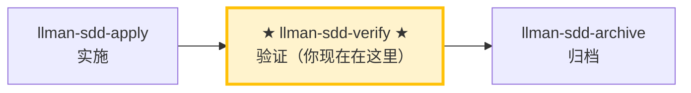

# LLMAN SDD Verify

使用此 skill 验证实现是否与该 change 的 artifacts 一致。

## Pipeline 位置

### Skill 导航（非生命周期；仅指示当前 skill）

> 📍 你现在在验证阶段 → 通过后下一步 `llman-sdd-archive`（归档）；失败则回到 `llman-sdd-apply`（修复）。对应 Git-native 图中的 **I（verify）**，对象应已 Specs-landed（`readyToImplement=true`）。
> 🗺️ Skill 导航 ≠ Git-native 生命周期；完整生命周期见底部 brief 单元。

## 硬约束

- **必须先通过 apply 阶段全绿**：未完成实现的 change 跳过验证。
- **CRITICAL 必须修复**：标记为 CRITICAL 的问题归档前必须修复。
- **不要问「要不要继续」**：跑完整个验证流程，输出完整报告。

{{ unit("skills/stage-guard") }}

## 步骤
1. 确定 change id（不明确时让用户从 `llman-sdd list --json` 选择）。
2. 先跑一个快速校验门禁：
   - `llman-sdd validate <id> --strict --no-interactive`
   - **诊断结构问题（Gherkin 解析 / `@req` 链接 / 双写 / 全局 req_id 唯一性）时优先加 `--no-check`**（BDD-on 下跳过可能耗时的 `bdd.run_command`），结构门禁全绿后再跑完整 `--check`（full mode）。`FAIL <item_type>/<id>` 行会逐条列出失败项（在 Totals 行上方）。
3. 阅读：
   - feature 分支上的 live specs：`llmanspec/specs/**`（`<capability>.feature`）——SSOT
   - `proposal.md` 与 `design.md`（如存在）
   - `tasks.md`（理解实现范围）
   - `llmanspec/changes/<id>/specs/` 若残留旧文档可忽略；SSOT 是 live specs
4. **双轴审查（标准轴 + 合约轴分离，互不掩盖）**——对比 diff（`git diff <merge-base>...HEAD`，merge-base 用现算 `git merge-base <本地默认分支> HEAD`；存储的 base_sha 仅作审计、MUST NOT 参与范围计算）分两轴：
   - **合约轴（Spec）**：实现是否满足 `@human` 规则的 MUST/SHALL 与 `@executable` 的 GWT。
     - 缺失/部分实现的行为、错误实现、以及 diff 中未被 spec 要求的超范围改动。
     - 给出最小修复建议，或建议更新 artifacts。
   - **标准轴（Standards）**：代码是否符合 `AGENTS.md` 的编码规范 + 常见代码坏味（code smell）清单。
     - **权威优先级**：`AGENTS.md` 文档规范 > 坏味清单（文档说了算）；工具已强制的项跳过。
     - 坏味标记为**判断性提示**（「可能是 Feature Envy」），不是硬性违规。
     - 坏味清单（每项「是什么 → 怎么修」）：

     | 坏味 | 怎么修 |
     |------|--------|
     | Mysterious Name（名不达意） | 重命名 |
     | Duplicated Code（重复逻辑） | 抽取共享部分 |
     | Feature Envy（方法更爱用别人的数据） | 把方法移过去 |
     | Data Clumps（同组字段到处走） | 打包成类型 |
     | Primitive Obsession（原始类型充当领域概念） | 给专门类型 |
     | Repeated Switches（同类 switch 反复出现） | 多态或共享 map |
     | Shotgun Surgery（一处改动散落多处） | 聚到一个模块 |
     | Divergent Change（一个文件因多个无关原因被改） | 拆分 |
     | Speculative Generality（为未发生的需求加抽象） | 删掉 |
     | Message Chains（长链 a.b().c()） | 隐入一个方法 |
     | Middle Man（只转发） | 删掉，直连 |
     | Refused Bequest（子类拒绝大部分继承） | 改组合 |
   - 两轴可并行（sub-agent）审查；报告 MUST 分离呈现，MUST NOT 合并或交叉重排（一轴通过不能掩盖另一轴失败）。
5. **BDD-on 验证（Git-native Partitioned SSOT）**——仅当 `config.yaml` 含 `bdd:` 段时：
   - 确认 change 已 attach，且当前在对应 feature 分支上。
   - `llman-sdd validate --specs`：Gherkin + `@req`/双写门禁；默认跑 `bdd.run_command`（可用 `--no-check` 跳过）。
   - 可选只读审查：`llman-sdd change diff <id>`（或 `--export-patch <path>`）。diff 仅作审查/导出——绝不当作 apply 步骤。
   - 检查：无遗留 `spec.toon` / `*.feature.delta.toon`；若存在，先跑 toon2features（不要自创 solidify/找补步骤）。
   - verify 通过后下一步：`llman-sdd-archive`（勿在此 inline finalize）。

   - 额外要求: {{ bdd_verify_prompt }}

6. 输出简短报告：
   - **CRITICAL**（归档前必须修复）
   - **WARNING**（建议修复）
   - **SUGGESTION**（可选优化）
7. **人审检查点**：报告无 CRITICAL 后、建议归档前，运行 `llman-sdd review`：
   - 退出码为零 → 建议 `llman-sdd-archive` 进行 finalize/archive。
   - 非零退出 = CRITICAL 发现：用 `llman-sdd-apply` 修复后重跑 review；MUST NOT 带着 CRITICAL 进入 finalize/archive。

> 💡 验证通过 → 下一步 `llman-sdd-archive`（归档）；有 CRITICAL → 回到 `llman-sdd-apply`（修复）

{{ unit("skills/git-native-flow-brief") }}
{{ unit("skills/human-readable-summary") }}
> 命令细节用 `llman-sdd <cmd> --help` 查看；命令参考以 CLI 为准，skill 不内嵌命令表。
> 文中「规约」= 本项目 `llmanspec/specs/` 下的 `.feature` 文件；用 `llman-sdd list --specs` / `llman-sdd show <capability>` 查全文。

{{ unit("skills/validation-hints") }}

{{ unit("skills/structured-protocol") }}
