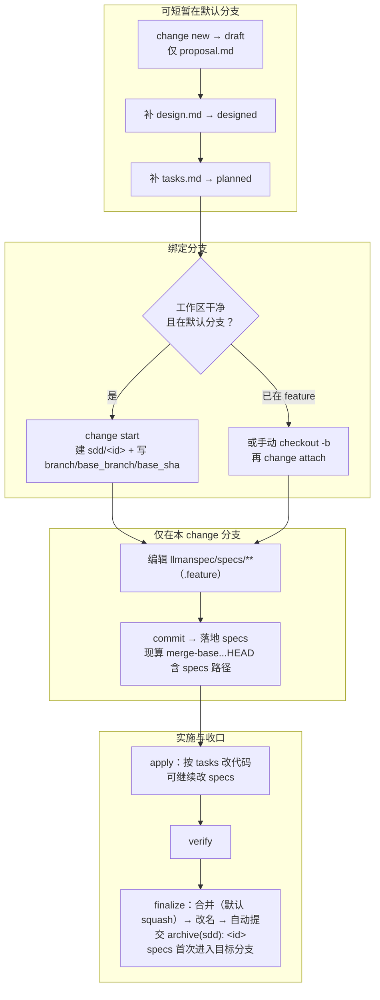

## Git 分支生命周期（权威全图）

两层别混：**分支生命周期**（绑定分支 → 落地 specs → `readyToImplement`）与 **skill 导航**（explore→propose→apply→verify→archive）。落地 specs **不是**独立 skill。

硬规则：
1. **先** `change start` / `attach` 绑定分支（进入 full）；**再**在绑定的非默认分支编辑 `llmanspec/specs/**` 并 commit（落地 specs）。
2. 无合约编辑的 change 设 frontmatter `needs_specs_change: false`。`stage=full` 且 specs-landed 门通过（specsLanded ∨ needs_specs_change=false）即可进 apply；`readyToImplement=true`（gateChecks 全过，含 tasks-done）是 verify/finalize 前的完成信号。diff 范围一律现算 merge-base；存储的 `base_sha` 仅审计。
3. 收口一律 `llman-sdd change finalize <id>`：自动提交 `archive(sdd): <id>`（实现 diff + 改名一笔）；`--no-commit` 跳过自动提交。change 分支上提交自由（分段或 finalize 一次收尾均可）。
4. **禁止**为过干净树门禁把 specs commit 到默认分支；已 attach 勿重复 `start`。

Worktree 决策表：

| 工作形态 | 命令 | 判据 |
|---|---|---|
| 单检出 | `llman-sdd change start <id>` | 在默认分支且树干净；直接切到新分支 |
| 保留当前检出 / 并行 change | `llman-sdd change start <id> --worktree` | 分支建于独立 worktree（`sdd.worktree_root` / `sdd.worktree_naming` 可调，缺省仓库根兄弟目录），当前检出不动，输出含 worktree 路径；配 `--base <branch>` 记录非默认分叉源 |
| 已在 feature 分支（含手工 wt/git-worktree） | `llman-sdd change attach <id>` | 分支已存在；`--base <branch>` 显式记录分叉源 |

finalize 目标定位：目标分支被其他 worktree 持有时，`llman-sdd change finalize <id>` / `llman-sdd change archive <id>` 自动在该 worktree 内完成合并、改名与提交（输出含 `executed in target worktree <path>`）；持有 worktree 脏时中止报错并列出处置选项（零写入）。
