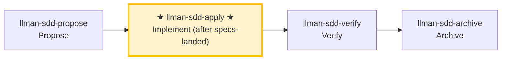

# LLMAN SDD Apply

Implement all tasks in `llmanspec/changes/<id>/tasks.md` **in one closed loop**:
Implement code → Add tests/acceptance → Run gates → Self-heal on failures → Report results when all pass.
Unless there is a clear blocker, **DO NOT stop halfway to ask "should I continue?"**

## Pipeline Position

## Git-native lifecycle (brief)

Do not conflate **skill navigation** with the **Git-native lifecycle**. Full diagram: root `AGENTS.md` or the diagram inside `llman-sdd-propose`.

Hard rules:
1. **First** Branch binding (`change start` / `attach`) → Full; **then** Specs landing (edit and commit `llmanspec/specs/**` on the bound branch).
2. No live contract edits → `needs_specs_change: false`. Enter apply when `stage=full` and the specs-landed gate passes; `readyToImplement=true` (all gates green) is the completion signal gating verify/finalize.
3. Close-out: `change finalize` (auto commit `archive(sdd): <id>`; `--no-commit` to skip).
4. **Do not** commit live specs on the default branch; if already attached, do not re-run `start`.
5. Worktree mode (optional): `change start --worktree` creates the branch in a dedicated worktree without hijacking the current checkout (`--base <branch>` records a non-default fork source); finalize runs in place when the target is held by another worktree (location annotated in output).

### Skill navigation (not the lifecycle; shows current skill only)



> 📍 You are at Git-native **H (apply)** in the full lifecycle diagram: specs-landed gate green (or `needs_specs_change: false`) required first; `readyToImplement=true` (all gates green) is the completion signal that closes this loop → next: `llman-sdd-verify`

## Hard Constraints

- **SSOT-driven**: `proposal.md` / `design.md` / `tasks.md` and live `llmanspec/specs/**` on the feature branch are the single source of truth; every MUST/SHALL in specs must be fulfilled.
- **Scope-locked**: Only implement what's in the current change; don't fix "unrelated issues" on the side.
- **Minimal changes**: Keep changes minimal and strictly scoped to current tasks.
- **No guessing**: If requirements are unclear, or specs contradict reality, STOP and report — don't assume behavior.
- **No legacy compatibility layers**: If a change requires new behavior, upgrade all call sites directly, unless tasks/proposal explicitly require compatibility.
- **Don't ask "should I continue?"**: Execute to loop closure unless you hit an unresolvable blocker.
- **Close-out**: this skill's closed loop ends by suggesting `llman-sdd-verify`; finalize/archive is handled by `llman-sdd-archive` (do not finalize inside the self-healing loop).

## Commit Policy

- **Commits on the change branch are free** (no mid-flight archive point; `change finalize` needs no clean tree): segment by task or milestone when it helps review, or keep the working tree dirty and let finalize make ONE close commit — both are first-class. So there is no mid-flight "archive point" to maintain; `change finalize` handles both shapes (it does NOT require a clean tree).
- **Default close-out**: after all tasks pass gates and verify is green, `llman-sdd change finalize <id>` auto-commits `archive(sdd): <change-id>` (uncommitted impl diff + frontmatter + archive rename in one commit). Do not run finalize inside the apply loop. `--no-commit` skips the auto commit (manual/CI histories; pre-commit-hook conflicts).
- **Blocker interrupt**: when you must STOP on a blocker, make ONE work-in-progress commit (e.g. `wip(sdd): <change-id> <summary>`) to preserve the state, then report.

## Steps

### 0) Preflight (required)
- Read and obey: `llmanspec/config.yaml`, `AGENTS.md` (if present).
- `git status --porcelain`:
  - If working tree is dirty and changes don't belong to the current change: `git stash push -u -m "llman-sdd-apply autopilot backup"`.
- Run `llman-sdd validate --all --strict`:
  - If it fails for reasons unrelated to the current change, stop and report (inconsistent artifacts prevent SSOT-driven implementation).
- **Check spec valid_scope integrity**: use `llman-sdd list --specs --json` to list all specs, then for each spec verify every path in its `valid_scope` exists on disk. If any scope file/directory is missing, stop and suggest updating the spec (remove the deleted path from `valid_scope`).

### 1) Select change id and check prerequisites
- If a change id is provided, use it directly.
- Otherwise infer from context; if ambiguous, run `llman-sdd list --json` and let user pick.
- Always announce: "Using change: <id>" and how to override.
- Confirm you are on the non-default feature branch bound via `llman-sdd change start <id>` or `change attach <id>` (`--force` only to rebind). Specs/features on the branch are SSOT — do not author under `changes/<id>/specs/`.
## Stage guard (`stage` / `readyToImplement`)

Decide from authoritative JSON (never from vague "complete artifacts" wording):

```bash
llman-sdd show <id> --output json --type change
```

Read: `stage`, `specsLanded`, `needsSpecsChange`, `readyToImplement`, `gateChecks` (per-item `pass` + one-line `hint` when failing).

| Condition | Action |
|-----------|--------|
| `stage=draft` (proposal.md only) | STOP. Grow to Designed (add design.md) → Planned (add tasks.md) → Branch binding → Specs landing. Draft cannot apply/verify. If proposal+tasks exist but stage is still `draft` (tasks-without-design — design.md gates the stage): add design.md first. **Do not** create `changes/<id>/specs/`; **do not** edit live specs on the default branch first. |
| `stage=designed` (proposal + design) | Next: add tasks.md → `planned`. Run `change start` / `attach` (Branch binding) only after planning artifacts are complete. |
| `stage=planned` (proposal + design + tasks) | STOP until binding: run `change start` / `attach` (Branch binding) → `full`. |
| `stage=full` and `readyToImplement=false` | Read the failing `gateChecks` items. specs-landed gate failing → finish Specs landing on the **bound branch** (edit `llmanspec/specs/**` and commit), or set `needs_specs_change: false`; **do not** re-run `change start` (lost bound-branch specs → checkout/recreate + `attach --force` if needed). specs-landed gate green but tasks-done/validate/clean-tree failing → normal mid-implementation state: proceed with apply (check off tasks); do not treat it as a landing failure. |
| `readyToImplement=true` | Completion signal: every gateChecks item green (tasks done + validate passed) — verify/finalize prerequisites met. `changes/<id>/specs/` is expected to be **absent** — do not treat as missing. |
- Use `llman-sdd context --task "<goal from proposal>" --paths "<scope from specs>"` to get relevant specs.
  - If context is unavailable, run `llman-sdd index check` first: stale/missing → `llman-sdd index rebuild` and retry; still unavailable on a fresh index (`LLMAN_SDD_INDEX_CHAT_MODEL` unset) → fall back to `llman-sdd list --specs` + reading `.feature` files directly — do not loop on rebuild.

### 2) Read SSOT artifacts
You must read through:
- `llmanspec/changes/<id>/proposal.md`
- `llmanspec/changes/<id>/design.md` (if present)
- `llmanspec/changes/<id>/tasks.md`
- Live specs on the feature branch: `llmanspec/specs/**` (`<capability>.feature`) — this is SSOT

Extract hard constraints from proposal.md and design.md decisions. Convert tasks.md into a minimal executable step sequence (preserving original order).

### 3) Show status
- Progress: "N/M tasks complete"
- Next 1–3 unchecked tasks (brief overview)

### 4) Implement tasks one by one (closed-loop execution)
For each unchecked task:
1. **Implement**: strictly per task description + specs requirements, keep changes minimal.
2. **Update checkbox immediately** after completion: `- [ ]` → `- [x]`. **Close-out is not a task**: `change finalize` / `change archive` are pipeline steps and MUST NOT appear in tasks.md — if one is listed (e.g. "close-out — finalize"), remove it from tasks.md (the finalize/archive task gate requires every task checked).
3. If task is unclear, you hit a blocker, or specs/design don't match reality → STOP and report the blocker, don't assume.

> 💡 Previous phase `llman-sdd-propose` (generated tasks); after this phase → `llman-sdd-verify` (verify)

### 5) Verification and self-healing loop (run after each task or batch)
Run project gate commands (adapt to the actual project):
- Relevant test suite: `just test` or `cargo test --all`
- Format/lint: `just check` or `just lint` + `just fmt`
- Git-native: stay on the bound feature branch; edit live `llmanspec/specs/<capability>.feature` (flat, or directory `llmanspec/specs/<capability>/` main file; rules `@human`, acceptance `@executable`) as needed; run `llman-sdd validate --specs` after spec edits; commit on the branch freely (segmented or leave dirty for finalize).
- SDD validation: `llman-sdd validate <id> --strict`

**On failure → enter self-healing loop (don't ask "should I continue?"):**
1. Parse failure cause (test failure / lint / format / validation error).
2. **Decide if it's a hard-to-locate bug** (cause unclear / intermittent flake / regression not obvious at a glance):
   - **Not hard-to-locate** (clear lint/format/compile/validation error): apply a minimum fix (don't expand scope); re-run the "minimum failure repro command" first, then re-run all gates.
   - **Hard-to-locate bug → escalate to the diagnose sub-flow**:
     1. **First build a command that reproduces the failure** (fast, deterministic, agent-runnable, and goes red on *this* bug) — one that drives the real bug path and asserts the user's exact symptom. **MUST NOT start hypothesizing before such a command exists** (staring at code and guessing is the failure this prevents).
     2. Run it, confirm red → minimize the repro (cut inputs/calls/config/data one at a time, keep only what's load-bearing).
     3. Generate **3–5 ranked hypotheses**, each falsifiable ("if X is the cause, changing Y makes the bug disappear").
     4. Verify one variable at a time; fix once the root cause is found.
     5. If there's no correct seam for a regression test, note the architectural gap (hand off to `llman-sdd-arch-review`; when that skill is not enabled via `extra_skills`, write the gap into this change's `proposal.md` Further Notes section or `design.md`, and MUST NOT break the loop over it).
3. Re-run the "minimum failure repro command" first, then re-run all gates.
4. Log as one self-healing round: `Round N: failure → fix → re-run → pass/fail`.

**Self-healing cap: 8 rounds**; exceeding this is a blocker: stop and output a blocker report (last failing command + output summary + what you tried).

**Human review gate (after each task batch passes the gates)**: once a batch is green, before starting the next batch or producing the completion report, run `llman-sdd review`:

- Exit code zero → continue.
- Non-zero exit = CRITICAL findings: STOP, fix, re-run review; MUST NOT enter the next batch or emit the completion report with CRITICAL findings open.

### 6) Completion report
After all tasks complete + all gates green, output a structured report (see Output Contract below).
Then suggest running `llman-sdd-verify` for the verification phase.

> 💡 Implementation done → next: `llman-sdd-verify` (verify)

> For command details run `llman-sdd <cmd> --help`; the CLI is the command reference — skills embed no command tables.
> "Spec" here = a `.feature` file under this project's `llmanspec/specs/`; run `llman-sdd list --specs` or `llman-sdd show <capability>`.

Validation fixes (single-track feature-as-spec):

1) Missing header comments (`missing `# capability:`` header comment`):
Every capability `.feature` (`llmanspec/specs/<capability>.feature` or `llmanspec/specs/<capability>/<capability>.feature`) MUST start with:
```
# language: zh-CN
# capability: <capability>
# purpose: One-line overview.
# scope: src/
```

2) Tag grammar (`@human constraint scenario must carry an @req:<req_id> tag` / `orphan acceptance scenario`):
- Rules: `@req:<id> @human` — statement in the scenario description (MUST/SHALL required).
- Acceptance: `@executable` + at least one `@req:<id>` linking a rule.
- Pairing: before adding an `@human` rule, run the triage — any GWT-expressible automated-verifiable behavior MUST get a paired `@executable` acceptance (prose-only rules guard nothing); `@human` is for non-automatable human judgment only; record the justification in proposal/design when no pairing is possible.
Never combine `@human` with `@executable`. (`@manual` was removed in 0.3.0 — drop it; `@human` already carries the human-judgement semantics.)

Git-native guardrail:
- **Branch binding** → **Specs landing**: first `change start` / `attach`, then edit live `.feature` files on the bound non-default branch and commit.
- Locked rules (report-only): editing/removing an existing `@human` scenario yields a WARNING and never blocks validate / change finalize / change diff; the report names the edited rule by `@req:<id>`. Control points: git branch diff plus `llman-sdd review` / `change diff` output. Legacy lock-ack metadata (frontmatter `rules_touched` / `agent_acked`, the `@agent` tag, the `--yes` ack semantics) is fully removed — no aliases, no compat layer (locked rules are report-only: a warning, never a block).
- Enter apply when `stage=full` and the specs-landed gate passes (specsLanded ∨ `needs_specs_change: false`); verify/finalize require `readyToImplement=true` (completion signal). Close-out prefers `change finalize`.

## Context
- Check state before acting: change/spec status comes from `llman-sdd show/list/validate` output.
- Locate relevant specs with `llman-sdd context --task --paths` before reading spec files.

## Goal
- Reach one verifiable outcome for this command; report result paths and validation state.

## Constraints
- Follow the hard rules in the skill body (not repeated here). Triage first: behavior-contract changes take the full SDD path, implementation-only changes take quick; when unsure choose full SDD.
- Keep changes minimal; never force past a known validation failure.

## Workflow
- Treat `llman-sdd` command output as the source of truth at every step; run `llman-sdd validate` after touching artifacts.
- Command details: the generated command reference below, or `llman-sdd <cmd> --help`.

## Decision Policy
- Clarify high-impact ambiguity before proceeding; verify facts yourself, ask the user only for decisions.

## Output Contract
- Human-readable summary first (conclusion / risks / decisions needed), machine detail after.

## Ethics Governance
- `ethics.risk_level`: low — reads/writes this repo and `llmanspec/` only, no outward-facing actions; a skill body may override.
- `ethics.prohibited_actions`: actions violating the skill body's hard rules; push / PR / external upload without an explicit user request.
- `ethics.required_evidence`: conclusions backed by command output or file paths; gate state per `llman-sdd validate`.
- `ethics.refusal_contract`: gate CRITICAL not cleared → refuse to advance; self-repair cap reached → report a blocker.
- `ethics.escalation_policy`: pause and ask the user before changing SDD contracts/templates or irreversible actions.
