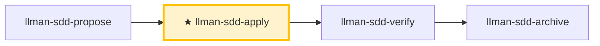

# LLMAN SDD Apply

Implement all tasks in `llmanspec/changes/<id>/tasks.md` **in one closed loop**: implement → add tests/acceptance → run gates → self-heal and re-run on failure → report when all pass. Unless there is a clear blocker, **do not stop halfway to ask "should I continue?"**

## Pipeline Position

## Branch lifecycle (brief)

**Skill navigation** ≠ **branch lifecycle**. Full diagram: root `AGENTS.md` or the one inside `llman-sdd-propose`.

Hard rules:
1. **First** bind the branch (`change start` / `attach`) → full; **then** land specs (edit and commit `llmanspec/specs/**` on the bound branch).
2. No contract edits → `needs_specs_change: false`. Enter apply when `stage=full` and the specs-landed gate passes; `readyToImplement=true` (all gates green) is the completion signal gating verify/finalize.
3. Close-out: `change finalize` (auto commit `archive(sdd): <id>`; `--no-commit` to skip).
4. **Do not** commit specs on the default branch; if already attached, do not re-run `start`.
5. Worktree (optional): `change start --worktree` creates the branch in a dedicated worktree without hijacking the current checkout (`--base <branch>` records a non-default fork source); finalize runs in place when the target is held by another worktree (location annotated in output).



> 📍 Entry requires the specs-landed gate green (or `needs_specs_change: false`); `readyToImplement=true` (all gates green) is the completion signal that closes this loop → next `llman-sdd-verify`.

## Hard Constraints

- **Single-source-of-truth driven**: `proposal.md` / `design.md` / `tasks.md` and `llmanspec/specs/**` on the branch; every MUST/SHALL in specs must be fulfilled.
- **Scope-locked**: only implement the current change's scope; never fix "unrelated issues" on the side; keep changes minimal.
- **No guessing**: unclear requirements or specs contradicting reality → STOP and report; don't assume.
- **No legacy compatibility layers**: if the change requires new behavior, upgrade all call sites directly, unless tasks/proposal explicitly require compatibility.
- **Close-out**: this loop ends by suggesting `llman-sdd-verify`; finalize/archive belongs to `llman-sdd-archive` (do not finalize inside the self-healing loop).

## Commit Policy

- **Commits on the change branch are free** (`change finalize` needs no clean tree): segment by task/milestone, or keep the tree dirty and let finalize make one close commit — both are first-class.
- **Default close-out**: after all tasks pass gates and verify is green, `llman-sdd change finalize <id>` auto-commits `archive(sdd): <change-id>` (uncommitted diff + frontmatter + rename in one commit). Do not run finalize inside the apply loop. `--no-commit` skips the auto commit (manual/CI histories; pre-commit-hook conflicts).
- **Blocker interrupt**: when you must STOP on a blocker, make ONE WIP commit (e.g. `wip(sdd): <change-id> <summary>`) to preserve the state, then report.

## Steps

### 0) Preflight (required)
- Read and obey `llmanspec/config.yaml`, `AGENTS.md` (if present).
- `git status --porcelain`: if the tree is dirty with changes not belonging to this change → `git stash push -u -m "llman-sdd-apply autopilot backup"` first.
- `llman-sdd validate --all --strict`: if it fails for reasons unrelated to this change → stop and report (inconsistent artifacts prevent source-of-truth-driven implementation).
- **Check spec valid_scope integrity**: `llman-sdd list --specs --json` lists all specs; for each, verify every `valid_scope` path exists on disk. On missing paths → stop and suggest updating the spec (remove the deleted path).

### 1) Select the change id and check prerequisites
- If provided, use it; otherwise infer from context, and if ambiguous run `llman-sdd list --json` and let the user pick. Always announce "Using change: <id>" and how to override.
- Confirm you are on the non-default branch bound via `llman-sdd change start <id>` or `change attach <id>` (`--force` only to rebind). Specs on the branch are the single source of truth — do not author under `changes/<id>/specs/`.
## Stage guard (`stage` / `readyToImplement`)

Decide from authoritative JSON (never from "artifacts look complete"):

```bash
llman-sdd show <id> --output json --type change
```

Read: `stage`, `specsLanded`, `needsSpecsChange`, `readyToImplement`, `gateChecks` (per-item `pass` + one-line `hint` when failing).

| Condition | Action |
|-----------|--------|
| `stage=draft` (proposal.md only) | STOP. Grow: add design.md → designed, add tasks.md → planned, then bind the branch and land specs. Draft cannot apply/verify. If proposal+tasks exist but stage is still `draft` (tasks-without-design — design.md gates the stage): add design.md first. **Do not** create `changes/<id>/specs/`; **do not** edit specs on the default branch first. |
| `stage=designed` (proposal + design) | Next: add tasks.md → `planned`. Bind (`change start` / `attach`) only after planning docs are complete. |
| `stage=planned` (proposal + design + tasks) | STOP until bound: `change start` / `attach` → `full`. |
| `stage=full` and `readyToImplement=false` | Read the failing `gateChecks` items. specs-landed gate failing → land specs on the **bound branch** (edit `llmanspec/specs/**` and commit), or set `needs_specs_change: false`; **do not** re-run `change start` (lost bound-branch specs → checkout/recreate + `attach --force` if needed). specs-landed gate green but tasks-done/validate/clean-tree failing → normal mid-implementation state: proceed with apply (check off tasks); do not treat it as a landing failure. |
| `readyToImplement=true` | Completion signal: every gateChecks item green (tasks done + validate passed) — verify/finalize prerequisites met. `changes/<id>/specs/` is expected to be **absent** — do not treat as missing. |
- Use `llman-sdd context --task "<goal from proposal>" --paths "<scope from specs>"` to get relevant specs.
  - Context unavailable → run `llman-sdd index check` first: stale/missing → `llman-sdd index rebuild` and retry; still unavailable on a fresh index (`LLMAN_SDD_INDEX_CHAT_MODEL` unset) → fall back to `llman-sdd list --specs` + reading `.feature` files directly — do not loop on rebuild.

### 2) Read the source-of-truth artifacts
- `llmanspec/changes/<id>/proposal.md`, `design.md` (if present), `tasks.md`
- `llmanspec/specs/**` (`<capability>.feature`) on the branch

Distill proposal/design decisions into a list of inviolable hard constraints; convert tasks.md into a minimal executable step sequence (preserving original order).

### 3) Show status
- Progress "N/M tasks complete" + a brief look at the next 1–3 unchecked tasks.

### 4) Implement tasks one by one (closed loop)
For each unchecked task:
1. **Implement**: strictly per task description + specs, minimal changes.
2. **Check the box immediately** after completion: `- [ ]` → `- [x]`. **Close-out is not a task**: `change finalize` / `change archive` are pipeline steps and MUST NOT appear in tasks.md — if one is listed (e.g. "close-out — finalize"), remove it (the close-out task gate requires every task checked).
3. **Edit, then verify — serially**: verification MUST run after edits land on disk; MUST NOT put edits and tests/validation in the same parallel tool-call batch (the check may read stale files and report a false failure or a false pass).
4. Task unclear, blocker hit, or specs/design contradict reality → STOP and report; don't assume.

### 5) Verification and self-healing loop (after each task or batch)
Run the project gates as appropriate:
- Test suite: `just test` or `cargo test --all`; format/lint: `just check` or `just lint` + `just fmt`
- Edit `llmanspec/specs/<capability>.feature` on the branch as needed (flat or directory main file; rules `@human`, acceptance `@executable`); run `llman-sdd validate --specs` after spec edits; commit on the branch freely.
- SDD validation: `llman-sdd validate <id> --strict`

**Gate evidence**:
- Close-out runs the configured `bdd.run_command`, so do not run that command again just before close-out; the skip line printed by `--no-check` is not a pass.
- Gate verdicts MUST come from the real harness: MUST NOT obtain a "pass" via `--no-check`; on harness failure, find the root cause first (leaked env vars, nested-invocation guards, wrong cwd …) — MUST NOT label it an "inherent/self-referential property" and bypass it.
- Before/after criteria (counts, baselines) MUST be measured on the change branch (against the freshly computed merge-base); a value measured on the default branch is usually trivially the baseline and proves nothing.
- Refactors and bulk replacements: MUST compare the test count before and after; all-green gates with fewer tests is a failure.

**On failure → self-heal (don't ask "should I continue?"):**
1. Parse the failure cause (test / lint / format / validation).
2. Decide if it's a hard-to-locate bug (cause unclear / intermittent flake / regression not obvious at a glance):
   - **Not hard-to-locate** (clear lint/format/compile/validation error): apply a minimal fix (don't expand scope); re-run the minimum failure-repro command first, then all gates.
   - **Hard-to-locate → escalate to the diagnose sub-flow**:
     1. **First build a command that reproduces the failure** (fast, deterministic, agent-runnable, and goes red on *this* bug) — one that drives the real bug path and asserts the user's exact symptom. **MUST NOT start hypothesizing before such a command exists** (staring at code and guessing is the failure this prevents).
     2. Run it, confirm red → minimize the repro (cut inputs/calls/config/data one at a time, keep only what's load-bearing).
     3. Generate **3–5 ranked hypotheses**, each falsifiable ("if X is the cause, changing Y makes the bug disappear").
     4. Verify one variable at a time; fix once the root cause is found.
     5. If there's no correct seam for a regression test, note the architectural gap (hand off to `llman-sdd-arch-review`; when not enabled, write the gap into this change's `proposal.md` Further Notes section or `design.md`, and MUST NOT break the loop over it).
3. Re-run the minimum failure-repro command first, then all gates.
4. Log one self-healing round: `Round N: failure → fix → re-run → pass/fail`.

**Self-healing cap: 8 rounds**; exceeding it is a blocker: stop and output a blocker report (last failing command + output summary + what you tried).

**Human review gate (after each task batch passes the gates)**: before starting the next batch or emitting the completion report, run `llman-sdd review`: exit code zero → continue; non-zero = CRITICAL findings → STOP, fix, re-run review; MUST NOT enter the next batch or emit the completion report with CRITICAL findings open.

### 6) Completion report
After all tasks complete + all gates green, output a structured report (see Output Contract), then suggest `llman-sdd-verify`.

> For command details run `llman-sdd <cmd> --help`; the CLI is the command reference — skills embed no command tables.
> "Spec" here = a `.feature` file under this project's `llmanspec/specs/`; run `llman-sdd list --specs` or `llman-sdd show <capability>`.

Validation fixes (single-track feature-as-spec):

1) Missing header comments (`missing # capability: header comment`): every capability `.feature` (`llmanspec/specs/<capability>.feature` or the same-named main file in a directory) MUST start with:
```
# language: zh-CN
# capability: <capability>
# purpose: One-line overview.
# scope: src/
```

2) Tag grammar (`@human constraint scenario must carry an @req:<req_id> tag` / `orphan acceptance scenario`):
- Rules: `@req:<id> @human` — statement verbatim in the scenario description (MUST/SHALL required).
- Acceptance: `@executable` + at least one `@req:<id>` linking a rule.
- Pairing triage: before adding an `@human` rule — any GWT-expressible automatable behavior MUST land as an `@executable` acceptance linked back to the rule (prose-only rules guard nothing); `@human` is for non-automatable human judgment only; record the justification in proposal/design when no pairing is possible.
- Never combine `@human` with `@executable`; `@manual` was removed in 0.3.0 — leftovers report a migration ERROR, just drop the tag (`@human` already carries the human-judgement semantics).

Branch guardrail:
- First `change start` / `attach` to bind the branch, then edit `.feature` on the bound non-default branch and commit (land specs).
- Locked rules (report-only): editing/removing an existing `@human` scenario yields a WARNING and never blocks validate / finalize / `change diff`; the report names the rule by `@req:<id>`. Control points: git branch diff plus `llman-sdd review` / `change diff`. Legacy lock-ack metadata (frontmatter `rules_touched` / `agent_acked`, the `@agent` tag, the `--yes` ack semantics) is fully removed — no aliases, no compat layer.
- Enter apply when `stage=full` and the specs-landed gate passes (specsLanded ∨ `needs_specs_change: false`); verify/finalize require `readyToImplement=true` (completion signal). Close-out prefers `change finalize`.

## Context
- Check state before acting: change/spec status comes from `llman-sdd show/list/validate`; locate relevant specs with `llman-sdd context --task --paths` before reading spec files.

## Goal
- Reach one verifiable outcome; report result paths and validation state.

## Constraints
- Follow the skill body's hard rules (not repeated here). Classify first: behavior-contract changes take the full SDD path, implementation-only changes take quick; when unsure choose full SDD. Keep changes minimal; never force past a known validation failure.

## Workflow
- Treat `llman-sdd` command output as the source of truth at every step; run `llman-sdd validate` after touching artifacts. Command details: `llman-sdd <cmd> --help`.

## Decision Policy
- Clarify high-impact ambiguity before proceeding; verify facts yourself, ask the user only for decisions.

## Output Contract
- Human-readable summary first (verdict / risks / decisions needed), machine detail after.

## Ethics Governance
- `ethics.risk_level`: low — reads/writes this repo and `llmanspec/` only, no outward-facing actions; a skill body may override.
- `ethics.prohibited_actions`: actions violating the skill body's hard rules; push / PR / external upload without an explicit user request.
- `ethics.required_evidence`: conclusions backed by command output or file paths; gate state per `llman-sdd validate`.
- `ethics.refusal_contract`: gate CRITICAL not cleared → refuse to advance; self-repair cap reached → report a blocker.
- `ethics.escalation_policy`: pause and ask the user before changing SDD contracts/templates or irreversible actions.
