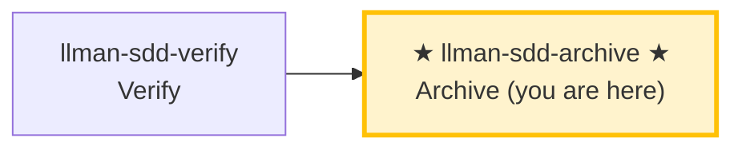

# LLMAN SDD Archive

Use this skill to archive completed changes. Prerequisites: verify all-green, and the change already has Branch binding plus Specs landing (or `needs_specs_change: false`; live specs are on the bound branch). `change finalize` **auto-merges** into the fork-point branch (target: `--into` > binding `base_branch` > default branch; method: `--method` > config `sdd.merge_method`, squash by default — feature diff + rename collapse into ONE close-out commit on the target), **renames** change docs to `changes/archive/`, then **auto-commits** `archive(sdd): <change-id>` (impl diff + rename in one commit; `--no-commit` skips). `change checkpoint` is removed (no mid-flight archive point; `change finalize` does not require a clean tree). `git push` / hosting PR are optional.

## Pipeline Position



> 📍 You are in the archive phase: the last stop in the Git-native lifecycle.
> 📎 If specs get too large, run `llman-sdd-specs-compact` to compress.

## Hard Constraints

- **Must pass verify phase all-green first**: don't archive changes that haven't passed verification.
- **Must already have Branch binding**: `change start` / `attach` done; otherwise STOP.
- **SSOT validation**: every change must pass `llman-sdd validate <id> --strict --no-interactive` before archiving.
- **Don't ask "should I continue?"**: execute the full batch to completion unless you hit an unresolvable error.
- **Close-out MUST NOT default to PR/push**: finalize performs a local merge (squash by default) + rename + one close-out commit (`archive(sdd): <id>`). `git push` / hosting PR are optional — only when the user or project explicitly requires remote review. **Agent MUST NOT** push or open a PR by default on this skill's account.

## Steps

### 0) Preflight
- `git status --porcelain`: confirm working tree changes belong to completed changes.
- If unexpected changes exist, handle them (stash or report).

### 1) Confirm target changes
- Determine target IDs: single or batch (from user input or `llman-sdd list --json`).
- Always announce: "Archiving IDs: <id1>, <id2>, ...".
- Confirm each change has passed verify phase all-green.

### 2) Archive one by one
- **Human review checkpoint (before each id is archived, including batches)**: run `llman-sdd review` (plain; `--capability` takes a spec id, not a change id). Exit code zero → continue; non-zero = CRITICAL findings: STOP, fix, re-run; MUST NOT archive with CRITICAL findings open.
- Validate each first: `llman-sdd validate <id> --strict --no-interactive`.
- Validation failure → STOP and report; don't skip validation and force archive.
- Optional preview: `llman-sdd change archive <id> --dry-run`.
- Execute archive:
  - default: `llman-sdd change archive <id>`
  - **stop immediately on first failure**, report remaining unprocessed IDs.
- **Git-native close-out**:
  - Prerequisites: Branch binding done (`change start` / `attach`); still on the bound branch (or the target branch after the auto merge).
  - `change archive` / `change finalize` run the **auto merge** (target `--into` > binding `base_branch` > default branch; method squash by default or `ff`; when the target is held by another worktree the merge and commit run in place inside that worktree, with `executed in target worktree <path>` in the output; if that worktree is dirty the command aborts with disposal options and zero writes), **then** rename change docs into `changes/archive/` — rename is never rolled back on merge failure and degradation is reported explicitly.
  - **Default: `change finalize` (one-command close)** — gates → auto merge → docs rename → **auto commit** `archive(sdd): <change-id>` (squash default: impl diff + rename collapse into ONE commit on the target; no manual `git commit` needed; locked-rule edits are a report-only WARNING — warn, never block):
    ```text
    1. Implement live specs + code (working tree may stay dirty; commits on the branch are free — segmented or none)
    2. llman-sdd change finalize <id>    # gates + merge (squash default) + rename + auto commit
    3. optional: git commit --amend    # adjust the message; git branch -D <feature>  # after squash the branch is no longer an ancestor; -d gets refused
    ```
    `--no-commit` skips the auto commit (CI / pre-commit-hook conflicts): finalize then leaves the tree dirty and prints the manual `git commit` command. Idempotent retry: a rerun after a failed auto commit detects the already-archived rename and finishes the commit.
  - **Fallback: plain `change archive <id>`** — same auto merge + rename + close-out commit as finalize (it auto-commits `archive(sdd): <id>` too; there is no `--no-commit` here); gates: task completion + clean tree + on the bound non-default branch (`--force` skips the gates). `checkpointed`/`checkpoint_sha` fields went away with checkpoint (no mid-flight archive point; `change finalize` needs no clean tree) — nothing to write beforehand, and nothing to review for the snapshot (use `change diff` instead).

### 3) Full validation
- After all archives complete: `llman-sdd validate --all --strict --no-interactive`.
- Confirm post-archive spec artifacts are consistent.

### 4) Commit guidance
- Finalize auto-committed (`archive(sdd): <id>`); with `--no-commit`, commit manually: `git add -A && git commit -m "archive(sdd): <id1>, <id2>"` (or the archive skill's suggested format).
- Optional: `git branch -D <feature>` after the merge (squash leaves the branch outside main's ancestry). push / hosting PR only when the user or project explicitly requires remote review.
- **Breaking contract changes** (removed/renamed frontmatter field, command, tag, or stage value) MUST ship an upgrade path under `migrations/v<from>-v<to>/` (README prompt + one-shot script, shipped in-repo) — verify it exists before closing the change.
- **Archived `depends_on`**: archive renames the change dir to `archive/YYYY-MM-DD-<id>`, but validate recognizes `depends_on` pointing to archived/frozen ids as INFO (not ERROR), so you do **not** need to manually update other changes' `depends_on` frontmatter after archive.

> 💡 Previous phase `llman-sdd-verify` (passed verification) → this phase completes the loop. If specs grow too large, run `llman-sdd-specs-compact`.

## Archive Cold Backup Guidance
- If archived directories are growing too large, use cold backup maintenance:
  - Preview freeze candidates: `llman-sdd archive freeze --dry-run`
  - Freeze old archives: `llman-sdd archive freeze --before <YYYY-MM-DD> --keep-recent <N>`
  - Restore when needed: `llman-sdd archive thaw --change <YYYY-MM-DD-id>`
- Apply freeze/thaw only to dated archive directories (`YYYY-MM-DD-*`) and keep a small recent window unfrozen when possible.
- freeze/thaw print a warning (never block) when run outside the main checkout (a worktree not holding the default branch) — continue there only intentionally.

> For command details run `llman-sdd <cmd> --help`; the CLI is the command reference — skills embed no command tables.
> "Spec" here = a `.feature` file under this project's `llmanspec/specs/`; run `llman-sdd list --specs` or `llman-sdd show <capability>`.

Validation fixes (single-track feature-as-spec):

1) Missing header comments (`missing `# capability:`` header comment`):
Every capability `.feature` (`llmanspec/specs/<capability>.feature` or `llmanspec/specs/<capability>/<capability>.feature`) MUST start with:
```
# language: zh-CN
# capability: <capability>
# purpose: One-line overview.
# scope: src/
```

2) Tag grammar (`@human constraint scenario must carry an @req:<req_id> tag` / `orphan acceptance scenario`):
- Rules: `@req:<id> @human` — statement in the scenario description (MUST/SHALL required).
- Acceptance: `@executable` + at least one `@req:<id>` linking a rule.
- Pairing: before adding an `@human` rule, run the triage — any GWT-expressible automated-verifiable behavior MUST get a paired `@executable` acceptance (prose-only rules guard nothing); `@human` is for non-automatable human judgment only; record the justification in proposal/design when no pairing is possible.
Never combine `@human` with `@executable`. (`@manual` was removed in 0.3.0 — drop it; `@human` already carries the human-judgement semantics.)

Git-native guardrail:
- **Branch binding** → **Specs landing**: first `change start` / `attach`, then edit live `.feature` files on the bound non-default branch and commit.
- Locked rules (report-only): editing/removing an existing `@human` scenario yields a WARNING and never blocks validate / change finalize / change diff; the report names the edited rule by `@req:<id>`. Control points: git branch diff plus `llman-sdd review` / `change diff` output. Legacy lock-ack metadata (frontmatter `rules_touched` / `agent_acked`, the `@agent` tag, the `--yes` ack semantics) is fully removed — no aliases, no compat layer (locked rules are report-only: a warning, never a block).
- Enter apply when `stage=full` and the specs-landed gate passes (specsLanded ∨ `needs_specs_change: false`); verify/finalize require `readyToImplement=true` (completion signal). Close-out prefers `change finalize`.
- Do not use `change delta` / solidify / `*.feature.delta.toon`.

## Context
- Check state before acting: change/spec status comes from `llman-sdd show/list/validate` output.
- Locate relevant specs with `llman-sdd context --task --paths` before reading spec files.

## Goal
- Reach one verifiable outcome for this command; report result paths and validation state.

## Constraints
- Follow the hard rules in the skill body (not repeated here). Triage first: behavior-contract changes take the full SDD path, implementation-only changes take quick; when unsure choose full SDD.
- Keep changes minimal; never force past a known validation failure.

## Workflow
- Treat `llman-sdd` command output as the source of truth at every step; run `llman-sdd validate` after touching artifacts.
- Command details: the generated command reference below, or `llman-sdd <cmd> --help`.

## Decision Policy
- Clarify high-impact ambiguity before proceeding; verify facts yourself, ask the user only for decisions.

## Output Contract
- Human-readable summary first (conclusion / risks / decisions needed), machine detail after.

## Ethics Governance
- `ethics.risk_level`: low — reads/writes this repo and `llmanspec/` only, no outward-facing actions; a skill body may override.
- `ethics.prohibited_actions`: actions violating the skill body's hard rules; push / PR / external upload without an explicit user request.
- `ethics.required_evidence`: conclusions backed by command output or file paths; gate state per `llman-sdd validate`.
- `ethics.refusal_contract`: gate CRITICAL not cleared → refuse to advance; self-repair cap reached → report a blocker.
- `ethics.escalation_policy`: pause and ask the user before changing SDD contracts/templates or irreversible actions.
