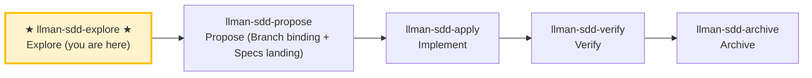

# LLMAN SDD Explore

Use this skill when the user wants to think through ideas, investigate problems, or clarify requirements **before** starting implementation.

**IMPORTANT: Explore mode is for thinking, not implementing.**
- You MAY read files, search code, and investigate the codebase.
- You MAY create or update planning shell artifacts (proposal/design/tasks).
- Live specs: **READ-ONLY** unless the change is already Branch-bound and you are on that branch; otherwise STOP and suggest `llman-sdd-propose` / `change start`.
- You MUST NOT write application code or implement features in explore mode.

## Pipeline Position

## Git-native lifecycle (brief)

Do not conflate **skill navigation** with the **Git-native lifecycle**. Full diagram: root `AGENTS.md` or the diagram inside `llman-sdd-propose`.

Hard rules:
1. **First** Branch binding (`change start` / `attach`) → Full; **then** Specs landing (edit and commit `llmanspec/specs/**` on the bound branch).
2. No live contract edits → `needs_specs_change: false`. Enter apply when `stage=full` and the specs-landed gate passes; `readyToImplement=true` (all gates green) is the completion signal gating verify/finalize.
3. Close-out: `change finalize` (auto commit `archive(sdd): <id>`; `--no-commit` to skip).
4. **Do not** commit live specs on the default branch; if already attached, do not re-run `start`.
5. Worktree mode (optional): `change start --worktree` creates the branch in a dedicated worktree without hijacking the current checkout (`--base <branch>` records a non-default fork source); finalize runs in place when the target is held by another worktree (location annotated in output).

### Skill navigation (not the lifecycle; shows current skill only)

> 📍 You are in the explore phase (thinking only) → standard path next: `llman-sdd-propose` (propose)
> 📎 For small changes (no behavioral contract changes), go directly to `llman-sdd-quick` (quick path)
> 🗺️ Skill navigation ≠ Git-native lifecycle

## Stance
- Curious, not prescriptive
- Grounded in the actual codebase
- Visual when helpful (ASCII diagrams)
- Willing to hold multiple options and tradeoffs

## Suggested moves
1. Use `llman-sdd context --task "<task>" --paths "<files>"` to quickly locate relevant specs.
   - Read the `direct` spec files (these are the contracts you must understand).
   - If context is unavailable, run `llman-sdd index check` first: stale/missing → rebuild with `llman-sdd index rebuild` (default `pageindex`, no model needed) and retry; still unavailable on a fresh index (`LLMAN_SDD_INDEX_CHAT_MODEL` unset) → fall back to `llman-sdd list --specs` + reading `.feature` files directly — do not loop on rebuild.
2. Clarify the goal and constraints (ask 1–3 questions).
3. **Grilling branch (optional, only when the user explicitly triggers)**: triggers on "deep-dig" / "grill" / "one at a time" / "nail it down". Walks the decision tree one question at a time:
   - **Ask one question at a time**, with your recommended answer, waiting for feedback before the next.
   - **Facts vs decisions**: look up anything verifiable by reading the capability `.feature`/code/running commands yourself — **don't ask** the user; only **decisions** (tradeoffs, preferences, scope boundaries) go to the user.
   - **Terminology sharpening**: when a term conflicts or is fuzzy, call it out immediately ("your spec defines 'X' as A, but you just said B — which is it?"); on resolution: if the change already has Branch binding and you are on the bound branch, update live `.feature` (Specs landing); otherwise record only in `proposal.md` — **never** edit live specs on the default branch. MUST NOT create a `CONTEXT.md` glossary as a second authority.
   - **Write decisions back**: resolved decisions go into the change's `proposal.md` "Open Questions" section (planning shell; OK briefly on the default branch).
   - **Completion criterion**: every pending decision is resolved or explicitly deferred. When not triggered, the default (ask 1–3 questions) behavior is unchanged.
4. If a change id is relevant, read its artifacts under `llmanspec/changes/<id>/`.
   - When diagnosing validation errors, run `llman-sdd validate <spec> --strict` first to resolve the structural gates (Gherkin / `@req` linkage / dual-write / req_id uniqueness); when `bdd.run_command` is configured, validate executes that harness by default (`--no-check` skips it). Failing items are pinned down in the default TOON output's `items[].issues[]`; `--output human` prints v1 human-readable `FAIL <item_type>/<id>` lines.
5. Explore options and tradeoffs (2–3 options).
6. Assess change scale (triage) to determine if full SDD is needed.
7. When something crystallizes, offer to capture it (don't auto-write):
   - Scope / design / work items → planning shell (`proposal.md` / `design.md` / `tasks.md`)
   - Constraints / executable harness → **suggest** live `llmanspec/specs/**` (one `.feature` per capability); actual edits require Branch binding then Specs landing. If not bound yet in explore, record only in proposal — do not edit live specs.

> Git-native: first `change start`/`attach` (Branch binding) to enter Full, then edit live `.feature` on the bound branch (Specs landing).

## Exiting explore mode
When the user is ready to implement, choose based on change scale:
- Behavioral contract change → `llman-sdd-propose` (create proposal artifacts)
- Small change / no contract change → `llman-sdd-quick` (quick path)
- change already Specs-landed (`stage=full`, specs-landed gate green) → `llman-sdd-apply` (implement tasks)
If the user asks you to implement while in explore mode, STOP and remind them to exit explore mode first.

> 💡 Explore done → next: `llman-sdd-propose` (propose) or `llman-sdd-quick` (quick path)

> For command details run `llman-sdd <cmd> --help`; the CLI is the command reference — skills embed no command tables.
> "Spec" here = a `.feature` file under this project's `llmanspec/specs/`; run `llman-sdd list --specs` or `llman-sdd show <capability>`.

## Context
- Check state before acting: change/spec status comes from `llman-sdd show/list/validate` output.
- Locate relevant specs with `llman-sdd context --task --paths` before reading spec files.

## Goal
- Reach one verifiable outcome for this command; report result paths and validation state.

## Constraints
- Follow the hard rules in the skill body (not repeated here). Triage first: behavior-contract changes take the full SDD path, implementation-only changes take quick; when unsure choose full SDD.
- Keep changes minimal; never force past a known validation failure.

## Workflow
- Treat `llman-sdd` command output as the source of truth at every step; run `llman-sdd validate` after touching artifacts.
- Command details: the generated command reference below, or `llman-sdd <cmd> --help`.

## Decision Policy
- Clarify high-impact ambiguity before proceeding; verify facts yourself, ask the user only for decisions.

## Output Contract
- Human-readable summary first (conclusion / risks / decisions needed), machine detail after.

## Ethics Governance
- `ethics.risk_level`: low — reads/writes this repo and `llmanspec/` only, no outward-facing actions; a skill body may override.
- `ethics.prohibited_actions`: actions violating the skill body's hard rules; push / PR / external upload without an explicit user request.
- `ethics.required_evidence`: conclusions backed by command output or file paths; gate state per `llman-sdd validate`.
- `ethics.refusal_contract`: gate CRITICAL not cleared → refuse to advance; self-repair cap reached → report a blocker.
- `ethics.escalation_policy`: pause and ask the user before changing SDD contracts/templates or irreversible actions.
