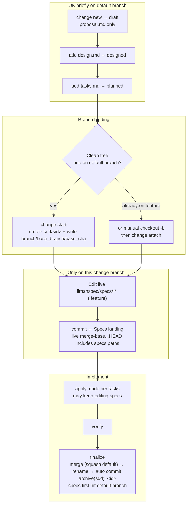
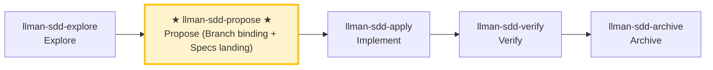

# LLMAN SDD Propose

Create a new change with planning artifacts (proposal + tasks; design optional), **first** `change start` (or `attach`) for Branch binding, **then** edit live `llmanspec/specs/<capability>.feature` (flat, or directory main file) on the bound branch (Specs landing), validate, and suggest next actions.

## Pipeline Position

## Git-native lifecycle (full diagram)

Do not conflate two layers: the **Git-native lifecycle** (Branch binding → Specs landing → `readyToImplement`) vs **skill navigation** (explore→propose→apply→verify→archive). Specs landing is **not** a separate skill.



Hard rules:
1. **First** `change start` / `attach` (Branch binding) to enter Full; **then** edit `llmanspec/specs/**` on the bound non-default branch and commit (Specs landing).
2. For changes with no live contract edits, set frontmatter `needs_specs_change: false`. Enter apply when `stage=full` and the specs-landed gate passes (specsLanded ∨ needs_specs_change=false); `readyToImplement=true` — every `gateChecks` item passing, incl. tasks-done — is the completion signal that gates verify/finalize (ranges are live merge-bases, stored `base_sha` is audit-only).
3. Close-out is `llman-sdd change finalize <id>`: it auto-commits `archive(sdd): <id>` (impl diff + rename in one commit); `--no-commit` skips the auto commit for manual/CI histories. Commits on the change branch are free (segmented or finalize single-shot).
4. **Do not** commit live specs to the default branch just to satisfy the clean-tree gate; if already attached, do not re-run `start`.

Worktree-mode decision table (multi-checkout workflows):

| Working style | Command | Criteria |
|---|---|---|
| Classic single checkout | `llman-sdd change start <id>` | On the default branch with a clean tree; switches this checkout to the new branch |
| Keep current checkout / parallel changes | `llman-sdd change start <id> --worktree` | Branch lives in a dedicated worktree (`sdd.worktree_root` / `sdd.worktree_naming` config; default sibling of the repo root), current checkout untouched, output includes the worktree path; pair with `--base <branch>` for a non-default fork source |
| Already on a feature branch (incl. manual wt/git-worktree) | `llman-sdd change attach <id>` | Branch already exists; `--base <branch>` records the fork source explicitly |

finalize target location: when the target branch is held by another worktree, `llman-sdd change finalize <id>` / `llman-sdd change archive <id>` automatically run the merge, rename and commit inside that worktree (output includes `executed in target worktree <path>`); a dirty holding worktree aborts with disposal options and zero writes.
# Human-Readable Summary (mandatory)

Every report, handoff, or gate output you produce in this workflow MUST open
with a short human-readable summary block before any machine detail:

- **Verdict** — one line (e.g. "all gates green" / "2 CRITICAL found").
- **Risks** — up to three bullets, highest impact first.
- **Decisions needed** — explicit asks, or "none".

Keep it under ten lines; details belong below the fold.

### Skill navigation (not the lifecycle; shows current skill only)



> 📍 You are in propose: the Git-native path above is **planning shell (draft → designed → planned) → Branch binding → Specs landing** (through the specs-landed gate) → next: `llman-sdd-apply`
> 📎 For small changes (no behavioral contract changes), use `llman-sdd-quick` (quick path)

## Hard Constraints

- **Non-blocking change id**: if the user supplied an id, use it; otherwise derive a valid kebab-case id from the task description (verb prefix, passes the CLI id check, follows the naming convention declared in `llmanspec/AGENTS.md`), announce the chosen id and how to override, and continue — MUST NOT wait for confirmation (ids are cheap to change before Branch binding). Only route to `llman-sdd-draft` when the user wants to capture an idea (draft, no id).
- **Live specs are SSOT**: edit `llmanspec/specs/**` only **after** Branch binding, on the **bound non-default branch** (Specs landing). **Do not** edit live specs on the default branch. The planning shell may briefly live on the default branch.
- **Don't ask "should I continue?"**: execute the full propose phase in one pass, generate artifacts and validate.

- **If change already exists**: STOP. If the specs-landed gate is green, suggest `llman-sdd-apply`; otherwise finish the planning shell / Branch binding / Specs landing (edit `llmanspec/changes/<id>/`, or enable `extra_skills: [llman-sdd-continue]`).

- **Frontmatter has a fixed schema**: when fleshing out `proposal.md`, only the allowed fields in `llmanspec/AGENTS.md` "Change Proposal Frontmatter SSOT" are accepted (including `depends_on`, `blocks`, `branch`, `base_sha`, `needs_specs_change`). `status`/`title`/`priority`/`author` etc. are rejected by `llman-sdd validate` as ERROR; lifecycle stage is inferred (query via `llman-sdd show`/`list`), never stored in frontmatter. Do not re-declare frontmatter fields in the prose body; the body H1 is a human-readable title, not a repeat of the change id.

## Quick-capture routing

If the user just wants to **capture an idea** (e.g. "draft a proposal", "note down X", "remember to do Y later") without full planning, route them to the `llman-sdd-draft` skill — it creates a `proposal.md`-only draft shell via `change new --from` (no id asked, no tasks/specs/attach). Full propose (triage + tasks → `change start`/`attach` → Specs landing) starts here.

## Steps

### 0) Preflight
- Read `llmanspec/config.yaml` for project context, rules, locale.
- `bun apps/cli/src/main.ts validate --all --strict` (equivalent to `llman-sdd validate --all --strict` once the global CLI is installed): ensure current artifacts are clean.
  - If pre-existing errors, stop and report (stacking new changes on dirty artifacts causes cascading errors).
- **Check spec valid_scope integrity**: use `llman-sdd list --specs --json` to list all specs, then for each spec verify every path in its `valid_scope` exists on disk. If any scope file/directory is missing, stop and suggest updating the spec (remove the deleted path from `valid_scope`).

### 1) Assess change scale (triage)
1. Classify:
   - **Behavioral contract change** (modify MUST/SHALL, change external behavior) → full SDD workflow
   - **Implementation change** (refactor, typo, perf) → quick path via `llman-sdd-quick`
   - **Meta-spec change** (SDD templates/process) → full SDD workflow
   - When uncertain, choose full SDD (conservative).
2. Use `llman-sdd context --task "<goal>" --paths "<scope>"` to find relevant specs.
   - If context is unavailable, run `llman-sdd index check` first: stale/missing → rebuild with `llman-sdd index rebuild` (default `pageindex`, no model needed) and retry; still unavailable on a fresh index (`LLMAN_SDD_INDEX_CHAT_MODEL` unset) → fall back to `llman-sdd list --specs` + reading `.feature` files directly — do not loop on rebuild.
3. Gather input:
   - A short description of the change
   - A change id (user-supplied if given; otherwise derive it with the non-blocking rule above and announce it)
   - The impacted capability/capabilities (to name `specs/<capability>`)

### 2) Ensure project is initialized
   - `llmanspec/` must exist; if missing, tell the user to run `llman-sdd init`, then STOP.

### 3) Create change directory and artifacts
   - Prefer `llman-sdd change new <change-id>` for the draft `proposal.md` shell (or create `llmanspec/changes/<change-id>/` manually).

   - If the change already exists, STOP and suggest filling missing artifacts or `llman-sdd-apply` (optionally enable continue via `extra_skills`).

   - Flesh out `proposal.md` (Why / What Changes / Capabilities / Impact)
   - `design.md` only when tradeoffs/migrations matter
   - **Confirm seams before writing tasks.md**: list the seams to be tested and confirm with the user. A seam = the public boundary driven by `*.feature` GWT steps (CLI subprocess or public interface) — MUST reuse existing harness seams, MUST NOT invent seams detached from `.feature`. Without `.feature`, seam = the CLI subcommand or public function boundary under test.
   - `tasks.md`: split into **vertical slices** (each task cuts a narrow but complete path through schema→API→UI→tests, independently verifiable), with `[blocked-by: <task-id>]` dependency markers. **Wide-refactor exception** (one mechanical change sweeping the codebase, single edit breaks many call sites): sequence as expand-contract (add new beside old → migrate call sites in batches → delete old), don't force into a vertical slice. **tasks.md lists implementation and verification tasks only**: close-out (`change finalize` / `change archive`) is a pipeline step and MUST NOT be listed as a task — its task gate requires every task checked, so a close-out task is self-contradictory (checking it lies, leaving it blocks finalize, and `validate --strict` stays red during implementation). Before/after completion criteria (counts, baselines) MUST state they are measured on the change branch (against merge-base) — a value taken on the default branch is usually trivially the baseline.
   - **First** `llman-sdd change start <change-id>` (recommended; clean tree on the default branch; use `--worktree` to keep the current checkout, `--base <branch>` for a non-default fork source) or manually create a branch then `change attach <change-id>` to reach Full (bound).
   - **Then** edit live `llmanspec/specs/<capability>.feature` (flat, or directory `llmanspec/specs/<capability>/` main file) on the bound non-default branch and commit (Specs landing). **Do not** edit live specs before start; **do not** commit live specs to the default branch just to satisfy the clean-tree gate. If already attached, do not re-run `start` (recover lost specs by checkout/recreate + `attach --force` if needed).
   - For changes with no live contract edits, set frontmatter `needs_specs_change: false`. Enter apply when `llman-sdd show <id> --output json` shows `stage=full` with the specs-landed gate green; `readyToImplement=true` (all gates) is the completion signal gating verify/finalize.
   - **Breaking contract changes** (removed/renamed fields, commands, tags, or stage values) MUST plan the upgrade path: write a `migrations/v<from>-v<to>/README` (upgrade guidance; a one-shot script SHALL ship with the repo when feasible) — include it in the proposal's What Changes.

### 4) Validate
   ```bash
   bun apps/cli/src/main.ts validate <change-id> --strict   # once the global CLI is installed: llman-sdd validate <change-id> --strict
   ```
   This MUST pass before proceeding; failing items are listed one by one in the validate output's `items[].issues[]` — fix each and re-run.

### 4a) Optional BDD runner (`bdd:` block)
- Read `llmanspec/config.yaml`. Is there a `bdd:` block?
  - **Yes**: `bdd.run_command` declares the project's BDD execution entry; validate executes that harness by default when its target set includes specs (`--no-check` skips it). Authoring follows 4b regardless.
  - **No**: if this change involves executable behavior scenarios (Given/When/Then the user will want to run), ask **once, up front**: "This change looks like it has executable behavior. Enable a `bdd:` runner block so scenarios can be validated as `.feature` files? (adds a `bdd:` block to `config.yaml` — runner only, does not change the lifecycle.)"
    - If **yes**: show the exact `bdd:` block to add (pick a `run_command` matching the project's test framework — `cargo test --features bdd` for rstest-bdd, `pytest {feature_dir} -k {feature_name} -v` for pytest-bdd). Let the user confirm or edit it, write it to `config.yaml`, then proceed with 4b rules.
    - If **no**: features still validate structurally; BDD execution responsibility always stays with the project test suite.
- **Do NOT silently add the `bdd:` block** — always ask first. Adding it declares the project-wide BDD execution entry (validate executes that harness by default when its target set includes specs).

### 4b) Single-track feature authoring
- Planning shell (proposal/design/tasks) may briefly live on the default branch; **do not** edit live `llmanspec/specs/**` on the default branch. After Branch binding, Specs landing and implementation happen on the bound branch.
- **Single-track**: each capability is ONE `<capability>.feature`. Constraint rules are `@req:<id> @human` scenarios (statement verbatim in the description); executable acceptance scenarios carry `@executable` and link back via `@req:<req_id>`. Never nest scenarios in `Rule:` blocks (the runner skips them).
- **Structured adds preferred**: to append rules/acceptances to an existing capability, prefer `llman-sdd spec next-req-id` (global rN allocation) + `spec add-req` / `spec add-scenario` (pairing tag syntax built in; write path auto-resolves flat vs directory layout). New capability → `spec skeleton <capability>`; id lookup → `spec resolve-req <rN>`. Hand-editing the `.feature` stays the escape hatch (best suited to editing existing clauses).
- **@human/@executable triage** (decide before writing any new clause): any behavior expressible as GWT (Given/When/Then) MUST land as an `@executable` acceptance scenario linked back to its rule — prose-only rules guard nothing; `@human` is only for human judgment that cannot be automated (process rulings, aesthetics, external facts). A new `@human` clause without a paired `@executable` MUST record the justification in proposal/design.
- Change shell: `llman-sdd change new <change-id>` → fill proposal/design/tasks → `llman-sdd change start <change-id>` (or `change attach`) → **then** edit live specs on the bound branch and commit (Specs landing).


### 5) Summarize and suggest next step
   - Enter implementation phase: `llman-sdd-apply`.
   - If you need to think more: `llman-sdd-explore`.

> 💡 Proposal done → next: `llman-sdd-apply` (implement)

> For command details run `llman-sdd <cmd> --help`; the CLI is the command reference — skills embed no command tables.
> "Spec" here = a `.feature` file under this project's `llmanspec/specs/`; run `llman-sdd list --specs` or `llman-sdd show <capability>`.
Validation fixes (single-track feature-as-spec):

1) Missing header comments (`missing `# capability:`` header comment`):
Every capability `.feature` (`llmanspec/specs/<capability>.feature` or `llmanspec/specs/<capability>/<capability>.feature`) MUST start with:
```
# language: zh-CN
# capability: <capability>
# purpose: One-line overview.
# scope: src/
```

2) Tag grammar (`@human constraint scenario must carry an @req:<req_id> tag` / `orphan acceptance scenario`):
- Rules: `@req:<id> @human` — statement in the scenario description (MUST/SHALL required).
- Acceptance: `@executable` + at least one `@req:<id>` linking a rule.
- Pairing: before adding an `@human` rule, run the triage — any GWT-expressible automated-verifiable behavior MUST get a paired `@executable` acceptance (prose-only rules guard nothing); `@human` is for non-automatable human judgment only; record the justification in proposal/design when no pairing is possible.
Never combine `@human` with `@executable`. (`@manual` was removed in 0.3.0 — drop it; `@human` already carries the human-judgement semantics.)

Git-native guardrail:
- **Branch binding** → **Specs landing**: first `change start` / `attach`, then edit live `.feature` files on the bound non-default branch and commit.
- Locked rules (report-only): editing/removing an existing `@human` scenario yields a WARNING and never blocks validate / change finalize / change diff; the report names the edited rule by `@req:<id>`. Control points: git branch diff plus `llman-sdd review` / `change diff` output. Legacy lock-ack metadata (frontmatter `rules_touched` / `agent_acked`, the `@agent` tag, the `--yes` ack semantics) is fully removed — no aliases, no compat layer (locked rules are report-only: a warning, never a block).
- Enter apply when `stage=full` and the specs-landed gate passes (specsLanded ∨ `needs_specs_change: false`); verify/finalize require `readyToImplement=true` (completion signal). Close-out prefers `change finalize`.

## Context
- Check state before acting: change/spec status comes from `llman-sdd show/list/validate` output.
- Locate relevant specs with `llman-sdd context --task --paths` before reading spec files.

## Goal
- Reach one verifiable outcome for this command; report result paths and validation state.

## Constraints
- Follow the hard rules in the skill body (not repeated here). Triage first: behavior-contract changes take the full SDD path, implementation-only changes take quick; when unsure choose full SDD.
- Keep changes minimal; never force past a known validation failure.

## Workflow
- Treat `llman-sdd` command output as the source of truth at every step; run `llman-sdd validate` after touching artifacts.
- Command details: the generated command reference below, or `llman-sdd <cmd> --help`.

## Decision Policy
- Clarify high-impact ambiguity before proceeding; verify facts yourself, ask the user only for decisions.

## Output Contract
- Human-readable summary first (conclusion / risks / decisions needed), machine detail after.

## Ethics Governance
- `ethics.risk_level`: low — reads/writes this repo and `llmanspec/` only, no outward-facing actions; a skill body may override.
- `ethics.prohibited_actions`: actions violating the skill body's hard rules; push / PR / external upload without an explicit user request.
- `ethics.required_evidence`: conclusions backed by command output or file paths; gate state per `llman-sdd validate`.
- `ethics.refusal_contract`: gate CRITICAL not cleared → refuse to advance; self-repair cap reached → report a blocker.
- `ethics.escalation_policy`: pause and ask the user before changing SDD contracts/templates or irreversible actions.
