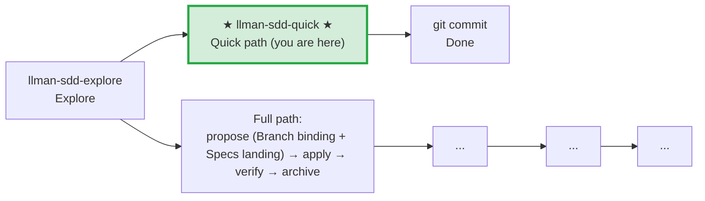

# LLMAN SDD Quick Path

Use this path for small changes that don't modify behavioral contracts.

## Pipeline Position

> 📍 Quick path: no behavioral contract changes, modify code and commit directly. If you find you need to change a contract → STOP, switch to full path `llman-sdd-propose`
> 🗺️ Full path includes Git-native Branch binding + Specs landing (Specs landing is not a separate skill)

## Conditions (all must hold)
- Does not change any MUST/SHALL-defined externally observable behavior
- Does not cross capability boundaries
- Does not involve migration or compatibility concerns
- Is not a meta-spec change (SDD templates/process)

## Steps
1. Use `llman-sdd context --task "..." --paths "..."` to confirm no spec changes needed.
   - If context returns `quality: "unavailable"`, run `llman-sdd index check` first: stale/missing → `llman-sdd index rebuild` (default `pageindex`, no model needed) and retry; still unavailable on a fresh index (`LLMAN_SDD_INDEX_CHAT_MODEL` unset) → fall back to `llman-sdd list --specs` + reading `.feature` files directly — do not loop on rebuild.
   - Use `llman-sdd list --specs --json` for keyword-level spec metadata.
2. Modify the code directly.
3. If you need to touch `llmanspec/specs/**`, STOP unless you are on a bound non-default change branch (mini change: `change start`/`attach` → edit → commit). Never commit live specs on the default branch — not even for typo or scope-only fixes. Prefer routing live-spec maintenance to `llman-sdd-propose`, or require an existing bound branch.
4. git commit (message must explain why).
5. No change directory, no archive needed.

## Boundary handling
- If during modification you find a behavioral contract change → STOP, switch to `llman-sdd-propose` (full path).
- If multiple files are involved and scope is unclear → verify with `llman-sdd context` first.

> 💡 Quick path done → git commit. If you need the full path → `llman-sdd-propose` → `llman-sdd-apply` → `llman-sdd-verify` → `llman-sdd-archive`

> For command details run `llman-sdd <cmd> --help`; the CLI is the command reference — skills embed no command tables.
> "Spec" here = a `.feature` file under this project's `llmanspec/specs/`; run `llman-sdd list --specs` or `llman-sdd show <capability>`.

## Ethics Governance
- `ethics.risk_level`: low — reads/writes this repo and `llmanspec/` only, no outward-facing actions; a skill body may override.
- `ethics.prohibited_actions`: actions violating the skill body's hard rules; push / PR / external upload without an explicit user request.
- `ethics.required_evidence`: conclusions backed by command output or file paths; gate state per `llman-sdd validate`.
- `ethics.refusal_contract`: gate CRITICAL not cleared → refuse to advance; self-repair cap reached → report a blocker.
- `ethics.escalation_policy`: pause and ask the user before changing SDD contracts/templates or irreversible actions.
