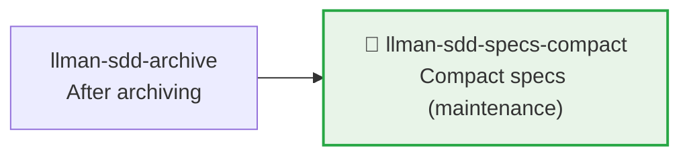

# LLMAN SDD Specs Compact

Use this skill to compact specs without changing normative behavior.

## Pipeline Position



> 📎 Maintenance tool, typically run after accumulating many archives. For daily development → `llman-sdd-propose` (Branch binding + Specs landing) / `llman-sdd-apply` (after Specs landing).

## Context
- Specs grow bloated with duplicate requirements/scenarios as changes accumulate.
- Compaction must remain verifiable and regressible.
- When archive history is too large, it interferes with compaction review and navigation.

## Goal
- Identify and merge redundant requirements/scenarios.
- Form a more compact and maintainable spec structure.

## Constraints
- Don't delete normative behavior without explicit replacement.
- Try to keep requirement titles stable.
- Each retained requirement must have at least one valid scenario.
- **Editing live `llmanspec/specs/**` requires a change**: Branch binding first (`change start` / `attach`), then commit on the bound branch (Specs landing style); **never** compact-rewrite live specs on the default branch.

## Workflow
1. Inventory current specs (`llman-sdd list --specs`).
2. If archived history is large, run archive freeze first:
   - Preview: `llman-sdd archive freeze --dry-run`
   - Execute: `llman-sdd archive freeze --before <YYYY-MM-DD> --keep-recent <N>`
3. Identify overlapping items across capabilities (duplicate req ids across specs: `llman-sdd project dedupe-req-ids --dry-run` reports the remap plan).
4. Produce a compaction plan (canonical requirements + keep/merge/remove decisions + migration notes).
5. Execute and validate (`llman-sdd validate --specs --strict`).

## Decision Policy
- Prefer merging when two requirements are semantically equivalent.
- Only extract shared spec text when reference relationships are clear.
- When archive directory is noisy, suggest freezing first before compacting.
- If compaction would change external behavior, pause and ask the user first.

## Output Contract
- Output compaction plan grouped by capability.
- Include: keep/merge/remove decisions with rationale.
- Include validation commands and expected results.

> 💡 After maintenance, new work goes through the normal pipeline: `llman-sdd-propose` (Branch binding + Specs landing) → `llman-sdd-apply` (after Specs landing) → `llman-sdd-verify` → `llman-sdd-archive`.

> For command details run `llman-sdd <cmd> --help`; the CLI is the command reference — skills embed no command tables.
> "Spec" here = a `.feature` file under this project's `llmanspec/specs/`; run `llman-sdd list --specs` or `llman-sdd show <capability>`.

Validation fixes (single-track feature-as-spec):

1) Missing header comments (`missing `# capability:`` header comment`):
Every capability `.feature` (`llmanspec/specs/<capability>.feature` or `llmanspec/specs/<capability>/<capability>.feature`) MUST start with:
```
# language: zh-CN
# capability: <capability>
# purpose: One-line overview.
# scope: src/
```

2) Tag grammar (`@human constraint scenario must carry an @req:<req_id> tag` / `orphan acceptance scenario`):
- Rules: `@req:<id> @human` — statement in the scenario description (MUST/SHALL required).
- Acceptance: `@executable` + at least one `@req:<id>` linking a rule.
- Pairing: before adding an `@human` rule, run the triage — any GWT-expressible automated-verifiable behavior MUST get a paired `@executable` acceptance (prose-only rules guard nothing); `@human` is for non-automatable human judgment only; record the justification in proposal/design when no pairing is possible.
Never combine `@human` with `@executable`. (`@manual` was removed in 0.3.0 — drop it; `@human` already carries the human-judgement semantics.)

Git-native guardrail:
- **Branch binding** → **Specs landing**: first `change start` / `attach`, then edit live `.feature` files on the bound non-default branch and commit.
- Locked rules (report-only): editing/removing an existing `@human` scenario yields a WARNING and never blocks validate / change finalize / change diff; the report names the edited rule by `@req:<id>`. Control points: git branch diff plus `llman-sdd review` / `change diff` output. Legacy lock-ack metadata (frontmatter `rules_touched` / `agent_acked`, the `@agent` tag, the `--yes` ack semantics) is fully removed — no aliases, no compat layer (locked rules are report-only: a warning, never a block).
- Enter apply when `stage=full` and the specs-landed gate passes (specsLanded ∨ `needs_specs_change: false`); verify/finalize require `readyToImplement=true` (completion signal). Close-out prefers `change finalize`.

## Ethics Governance
- `ethics.risk_level`: low — reads/writes this repo and `llmanspec/` only, no outward-facing actions; a skill body may override.
- `ethics.prohibited_actions`: actions violating the skill body's hard rules; push / PR / external upload without an explicit user request.
- `ethics.required_evidence`: conclusions backed by command output or file paths; gate state per `llman-sdd validate`.
- `ethics.refusal_contract`: gate CRITICAL not cleared → refuse to advance; self-repair cap reached → report a blocker.
- `ethics.escalation_policy`: pause and ask the user before changing SDD contracts/templates or irreversible actions.
