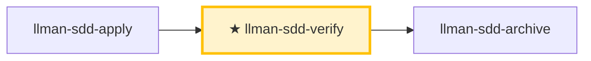

# LLMAN SDD Verify

Verify that the implementation matches the change's artifacts.

## Pipeline Position



> 📍 You are in verify → pass leads to `llman-sdd-archive`, failure goes back to `llman-sdd-apply`. The change should already have landed specs with `readyToImplement=true` (all gates green — the completion signal).

## Hard Constraints

- **Apply must be all-green first**: don't verify unimplemented changes.
- **CRITICAL must be fixed**: zero CRITICAL before archive.
- **Rerun the gates yourself**: MUST rerun `llman-sdd validate <id> --strict` (real harness) and the project gates; MUST NOT trust gate verdicts in the implementer's report — a mismatch is CRITICAL.
- **`--no-check` is not evidence**: gate evidence obtained with `--no-check` → CRITICAL. Close-out runs the configured `bdd.run_command`, so do not run that command again just before close-out; the skip line printed by `--no-check` is not a pass.
- **Don't ask "should I continue?"**: run the full verification flow and output a complete report.

## Stage guard (`stage` / `readyToImplement`)

Decide from authoritative JSON (never from "artifacts look complete"):

```bash
llman-sdd show <id> --output json --type change
```

Read: `stage`, `specsLanded`, `needsSpecsChange`, `readyToImplement`, `gateChecks` (per-item `pass` + one-line `hint` when failing).

| Condition | Action |
|-----------|--------|
| `stage=draft` (proposal.md only) | STOP. Grow: add design.md → designed, add tasks.md → planned, then bind the branch and land specs. Draft cannot apply/verify. If proposal+tasks exist but stage is still `draft` (tasks-without-design — design.md gates the stage): add design.md first. **Do not** create `changes/<id>/specs/`; **do not** edit specs on the default branch first. |
| `stage=designed` (proposal + design) | Next: add tasks.md → `planned`. Bind (`change start` / `attach`) only after planning docs are complete. |
| `stage=planned` (proposal + design + tasks) | STOP until bound: `change start` / `attach` → `full`. |
| `stage=full` and `readyToImplement=false` | Read the failing `gateChecks` items. specs-landed gate failing → land specs on the **bound branch** (edit `llmanspec/specs/**` and commit), or set `needs_specs_change: false`; **do not** re-run `change start` (lost bound-branch specs → checkout/recreate + `attach --force` if needed). specs-landed gate green but tasks-done/validate/clean-tree failing → normal mid-implementation state: proceed with apply (check off tasks); do not treat it as a landing failure. |
| `readyToImplement=true` | Completion signal: every gateChecks item green (tasks done + validate passed) — verify/finalize prerequisites met. `changes/<id>/specs/` is expected to be **absent** — do not treat as missing. |

## Steps
1. Select the change id (or ask the user to pick from `llman-sdd list --json`).
2. Fast validation gate: `llman-sdd validate <id> --strict`.
   - When diagnosing structural issues (Gherkin parse / `@req` linkage / dual-write / req_id uniqueness), run the structural validation first (when `bdd.run_command` is configured, validate executes that harness by default — `--no-check` skips it; a harness failure lands as an ERROR on its spec item). Failing items are listed one by one in the default TOON output's `items[].issues[]` (`--output human` prints `FAIL <item_type>/<id>` lines above the `Totals` line).
3. Read: `llmanspec/specs/**` (`<capability>.feature`, the single source of truth) on the branch, `proposal.md` and `design.md` (if present), `tasks.md`; ignore residual old docs under `changes/<id>/specs/`.
4. **Dual-axis review (kept separate so neither masks the other)** — diff against `git diff <merge-base>...HEAD` (merge-base is COMPUTED via `git merge-base <local-default> HEAD`; the stored base_sha is audit-only and MUST NOT feed range math):
   - **Spec axis**: does the implementation satisfy the `@human` rule MUST/SHALL and the `@executable` GWT? Missing/partial behaviors, wrong implementations, and scope creep not asked for by the spec → suggest minimal fixes or artifact updates. Check where before/after evidence (counts, baselines) was taken: it MUST be measured on the change branch (against the freshly computed merge-base); a value measured on the default branch is usually trivially the baseline and proves nothing.
   - **Standards axis**: does the code follow `AGENTS.md` + the smell baseline? Authority priority: `AGENTS.md` > smell baseline; skip anything tooling already enforces. Smells are **judgement heuristics** ("possible Feature Envy"), not hard violations:

     | Smell | Fix |
     |-------|-----|
     | Mysterious Name (name hides intent) | rename it |
     | Duplicated Code (same logic shape) | extract the shared part |
     | Feature Envy (method uses another's data more) | move the method over |
     | Data Clumps (same fields travel together) | bundle into a type |
     | Primitive Obsession (primitive stands in for a domain concept) | give it a dedicated type |
     | Repeated Switches (same switch recurs) | polymorphism or a shared map |
     | Shotgun Surgery (one change scatters edits) | gather into one module |
     | Divergent Change (one file changes for unrelated reasons) | split it |
     | Speculative Generality (abstraction for unseen needs) | delete it |
     | Message Chains (long a.b().c()) | hide the chain behind one method |
     | Middle Man (just delegates) | cut it, call direct |
     | Refused Bequest (subclass rejects most inheritance) | use composition |
   - The two axes may be reviewed in parallel (sub-agents); the report MUST present them separately, MUST NOT merge or cross-rerank (one axis passing must not mask the other failing).
5. **BDD verification** — only when `config.yaml` has a `bdd:` block:
   - Confirm the change is branch-bound and you are on that branch.
   - `llman-sdd validate --specs`: Gherkin + `@req`/dual-write gates; when `bdd.run_command` is configured the harness runs by default (`--no-check` skips it) and a failure maps to an ERROR on the matching spec item.
   - Optional read-only review: `llman-sdd change diff <id>` (or `--export-patch <path>`) — review/export only, never an apply step.
   - Next step after verify passes: `llman-sdd-archive` (not inline finalize here).

6. Produce a short report: **CRITICAL** (must fix before archive) / **WARNING** (should fix) / **SUGGESTION** (nice to have).
7. **Human review gate**: once the report has no CRITICAL findings and before suggesting archive, run `llman-sdd review`: exit code zero → suggest `llman-sdd-archive`; non-zero = CRITICAL → fix via `llman-sdd-apply`, then re-run review; MUST NOT enter finalize/archive with CRITICAL findings open.

## Branch lifecycle (brief)

**Skill navigation** ≠ **branch lifecycle**. Full diagram: root `AGENTS.md` or the one inside `llman-sdd-propose`.

Hard rules:
1. **First** bind the branch (`change start` / `attach`) → full; **then** land specs (edit and commit `llmanspec/specs/**` on the bound branch).
2. No contract edits → `needs_specs_change: false`. Enter apply when `stage=full` and the specs-landed gate passes; `readyToImplement=true` (all gates green) is the completion signal gating verify/finalize.
3. Close-out: `change finalize` (auto commit `archive(sdd): <id>`; `--no-commit` to skip).
4. **Do not** commit specs on the default branch; if already attached, do not re-run `start`.
5. Worktree (optional): `change start --worktree` creates the branch in a dedicated worktree without hijacking the current checkout (`--base <branch>` records a non-default fork source); finalize runs in place when the target is held by another worktree (location annotated in output).
# Human-Readable Summary (mandatory)

Every report, handoff, or gate output MUST open with a short human-readable summary before any machine detail:

- **Verdict** — one line (e.g. "all gates green" / "2 CRITICAL found").
- **Risks** — up to three bullets, highest impact first.
- **Decisions needed** — explicit asks, or "none".

Under ten lines; details below the fold.
> For command details run `llman-sdd <cmd> --help`; the CLI is the command reference — skills embed no command tables.
> "Spec" here = a `.feature` file under this project's `llmanspec/specs/`; run `llman-sdd list --specs` or `llman-sdd show <capability>`.

Validation fixes (single-track feature-as-spec):

1) Missing header comments (`missing # capability: header comment`): every capability `.feature` (`llmanspec/specs/<capability>.feature` or the same-named main file in a directory) MUST start with:
```
# language: zh-CN
# capability: <capability>
# purpose: One-line overview.
# scope: src/
```

2) Tag grammar (`@human constraint scenario must carry an @req:<req_id> tag` / `orphan acceptance scenario`):
- Rules: `@req:<id> @human` — statement verbatim in the scenario description (MUST/SHALL required).
- Acceptance: `@executable` + at least one `@req:<id>` linking a rule.
- Pairing triage: before adding an `@human` rule — any GWT-expressible automatable behavior MUST land as an `@executable` acceptance linked back to the rule (prose-only rules guard nothing); `@human` is for non-automatable human judgment only; record the justification in proposal/design when no pairing is possible.
- Never combine `@human` with `@executable`; `@manual` was removed in 0.3.0 — leftovers report a migration ERROR, just drop the tag (`@human` already carries the human-judgement semantics).

Branch guardrail:
- First `change start` / `attach` to bind the branch, then edit `.feature` on the bound non-default branch and commit (land specs).
- Locked rules (report-only): editing/removing an existing `@human` scenario yields a WARNING and never blocks validate / finalize / `change diff`; the report names the rule by `@req:<id>`. Control points: git branch diff plus `llman-sdd review` / `change diff`. Legacy lock-ack metadata (frontmatter `rules_touched` / `agent_acked`, the `@agent` tag, the `--yes` ack semantics) is fully removed — no aliases, no compat layer.
- Enter apply when `stage=full` and the specs-landed gate passes (specsLanded ∨ `needs_specs_change: false`); verify/finalize require `readyToImplement=true` (completion signal). Close-out prefers `change finalize`.

## Context
- Check state before acting: change/spec status comes from `llman-sdd show/list/validate`; locate relevant specs with `llman-sdd context --task --paths` before reading spec files.

## Goal
- Reach one verifiable outcome; report result paths and validation state.

## Constraints
- Follow the skill body's hard rules (not repeated here). Classify first: behavior-contract changes take the full SDD path, implementation-only changes take quick; when unsure choose full SDD. Keep changes minimal; never force past a known validation failure.

## Workflow
- Treat `llman-sdd` command output as the source of truth at every step; run `llman-sdd validate` after touching artifacts. Command details: `llman-sdd <cmd> --help`.

## Decision Policy
- Clarify high-impact ambiguity before proceeding; verify facts yourself, ask the user only for decisions.

## Output Contract
- Human-readable summary first (verdict / risks / decisions needed), machine detail after.

## Ethics Governance
- `ethics.risk_level`: low — reads/writes this repo and `llmanspec/` only, no outward-facing actions; a skill body may override.
- `ethics.prohibited_actions`: actions violating the skill body's hard rules; push / PR / external upload without an explicit user request.
- `ethics.required_evidence`: conclusions backed by command output or file paths; gate state per `llman-sdd validate`.
- `ethics.refusal_contract`: gate CRITICAL not cleared → refuse to advance; self-repair cap reached → report a blocker.
- `ethics.escalation_policy`: pause and ask the user before changing SDD contracts/templates or irreversible actions.
