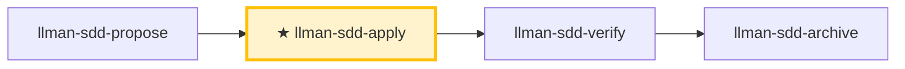

# LLMAN SDD Apply

在**一个闭环内**按顺序完成 `llmanspec/changes/<id>/tasks.md` 的所有任务：实现 → 补测试/验收 → 跑门禁 → 失败自修复重跑 → 全过后报告。除非明确 blocker，**不要中途问「要不要继续」**。

## Pipeline 位置

## Git 分支生命周期（摘要）

**Skill 导航** ≠ **分支生命周期**。全图见根 `AGENTS.md` 或 `llman-sdd-propose` 内嵌图。

硬规则：
1. **先**绑定分支（`change start` / `attach`）→ full；**再**落地 specs（绑定分支上编辑并 commit `llmanspec/specs/**`）。
2. 无合约编辑 → `needs_specs_change: false`。`stage=full` 且 specs-landed 门通过即可进 apply；`readyToImplement=true`（全门绿）是 verify/finalize 前的完成信号。
3. 收口用 `change finalize`（自动提交 `archive(sdd): <id>`；`--no-commit` 跳过）。
4. **禁止**在默认分支 commit specs；已 attach 勿重复 `start`。
5. worktree（可选）：`change start --worktree` 在独立 worktree 建分支、不动当前检出（`--base <branch>` 记录分叉源）；finalize 目标被其他 worktree 持有时自动在该 worktree 内执行（输出标注位置）。



> 📍 进入前须 specs-landed 门通过（或 `needs_specs_change: false`）；`readyToImplement=true`（全门绿）是本闭环的完成信号 → 下一步 `llman-sdd-verify`。

## 硬约束

- **唯一事实来源驱动**：`proposal.md` / `design.md` / `tasks.md` 与分支上的 `llmanspec/specs/**`；specs 的 MUST/SHALL 逐条落实。
- **范围锁定**：只做当前 change 范围，禁止顺手修无关问题；改动保持最小。
- **禁止猜测**：需求不明或 specs 与现实矛盾 → STOP 报告，不自行假定。
- **不留旧兼容层**：change 要求改行为就全量升级到新写法，除非 tasks/proposal 明确要兼容。
- **收尾**：闭环以建议 `llman-sdd-verify` 结束；finalize/archive 归 `llman-sdd-archive`（勿在自修复循环里 finalize）。

## Commit 策略

- **change 分支上提交自由**（`change finalize` 不要求干净树）：按 task/里程碑分段提交，或留脏交给 finalize 一次收尾——均为一等公民。
- **默认收尾**：全部 task 过门禁且 verify 全绿后，`llman-sdd change finalize <id>` 自动提交 `archive(sdd): <change-id>`（未提交 diff + frontmatter + 改名一笔）。不要在 apply 循环内 finalize。`--no-commit` 跳过自动提交（手动/CI 历史、pre-commit hook 冲突）。
- **blocker 中断**：因 blocker STOP 前先做**一次** WIP commit（如 `wip(sdd): <change-id> <摘要>`）保全现场再报告。

## 步骤

### 0) Preflight（必须）
- 读取并遵守 `llmanspec/config.yaml`、`AGENTS.md`（若存在）。
- `git status --porcelain`：工作区不干净且改动不属于本 change → 先 `git stash push -u -m "llman-sdd-apply autopilot backup"`。
- `llman-sdd validate --all --strict`：失败且与本 change 无关 → 停下报告（工件不一致则无法以事实来源驱动实现）。
- **检查 spec valid_scope 完整性**：`llman-sdd list --specs --json` 列出所有 spec，逐个核对 `valid_scope` 路径存在于磁盘；有缺失 → 停下并建议更新 spec（移除已删路径）。

### 1) 选定 change id 并查前置
- 已提供则直接用；否则从上下文推断，不明确就跑 `llman-sdd list --json` 让用户选。始终说明「使用变更：<id>」并告知如何覆盖。
- 确认在经 `llman-sdd change start <id>` 或 `change attach <id>` 绑定的非默认分支上（仅重绑用 `--force`）。分支上的 specs 即唯一事实来源——不要在 `changes/<id>/specs/` 下编写。
## 阶段守卫（`stage` / `readyToImplement`）

以权威 JSON 判定（勿凭「工件看着齐了」）：

```bash
llman-sdd show <id> --output json --type change
```

读字段：`stage`、`specsLanded`、`needsSpecsChange`、`readyToImplement`、`gateChecks`（逐项 `pass` + 未过时的 `hint`）。

| 状态 | 动作 |
|------|------|
| `stage=draft`（仅 proposal.md） | STOP。补 design.md → designed，补 tasks.md → planned，再绑定分支、落地 specs。draft 不能 apply/verify。若已有 proposal+tasks 而仍是 `draft`（缺 design.md——它是 stage 门槛）：先补 design.md。**不要**建 `changes/<id>/specs/`，**不要**在默认分支改 specs。 |
| `stage=designed`（proposal + design） | 补 tasks.md → `planned`；规划文档齐全后再 `change start` / `attach`（绑定分支）。 |
| `stage=planned`（proposal + design + tasks） | STOP 直到绑定：`change start` / `attach` → `full`。 |
| `stage=full` 且 `readyToImplement=false` | 读未过的 `gateChecks` 分项。specs-landed 门未过 → 在**绑定分支**落地 specs（编辑 `llmanspec/specs/**` 并 commit），或设 `needs_specs_change: false`；**不要**重跑 `change start`（绑定分支上的 specs 丢失 → checkout/重建 + 必要时 `attach --force`）。specs-landed 门已绿而 tasks-done/validate/clean-tree 未过 → 实施中期的正常状态：继续 apply 勾 tasks，勿当落地失败。 |
| `readyToImplement=true` | 完成信号：gateChecks 全绿（tasks 全勾 + validate 通过）——verify/finalize 前置已满足。`changes/<id>/specs/` 预期**不存在**，勿当缺失。 |
- 用 `llman-sdd context --task "<proposal 目标>" --paths "<specs scope>"` 获取相关 specs。
  - context 不可用 → 先 `llman-sdd index check`：stale/缺失则 `llman-sdd index rebuild` 后重试；fresh 仍不可用（`LLMAN_SDD_INDEX_CHAT_MODEL` 未设）→ 改用 `llman-sdd list --specs` + 直读 `.feature`——勿循环 rebuild。

### 2) 通读事实来源工件
- `llmanspec/changes/<id>/proposal.md`、`design.md`（如有）、`tasks.md`
- 分支上的 `llmanspec/specs/**`（`<capability>.feature`）

把 proposal/design 的决策整理为不可违反的硬约束清单；把 tasks.md 转成最小可执行步骤序列（保持原顺序）。

### 3) 展示状态
- 进度「N/M tasks complete」+ 接下来 1–3 个未完成任务的简短概览。

### 4) 逐任务实施（闭环）
对每个未完成 task：
1. **实现**：严格按 task 描述 + specs 要求，改动最小。
2. **完成后立刻勾 checkbox**：`- [ ]` → `- [x]`。**收口不是 task**：`change finalize` / `change archive` 是流水线步骤，MUST NOT 出现在 tasks.md——若已列（如「收口——finalize」），删掉（收口的任务门要求全部任务已勾）。
3. **编辑与验证串行**：验证 MUST 在编辑落盘后执行；MUST NOT 把编辑与测试/校验放进同一批并行工具调用（可能读到旧文件，产生假失败/假通过）。
4. task 不明、遇 blocker、或 specs/design 与现实不一致 → STOP 报告，不自行假定。

### 5) 验证与自修复循环（每个 task 或每批 task 后跑一次）
按项目实际跑门禁：
- 测试集：`just test` 或 `cargo test --all`；格式/lint：`just check` 或 `just lint` + `just fmt`
- 分支上按需编辑 `llmanspec/specs/<capability>.feature`（扁平或目录主文件；规则 `@human`，验收 `@executable`），spec 改动后跑 `llman-sdd validate --specs`；分支上可自由提交。
- SDD 校验：`llman-sdd validate <id> --strict`

**门禁证据**：
- 收口会执行已配置的 `bdd.run_command`，收口前不必再跑一遍；`--no-check` 打出的跳过说明不是通过。
- 门禁结论 MUST 来自真实 harness：MUST NOT 以 `--no-check` 取得「通过」；harness 失败 MUST 先查根因（环境变量泄漏、嵌套调用守卫、工作目录错误等），MUST NOT 以「固有/自指属性」定性后绕过。
- 前后对比类判据（计数、基线）MUST 在 change 分支上测量（相对现算 merge-base）；默认分支测得的值通常恒为基线，不构成证据。
- 重构或批量替换类 task：MUST 对比改动前后测试用例数；门禁全绿但用例数下降视为失败。

**失败 → 自修复（不要问要不要继续）：**
1. 解析失败原因（测试 / lint / 格式 / 校验）。
2. 判定是否难定位 bug（原因不明 / 间歇 flake / 回归看不穿）：
   - **不是**（明确的 lint/格式/编译/校验错误）：最小修复（不扩范围），先重跑最小失败复现命令，再重跑全部门禁。
   - **是 → 升级诊断子流程**：
     1. **先建一个能复现失败的命令**（快、确定、agent 可跑、能在此 bug 上变红）——驱动真实 bug 路径并断言用户症状。**MUST NOT 在没有它之前猜原因**（盯着代码空想正是要防止的失败）。
     2. 运行确认变红 → 最小化复现（逐个剔除输入/调用/配置/数据，只留关键部分）。
     3. 生成 **3–5 个排序假设**，每个可证伪（「若 X 是因，改 Y 会让 bug 消失」）。
     4. 单变量验证（一次只改一个），找到根因后修复。
     5. 没有合适 seam 写回归测试时，记录该架构缺口（交 `llman-sdd-arch-review`；未启用时写入本 change 的 `proposal.md` Further Notes 段或 `design.md`，MUST NOT 因此中断闭环）。
3. 先重跑最小失败复现命令，再重跑全部门禁。
4. 记为一轮自修复：`Round N：失败点 → 修复 → 重跑 → 通过/失败`。

**自修复上限 8 轮**；超过仍不过视为 blocker：停止并输出 blocker 报告（最后一次失败命令与输出摘要、已尝试的修复）。

**人审关卡（每批 task 门禁通过后）**：进入下一批次或输出完成报告前跑 `llman-sdd review`：退出码零 → 继续；非零 = CRITICAL → STOP 修复后重跑；MUST NOT 带 CRITICAL 进入下一批次或输出完成报告。

### 6) 完成报告
所有 task 完成 + 全部门禁通过后输出结构化报告（见 Output Contract），然后建议 `llman-sdd-verify`。

> 命令细节用 `llman-sdd <cmd> --help` 查看；命令参考以 CLI 为准，skill 不内嵌命令表。
> 文中「规约」= 本项目 `llmanspec/specs/` 下的 `.feature` 文件；用 `llman-sdd list --specs` / `llman-sdd show <capability>` 查全文。

校验修复（单轨 feature-as-spec）：

1）缺头注释（`missing # capability: header comment`）：每个 capability `.feature`（`llmanspec/specs/<capability>.feature` 或目录内同名主文件）必须以下列注释开头：
```
# language: zh-CN
# capability: <capability>
# purpose: 一句话概述
# scope: src/
```

2）tag 语法（`@human constraint scenario must carry an @req:<req_id> tag` / `orphan acceptance scenario`）：
- 规则：`@req:<id> @human`——statement 全文放场景描述（须含 MUST/SHALL）。
- 验收：`@executable` + 至少一个 `@req:<id>` 挂回规则。
- 配对判据：新增 `@human` 前先分流——凡 GWT 可表达的自动化判定行为 MUST 落 `@executable` 验收并挂回规则（纯文字规则无行为守护）；`@human` 仅用于不可自动化的人工约束，无法配对时在 proposal/design 记录理由。
- 禁止 `@human` 与 `@executable` 同场景；`@manual` 已在 0.3.0 移除——残留报迁移 ERROR，删掉即可（`@human` 本身已承载人工判定语义）。

分支护栏：
- 先 `change start` / `attach` 绑定分支，再在绑定的非默认分支编辑 `.feature` 并 commit（落地 specs）。
- 锁定规则（报告制）：改/删既有 `@human` 场景只出 WARNING，不阻断 validate / finalize / `change diff`；报告按 `@req:<id>` 指明被改规则。控制点：git 分支对比 + `llman-sdd review` / `change diff`。旧锁定确认元数据（frontmatter `rules_touched` / `agent_acked`、`@agent` tag、`--yes` 确认语义）已全部删除，无别名无兼容层。
- `stage=full` 且 specs-landed 门通过（specsLanded ∨ `needs_specs_change: false`）即可进 apply；verify/finalize 须 `readyToImplement=true`（完成信号）。收口优先 `change finalize`。

## Context
- 先查状态再动手：change/spec 状态以 `llman-sdd show/list/validate` 输出为准；读 spec 全文前先用 `llman-sdd context --task --paths` 定位。

## Goal
- 达成一个可验证结果；报告附结果路径与校验状态。

## Constraints
- 遵守正文硬约束（不复读）。先判断规模选路径：合约变更走完整 SDD，实现层走 quick；不确定选完整 SDD。改动最小；已知校验错误禁止强行继续。

## Workflow
- 每步以 `llman-sdd` 命令结果为事实来源；改动工件后必跑 `llman-sdd validate`；命令细节见 `llman-sdd <cmd> --help`。

## Decision Policy
- 高影响歧义先澄清再继续；事实自己查证，只有决策问用户。

## Output Contract
- 先给人读摘要（结论 / 风险 / 待决策），机器细节随后。

## Ethics Governance
- `ethics.risk_level`：low——仅读写本仓库与 `llmanspec/`，无外发动作；正文另有声明时从其声明。
- `ethics.prohibited_actions`：违反正文「硬约束」的动作；未经用户明确要求的 push / PR / 外部上传。
- `ethics.required_evidence`：结论须有命令输出或文件路径佐证；门禁状态以 `llman-sdd validate` 为准。
- `ethics.refusal_contract`：门禁 CRITICAL 未清零 → 拒绝进入下一阶段；自修复达上限 → 报告 blocker。
- `ethics.escalation_policy`：改动 SDD 合约/模板或执行不可逆动作前，暂停并请用户确认。
