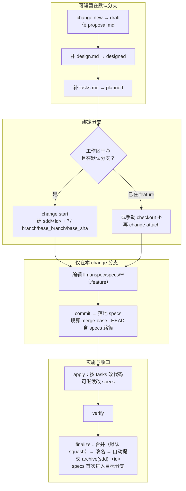
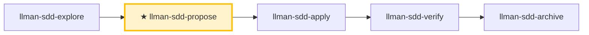

# LLMAN SDD Propose

创建带规划文档的新 change（proposal + tasks；design 可选）：**先** `change start`（或 `attach`）绑定分支，**再**在绑定分支编辑 `llmanspec/specs/<capability>.feature`（扁平，或目录主文件）落地 specs、校验，并建议下一步。

## Pipeline 位置

## Git 分支生命周期（权威全图）

两层别混：**分支生命周期**（绑定分支 → 落地 specs → `readyToImplement`）与 **skill 导航**（explore→propose→apply→verify→archive）。落地 specs **不是**独立 skill。



硬规则：
1. **先** `change start` / `attach` 绑定分支（进入 full）；**再**在绑定的非默认分支编辑 `llmanspec/specs/**` 并 commit（落地 specs）。
2. 无合约编辑的 change 设 frontmatter `needs_specs_change: false`。`stage=full` 且 specs-landed 门通过（specsLanded ∨ needs_specs_change=false）即可进 apply；`readyToImplement=true`（gateChecks 全过，含 tasks-done）是 verify/finalize 前的完成信号。diff 范围一律现算 merge-base；存储的 `base_sha` 仅审计。
3. 收口一律 `llman-sdd change finalize <id>`：自动提交 `archive(sdd): <id>`（实现 diff + 改名一笔）；`--no-commit` 跳过自动提交。change 分支上提交自由（分段或 finalize 一次收尾均可）。
4. **禁止**为过干净树门禁把 specs commit 到默认分支；已 attach 勿重复 `start`。

Worktree 决策表：

| 工作形态 | 命令 | 判据 |
|---|---|---|
| 单检出 | `llman-sdd change start <id>` | 在默认分支且树干净；直接切到新分支 |
| 保留当前检出 / 并行 change | `llman-sdd change start <id> --worktree` | 分支建于独立 worktree（`sdd.worktree_root` / `sdd.worktree_naming` 可调，缺省仓库根兄弟目录），当前检出不动，输出含 worktree 路径；配 `--base <branch>` 记录非默认分叉源 |
| 已在 feature 分支（含手工 wt/git-worktree） | `llman-sdd change attach <id>` | 分支已存在；`--base <branch>` 显式记录分叉源 |

finalize 目标定位：目标分支被其他 worktree 持有时，`llman-sdd change finalize <id>` / `llman-sdd change archive <id>` 自动在该 worktree 内完成合并、改名与提交（输出含 `executed in target worktree <path>`）；持有 worktree 脏时中止报错并列出处置选项（零写入）。
# 人读摘要（强制）

每份报告、交接或门禁输出，MUST 在任何机器细节之前先给人读摘要：

- **结论** — 一行（如「门禁全绿」/「发现 2 个 CRITICAL」）。
- **风险** — 最多三条，按影响降序。
- **待决策** — 明确提问，或「无」。

十行以内；细节放折叠线以下。



> 📍 你在 propose 阶段：规划文档（draft → designed → planned）→ 绑定分支 → 落地 specs（至 specs-landed 门通过）→ 下一步 `llman-sdd-apply`。小改动走 `llman-sdd-quick`。

## 硬约束

- **change id 非阻塞**：用户给了就用；否则从任务描述推导合法 kebab-case id（动词前缀，过 CLI id 检查，遵循 `llmanspec/AGENTS.md` 命名约定），宣布所用 id 与覆盖方式后继续，MUST NOT 等确认——绑定分支前换 id 成本很低。只想先记 idea（不要 id）时转 `llman-sdd-draft`。
- **specs 是唯一事实来源**：只在绑定分支**之后**、在**绑定的非默认分支**上编辑 `llmanspec/specs/**`。**不要**在默认分支改 specs。规划文档可短暂留在默认分支。
- **不要问「要不要继续」**：一口气执行完 propose，生成工件并校验。

- **change 已存在**：STOP。specs-landed 门已绿 → 建议 `llman-sdd-apply`；否则补规划文档 / 绑定分支 / 落地 specs（编辑 `llmanspec/changes/<id>/`，或配置 `extra_skills: [llman-sdd-continue]`）。

- **frontmatter 有固定 schema**：`proposal.md` 只接受 `llmanspec/AGENTS.md`「Change Proposal Frontmatter SSOT」的合法字段（`depends_on`、`blocks`、`branch`、`base_sha`、`needs_specs_change` 等）；`status`/`title`/`priority`/`author` 会被 `llman-sdd validate` 报 ERROR。生命周期阶段是推断量（用 `llman-sdd show`/`list` 查），绝不写进 frontmatter。正文 MUST NOT 复读 frontmatter 字段；H1 用人类可读标题，不复读 change id。

## 快速记录分流

只想**记一个 idea**（「draft 一个提案」「记下 X」「之后要做 Y」）→ `llman-sdd-draft`：经 `change new --from` 建仅含 `proposal.md` 的草案（不问 id、无 tasks/specs/attach）。完整 propose 从这里开始。

## 步骤

### 0) 预检
- 读 `llmanspec/config.yaml` 获取项目上下文、规则、locale。
- `llman-sdd validate --all --strict` 确认现有工件干净；有错误则 STOP 并报告（脏工件上叠新 change 会级联出错）。
- **检查 spec valid_scope 完整性**：`llman-sdd list --specs --json` 列出全部 specs，逐个核对 `valid_scope` 路径在磁盘上存在；有缺失则 STOP 并建议更新该 spec（移除已删路径）。

### 1) 判断变更规模
1. 分类：
   - **行为合约变更**（改 MUST/SHALL、改外部行为）→ 完整 SDD
   - **实现层变更**（重构、typo、性能）→ `llman-sdd-quick`
   - **元规范变更**（SDD 模板/流程）→ 完整 SDD
   - 不确定选完整 SDD（保守）。
2. 用 `llman-sdd context --task "<目标>" --paths "<范围>"` 找相关 specs。
   - context 不可用 → 先 `llman-sdd index check`：stale/缺失则 `llman-sdd index rebuild`（默认 pageindex，免模型）后重试；fresh 仍不可用（`LLMAN_SDD_INDEX_CHAT_MODEL` 未设）→ 改用 `llman-sdd list --specs` + 直读 `.feature`——勿循环 rebuild。
3. 收集输入：简短变更描述；change id（用户给了就用，否则按非阻塞规则推导并宣布）；受影响 capability（命名 `specs/<capability>`）。

### 2) 确认项目已初始化
- `llmanspec/` 必须存在；缺失则让用户跑 `llman-sdd init`，然后 STOP。

### 3) 创建 change 目录与工件
- 优先 `llman-sdd change new <change-id>` 生成 `proposal.md` 草案（或手动建 `llmanspec/changes/<change-id>/`）。

- change 已存在时 STOP 并建议补齐缺失工件或 `llman-sdd-apply`（可经 `extra_skills` 启用 continue）。

- 充实 `proposal.md`（Why / What Changes / Capabilities / Impact）；仅当有权衡/迁移时写 `design.md`。
- **写 tasks.md 前确认测试边界（seam）**：列出要测的 seam 并与用户确认。seam = 由 `*.feature` GWT 步骤驱动的公共边界（CLI 子进程或公共接口）——MUST 复用既有 harness seam，MUST NOT 脱离 `.feature` 凭空发明；没有 `.feature` 时，seam = 被测的 CLI 子命令或公共函数边界。
- `tasks.md` 按**垂直切片**拆（每个 task 打穿 schema→API→UI→tests 一条窄而完整的路径，可独立验证），带 `[blocked-by: <task-id>]` 依赖标记。**大范围重构例外**（一个机械改动扫全库、单点编辑牵动大量调用处）：按先加后删排序（新的加在旧的旁边 → 分批迁移调用处 → 删旧的），不强拆垂直切片。**tasks.md 只列实现与验证任务**：收口（`change finalize` / `change archive`）是流水线步骤，MUST NOT 列为任务——收口的任务门要求全部任务已勾，列了必然自相矛盾（勾选即虚报、不勾则收口被拒，实施期 `validate --strict` 永红）。前后对比类完成判据（计数、基线）MUST 注明在 change 分支上测量（相对 merge-base）——默认分支测得的值通常恒为基线。
- **先** `llman-sdd change start <change-id>`（推荐；默认分支上工作树干净时；保留当前检出用 `--worktree`，非默认分叉源用 `--base <branch>`）或手动建分支后 `change attach <change-id>`。
- **再**在绑定的非默认分支编辑 `llmanspec/specs/<capability>.feature`（扁平，或目录 `llmanspec/specs/<capability>/` 内主文件）并 commit（落地 specs）。**不要**在 start 前改 specs；**不要**为过干净树门禁把 specs commit 到默认分支。已 attach 勿重复 `start`（specs 丢失用 checkout/重建 + `attach --force` 恢复）。
- 无合约编辑的 change 设 frontmatter `needs_specs_change: false`。`llman-sdd show <id> --output json` 显示 `stage=full` 且 specs-landed 门通过即可进 apply；`readyToImplement=true`（全门）是 verify/finalize 的完成信号。
- **破坏性合约变更**（移除/重命名字段、命令、tag 或 stage 值域）MUST 规划升级路径：`migrations/v<from>-v<to>/` 下写 README（升级提示；一次性脚本可行时随仓库提供）——写进提案 What Changes。

### 4) 校验
```bash
llman-sdd validate <change-id> --strict
```
MUST 通过才能继续；失败项在 validate 输出的 `items[].issues[]` 逐条指明，按条修复后重跑。

### 4a) 可选 BDD runner（`bdd:` 段）
- 读 `llmanspec/config.yaml` 是否含 `bdd:` 段：
  - **有**：`bdd.run_command` 是项目的 BDD 执行入口；validate 在目标集含 spec 时缺省执行它（`--no-check` 跳过）。撰写仍按 4b。
  - **无**：若本次 change 含可执行行为场景（用户会想运行的 Given/When/Then），**一次性前置**询问是否启用 `bdd:` runner 段（会向 `config.yaml` 加一个 `bdd:` 段——仅 runner，不改生命周期）。**是**：展示要加的精确 `bdd:` 段（`run_command` 选匹配项目测试框架的——rstest-bdd 用 `cargo test --features bdd`，pytest-bdd 用 `pytest {feature_dir} -k {feature_name} -v`），用户确认或修改后写入 `config.yaml`，再按 4b 继续。**否**：feature 仍做结构校验；BDD 执行责任始终在项目测试套件。
- **MUST NOT 静默添加 `bdd:` 段**——总是先问。添加它会向全项目声明 BDD 执行入口。

### 4b) 单轨 feature 撰写
- 规划文档可短暂留在默认分支；**不要**在默认分支编辑 `llmanspec/specs/**`。绑定分支后，落地 specs 与实现都在绑定分支上。
- **单轨**：每个 capability 只有一个 `<capability>.feature`。约束规则是 `@req:<id> @human` 场景（statement 全文放描述）；可执行验收场景带 `@executable` 并用 `@req:<req_id>` 挂回规则。绝不把场景嵌进 `Rule:` 块（runner 静默跳过其中场景）。
- **结构化新增首选**：向既有 capability 追加规则/验收，优先 `llman-sdd spec next-req-id`（全局 rN 分配）+ `spec add-req` / `spec add-scenario`（配对 tag 语法内建；写入路径自动解析扁平/目录布局）。新建 capability 用 `spec skeleton <capability>`；rN 反查用 `spec resolve-req <rN>`。手改 `.feature` 保留为逃生门（适合改既有条款）。
- **@human/@executable 分流判据**（写新条款前先判定）：凡 GWT（假如/当/那么）可表达的自动化判定行为 MUST 落成 `@executable` 验收场景并挂回对应规则——纯文字规则无法守护行为；`@human` 仅用于无法自动化判定的人工约束（流程裁决、审美、外部事实）。新增 `@human` 无可配对验收时 MUST 在 proposal/design 记录理由。

### 5) 总结并建议下一步
- 进入实现：`llman-sdd-apply`；需要再想清楚：`llman-sdd-explore`。

> 命令细节用 `llman-sdd <cmd> --help` 查看；命令参考以 CLI 为准，skill 不内嵌命令表。
> 文中「规约」= 本项目 `llmanspec/specs/` 下的 `.feature` 文件；用 `llman-sdd list --specs` / `llman-sdd show <capability>` 查全文。
校验修复（单轨 feature-as-spec）：

1）缺头注释（`missing # capability: header comment`）：每个 capability `.feature`（`llmanspec/specs/<capability>.feature` 或目录内同名主文件）必须以下列注释开头：
```
# language: zh-CN
# capability: <capability>
# purpose: 一句话概述
# scope: src/
```

2）tag 语法（`@human constraint scenario must carry an @req:<req_id> tag` / `orphan acceptance scenario`）：
- 规则：`@req:<id> @human`——statement 全文放场景描述（须含 MUST/SHALL）。
- 验收：`@executable` + 至少一个 `@req:<id>` 挂回规则。
- 配对判据：新增 `@human` 前先分流——凡 GWT 可表达的自动化判定行为 MUST 落 `@executable` 验收并挂回规则（纯文字规则无行为守护）；`@human` 仅用于不可自动化的人工约束，无法配对时在 proposal/design 记录理由。
- 禁止 `@human` 与 `@executable` 同场景；`@manual` 已在 0.3.0 移除——残留报迁移 ERROR，删掉即可（`@human` 本身已承载人工判定语义）。

分支护栏：
- 先 `change start` / `attach` 绑定分支，再在绑定的非默认分支编辑 `.feature` 并 commit（落地 specs）。
- 锁定规则（报告制）：改/删既有 `@human` 场景只出 WARNING，不阻断 validate / finalize / `change diff`；报告按 `@req:<id>` 指明被改规则。控制点：git 分支对比 + `llman-sdd review` / `change diff`。旧锁定确认元数据（frontmatter `rules_touched` / `agent_acked`、`@agent` tag、`--yes` 确认语义）已全部删除，无别名无兼容层。
- `stage=full` 且 specs-landed 门通过（specsLanded ∨ `needs_specs_change: false`）即可进 apply；verify/finalize 须 `readyToImplement=true`（完成信号）。收口优先 `change finalize`。

## Context
- 先查状态再动手：change/spec 状态以 `llman-sdd show/list/validate` 输出为准；读 spec 全文前先用 `llman-sdd context --task --paths` 定位。

## Goal
- 达成一个可验证结果；报告附结果路径与校验状态。

## Constraints
- 遵守正文硬约束（不复读）。先判断规模选路径：合约变更走完整 SDD，实现层走 quick；不确定选完整 SDD。改动最小；已知校验错误禁止强行继续。

## Workflow
- 每步以 `llman-sdd` 命令结果为事实来源；改动工件后必跑 `llman-sdd validate`；命令细节见 `llman-sdd <cmd> --help`。

## Decision Policy
- 高影响歧义先澄清再继续；事实自己查证，只有决策问用户。

## Output Contract
- 先给人读摘要（结论 / 风险 / 待决策），机器细节随后。

## Ethics Governance
- `ethics.risk_level`：low——仅读写本仓库与 `llmanspec/`，无外发动作；正文另有声明时从其声明。
- `ethics.prohibited_actions`：违反正文「硬约束」的动作；未经用户明确要求的 push / PR / 外部上传。
- `ethics.required_evidence`：结论须有命令输出或文件路径佐证；门禁状态以 `llman-sdd validate` 为准。
- `ethics.refusal_contract`：门禁 CRITICAL 未清零 → 拒绝进入下一阶段；自修复达上限 → 报告 blocker。
- `ethics.escalation_policy`：改动 SDD 合约/模板或执行不可逆动作前，暂停并请用户确认。
